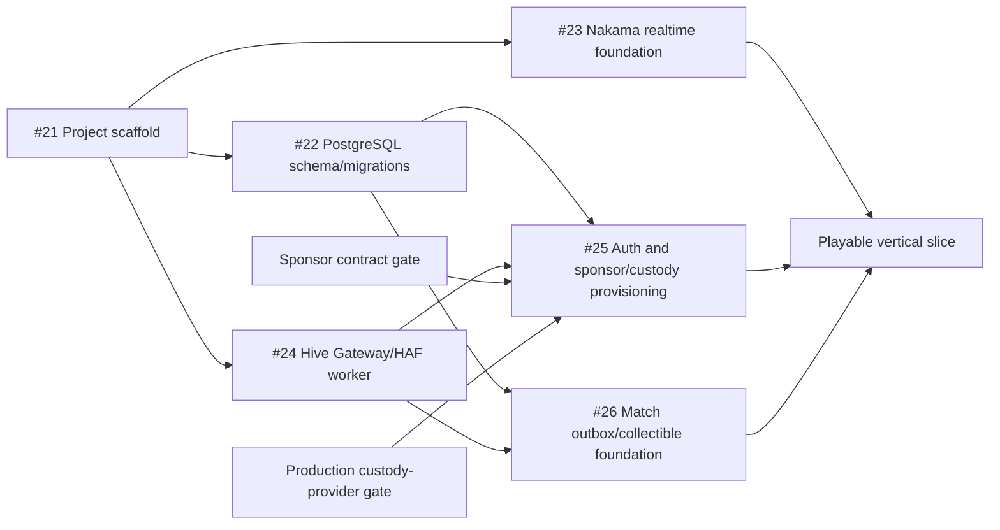

# Hive Chameleon — Implementation Roadmap

- **Status:** Initial delivery baseline
- **Estimate unit:** Engineering person-days (`pd`), excluding external approval/wait time
- **Planning assumption:** Two or three contributors can own independent tracks; ranges are
  planning forecasts, not delivery promises

## 1. Delivery strategy

Build one thin, integrated path before expanding breadth:

```text
Unity login shell
→ NestJS session
→ scoped Nakama connection
→ one persistent lobby
→ one authoritative round result
→ PostgreSQL terminal commit/outbox
→ one irreversible Hive summary
```

Every milestone must leave the repository buildable and the preceding path working. P0 proves the
game and Hive proposition; P1 adds the required product layer only after the vertical slice is
stable. P2 remains outside committed scheduling.

## 2. Planning-card closure

The Technical Architecture parent card (#3) remains **Doing** until the goals of these cards are
complete and their documents are pushed:

- #8: [Non-functional requirements](./technical-specification/non-functional-requirements.md)
- #9: Auth and identity approach, already defined across the Product Spec, Hive-Layer Design,
  data model, and architecture
- #14: [Roles and permissions](./technical-specification/roles-and-permissions.md)
- #10: This implementation roadmap

Checklist state does not determine completion. The card-title deliverable and its reviewed
repository artifact do.

## 3. Foundation card sequence



#21 is the only serial scaffold step. Once its workspace, CI, health path, Unity project, and Go
module conventions are stable, #22, #23, and #24 proceed in parallel with separate owners and
directories. #25 and #26 integrate those tracks afterward.

## 4. Milestones and estimates

| Milestone | Goal and principal scope | Dependencies | Estimate |
| --- | --- | --- | ---: |
| M0 — Planning baseline | Complete #8, #9, #10, #14; approve P0 boundary and measurable NFRs | Approved product/Hive docs | 2–4 pd |
| M1 — Shared scaffold | #21: workspace, NestJS API/health, Unity desktop+WebGL project, Nakama Go module, lint/test/CI, local dev services | M0 | 3–5 pd |
| M2A — Durable data | #22: seven schemas, migrations, extensions, UUIDv7, partial indexes/triggers, role assignments/audit, migration tests | M1 | 7–10 pd |
| M2B — Realtime base | #23: Nakama server/plugin, scoped NestJS session bridge, lobby RPC skeletons, Unity socket adapter, integration test | M1 | 8–12 pd |
| M2C — Hive base | #24: WAX gateway, provider-neutral signer boundary, fork-aware HAF cursor/projector, operation validation and tests | M1 | 8–12 pd |
| M3A — Identity end to end | #25: Keychain/HiveAuth challenge login, Google OIDC, sponsor-backed provisioning, custody references/intents, claim states | M2A + M2C + external gates | 12–18 pd |
| M3B — Public-event pipeline | #26: [terminal commit/outbox, canonical match batching, publisher policy, and collectible issue/revoke foundation](./technical-specification/publication-pipeline.md) | M2A + M2C | 8–12 pd |
| M4 — Playable P0 loop | Lobby lifecycle, host migration, nomination, Casual/Infection authoritative round, reconnect, result/Answer Check, one map | M2B + identity session | 35–50 pd |
| M5 — P0 integration and hardening | Cross-platform end-to-end path, Hive outage/degradation, load/restore/security tests, WebGL/desktop builds, demo polish | M3–M4 | 15–25 pd |
| M6 — P1 product layer | Friends/invites/Streamer Mode, controller, cosmetics/shop, controlled tournament, map attribution/showcase | P0 accepted | 40–60 pd |

With three contributors, M2A–M2C should occupy roughly two to three calendar weeks after the
scaffold, allowing integration time. M3–M5 are feature- and external-provider-sensitive; their
person-day ranges should be replanned after the first end-to-end session and provider spikes.

## 5. Initial sprint plan

### Sprint 0 — Planning and repository baseline

- Land #8, #14, and #10 documents and confirm #9's existing auth/identity baseline.
- Keep #3 Doing until those four title goals are complete; then close #3 with links to the
  approved artifacts.
- Complete #21 and make one command exercise TypeScript, Go, schema, and repository checks.
- Install/pin Unity 6.3 LTS with desktop and WebGL build support on a developer machine, prove both
  build targets locally, and establish an isolated licensed CI runner before staging promotion.

### Sprint 1 — Parallel foundations

- **Data owner:** implement #22 from DBML, then add the non-DBML partial indexes, triggers,
  platform role assignments, audit events, and migration tests.
- **Realtime owner:** implement #23 with a pinned Nakama/pluginbuilder pair, health/startup path,
  authenticated RPC stubs, and a Unity client abstraction.
- **Hive owner:** implement #24 with WAX construction, signer interfaces, safe mock provider,
  cursor/checkpoint persistence, fork state, and fixture-based validation.
- Integrate to `main` at least daily; no track owns a private replacement for shared identity,
  configuration, IDs, or error formats.

### Sprint 2 — First end-to-end identity and lobby

- Implement direct-Hive challenge login first because it does not depend on production custody or
  the signup sponsor.
- Connect the Unity shell through NestJS to a scoped Nakama session and the lobby RPC skeleton.
- Contract-test sponsor account/RC behavior and complete the production custody-provider spike in
  parallel; do not block direct-Hive gameplay on those external gates.
- Implement Google onboarding only against the approved sponsor/custody contracts.

### Sprints 3–5 — Authoritative vertical slice

- Build persistent lobby, host migration, nomination, one official map, role assignment, Casual,
  Infection, spectator/Answer Check, score, and 60-second reconnect in thin vertical increments.
- Commit the terminal result and publication request in one database transaction.
- Publish and re-read one canonical match batch through the isolated service path.
- Maintain desktop and WebGL builds throughout; avoid a late platform port.

### Sprint 6 — P0 release candidate

- Execute the NFR load profile, backup restore, dependency outage, fork/replay, signer-denial,
  authorization, and privacy-field tests.
- Resolve critical/high defects, validate 30 FPS on the agreed hardware/scenes, and rehearse the
  demo/recovery path.
- Freeze P0 scope; move unfinished P1/P2 work out of the release candidate.

## 6. Cross-track contracts

| Contract | Owning source | Consumers |
| --- | --- | --- |
| HTTP resources/errors/idempotency | `openapi.yaml` and NestJS shared types | Unity, portal, tests |
| Durable entities and constraints | DBML plus ordered migrations | NestJS, workers, projectors |
| Player/session identity | NestJS identity module | Nakama session bridge, Hive intents |
| Realtime RPC/event names | Architecture doc plus Nakama package | Unity and integration tests |
| Hive operation serialization | WAX gateway | Player signers, custody adapter, official workers |
| Fork/finality state | HAF projection package | Provisioning, match publication, ownership/payments |
| Authorization | Roles document plus current resource state | NestJS, Nakama, workers |
| Runtime configuration | Validated environment schema | All deployables and CI |

Contract changes land with producer and consumer tests in the same integration window. A track may
use mocks behind the shared interface, but it may not fork the contract silently.

## 7. Definition of done

A foundation card is complete when its title goal works from a clean checkout, tests cover its
authority/failure boundary, configuration and local startup are documented, CI runs the relevant
checks, and no placeholder silently reports production success. A later card may extend it, but
must not be required to make the completed foundation compile or start.

P0 is complete only when desktop and Chrome clients can authenticate, join the same authoritative
session, finish the approved gameplay loop, recover under the normal reconnect policy, commit the
result durably, and retrieve its irreversible Hive summary while meeting the NFR baseline.

## 8. Decision gates and risks

| Gate/risk | Required action | Latest safe point |
| --- | --- | --- |
| Unity editor/CI availability | Pin Unity 6.3 LTS and prove desktop/WebGL locally; establish an isolated licensed build runner before staging promotion | Local proof for #21; runner before staging |
| Go plugin compatibility | Pin matching Nakama, pluginbuilder, Go, and `nakama-common` versions | At #23 start |
| Signup sponsor | Contract-test exact authorities, creator/recovery semantics, initial RC, idempotency, and capacity | Before Google path in #25 |
| Custody provider | Pass signing, policy, destruction, scale/cost, and memo-capability gate | Before real Google player keys |
| HAF/RPC providers | Select health/failover and history/retention behavior | Before #24 production configuration |
| Hetzner topology | Choose location, server/database/ingress shape, backups and restore ownership | Before staging promotion |
| Gameplay networking budget | Measure tick/snapshot/bandwidth and ordinary-laptop WebGL performance | Before M4 content expansion |
| Scope growth | Enforce P0/P1/P2 boundary and re-estimate material changes | Every sprint review |

## 9. Tracking and replanning

Track cycle time, escaped defects, CI duration/failure, oldest queue item, load-test headroom, and
provider-gate status. Re-estimate at the end of M2 and after the first full authoritative round.
Move work between milestones only when its dependency and acceptance effect are explicit; do not
mark a card complete solely because its checklist was ignored or partially checked.
