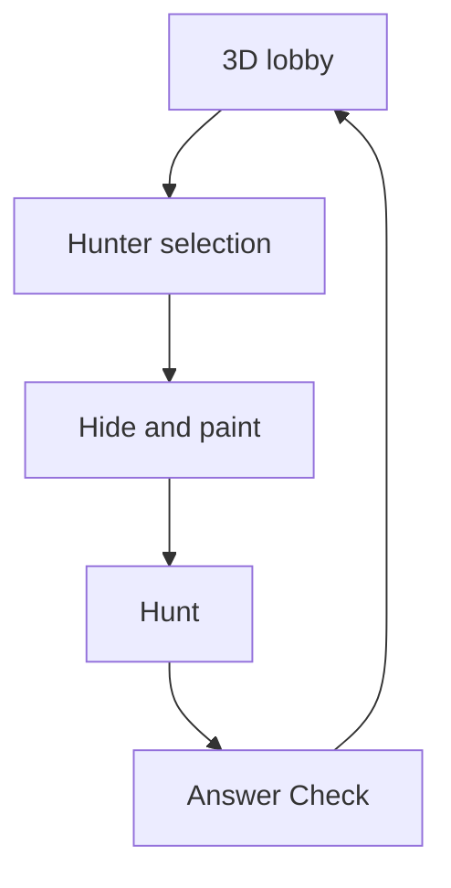
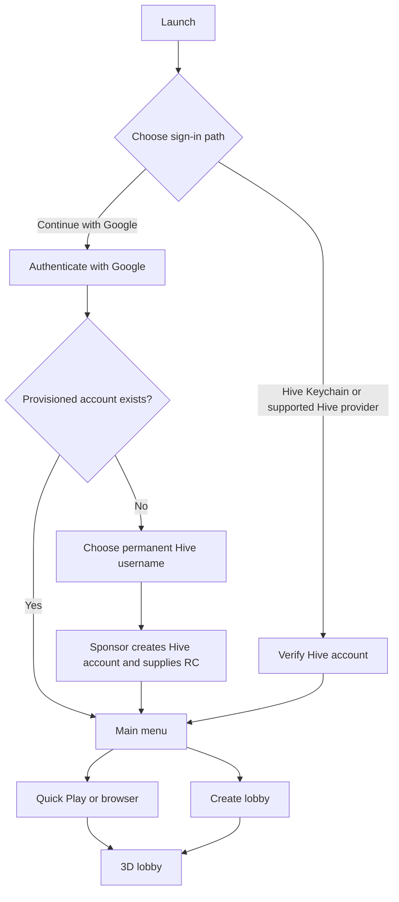
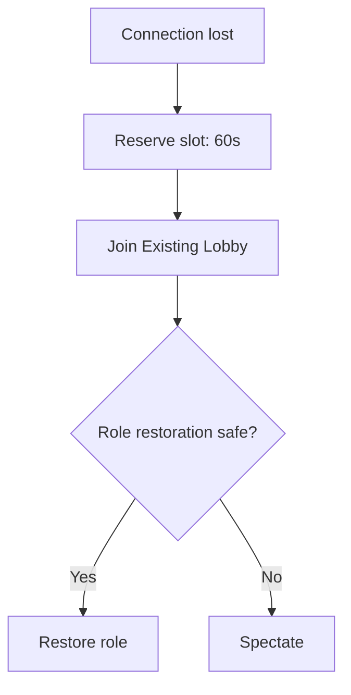
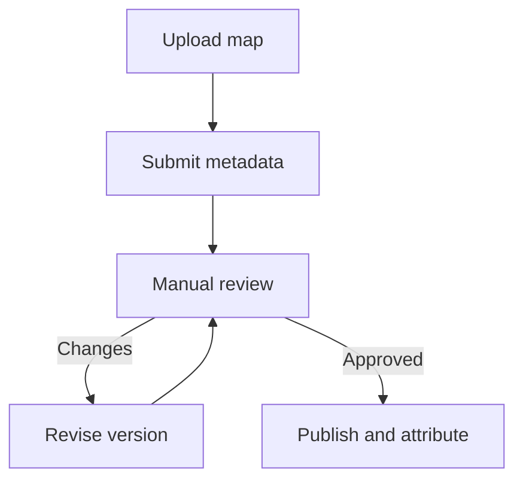

# Hive Chameleon

## Product Specification & Design Plan

**Status:** Pre-development draft for management review  
**Product name:** Hive Chameleon as an internal name. Official name is not required to be decided now.
**Document scope:** Product specification, experience design, low-fidelity wireframes, prioritized backlog, and acceptance criteria

---

## 1. Document Purpose

This document defines what Hive Chameleon should become, how the player experience should work, and which features should be delivered first. It intentionally avoids committing to a particular technical implementation when product behavior can remain implementation-independent.

## 2. Product Summary

Hive Chameleon is a cross-platform multiplayer camouflage and hide-and-seek party game inspired by the social tension and creative concealment of Meccha Chameleon. It will use original maps, presentation, production assets, and product systems.

Players join a persistent lobby of up to 10 people. Before each round, eligible players can physically stand in a nomination area to volunteer as Hunters. Hiders are transported into the selected map, where they paint and pose their characters to blend into the environment. Hunters enter after the hiding period and use limited-shell weapons to identify them before the timer expires.

The game is intended to create funny, skill-based moments. A Hider is never truly invisible to a Hunter; success comes from color matching, surface imitation, silhouette control, position, and misdirection. An end-of-round Answer Check reveals every disguise and lets eligible players recognize one favorite.

Hive is a product layer rather than a decorative integration. Player identity, persistent profiles, map attribution, showcase posts, tournament transactions, and cosmetic ownership are connected to Hive accounts. That identity is also reinforced through restrained use of official Hive brand assets—its signature red/crimson (approximately `#E31337`) and approved logomark/wordmark from the hive.io brand kit—and official Actifit assets where applicable, rather than existing only in backend systems.

## 3. Target Audience

Hive Chameleon targets two audiences equally:

1. Existing Hive and Actifit users who value persistent identity, community creation, and transparent ownership or rewards.
2. Party-game players who may have no prior Hive experience and are attracted by a funny, creative, cross-platform multiplayer loop.

The first interface is English-only. Future localization may be considered after the core experience is validated.

## 4. Product Vision and Principles

### 4.1 Vision

Create an approachable multiplayer party game in which creative camouflage and human observation generate memorable social moments, while Hive gives identity, attribution, and ownership a persistent foundation.

### 4.2 Product Principles

- **Fun before infrastructure:** Hive features must support the game rather than interrupt its core loop.
- **Visible but deceptive:** Hiders win through creativity and positioning, not literal invisibility from Hunters.
- **Easy entry, deep expression:** Movement and objectives should be understandable immediately; painting and posing should allow mastery.
- **Fair competition:** Purchases and collectible weapons must not provide mechanical advantages.
- **Persistent identity:** A player uses a Hive identity across supported platforms.
- **Authoritative results:** Exact server results and append-only corrections are retained durably and can be audited from the game database.
- **Hive-native presentation:** Hive presentation uses its real red/crimson identity and official hive.io brand-kit marks in natural locations such as account connection, verification, cosmetics, badges, and victory effects. Generic hexagons, honeycomb imagery, unofficial logo substitutes, and generic blue treatments are not Hive blockchain branding.
- **Creator attribution:** Approved community maps preserve authorship, versions, and historical records.
- **Cross-platform continuity:** Desktop and web players share identity and multiplayer sessions.
- **Extensible scope:** The first polished vertical slice establishes a complete core, while later contributors can expand maps, tournaments, cosmetics, and creator systems.

### 4.3 Product Differentiation

Hive Chameleon's primary differentiator is its Hive-native identity, creator attribution, player-authorized transactions, and ownership layer. PostgreSQL supports fast authoritative live play and exact durable result history. Cross-platform availability broadens access beyond a single desktop storefront, while continued maps, cosmetics, and product updates provide an ongoing expansion path.

## 5. Goals

1. Deliver a polished vertical slice suitable for demonstration.
2. Support stable lobbies of up to 10 players across desktop and Chrome web builds.
3. Deliver both Casual and Infection modes.
4. Make painting, posing, hiding, hunting, spectating, and Answer Check understandable without a tutorial.
5. Make reconnect reliable for normal matches.
6. Demonstrate meaningful Hive login, profile, creator-attribution, transaction, and ownership flows.
7. Reach at least 30 FPS at 1080p on low settings on an ordinary target laptop, for both desktop and web.
8. Produce funny or satisfying camouflage moments during playtests.
9. Leave a prioritized, maintainable product direction for future development.

## 6. Non-Goals and Deferred Scope

- Mobile or touch release in the initial version
- Built-in text chat, voice chat, or direct messaging at any stage currently planned
- Music during gameplay
- Multiple official maps in the first vertical slice
- Persistent competitive rank or full seasonal competitive systems initially
- Full creator-revenue programs initially
- A general-purpose in-game map editor
- Dynamic community-map loading on the web build
- Dedicated anti-cheat and broad administration tooling in the initial scope
- A playable onboarding tutorial or instruction flow
- Final game brand, game logo, tagline, broader product palette, and exact map/lobby art execution; the approved direction still requires restrained use of official Hive and Actifit brand assets

## 7. Product Scope and Priorities

Priorities describe implementation sequence, not cancellation of later features.

| Priority | Definition | Product scope |
| --- | --- | --- |
| **P0 - Core demonstration** | Required to prove the product | Hive-linked login and profile, public/private discovery, Quick Play, 3D lobby, Hunter nomination, host migration, Casual and Infection, one official map, painting, poses, shotgun identification, spectators, Answer Check, likes, exact durable result history, normal-match reconnect, desktop/web builds |
| **P1 - Required product layer** | Completes the intended product proposition after the core is stable | Friends and invitations, Streamer Mode, controller support, cosmetic ownership/shop, one controlled tournament payment/payout flow, controlled map-attribution and showcase demonstration |
| **P2 - Expansion and stretch** | Built when the core and required layer permit | Creator Workshop, dynamic desktop community maps, transferable/resellable cosmetics, fiat payments, multiple tournament structures, extra cosmetic weapon forms, experimental 3D texture copying |
| **Deferred** | Explicitly outside the initial delivery path | Mobile/touch release, built-in communication, seasonal competitive systems, multiple official maps, full creator-revenue programs |

## 8. Supported Platforms and Presentation Constraints

### 8.1 Initial Platforms

- Windows desktop
- macOS desktop
- Linux desktop
- Unity web build, Chrome-first

Desktop and web players should be able to enter the same supported lobbies. Mobile and touch controls are deferred.

### 8.2 Input

- Keyboard and mouse
- Game controllers
- Full input remapping is planned
- Touch controls are deferred

### 8.3 Display Behavior

- Gameplay is designed for a fixed 16:9 layout.
- Desktop wireframes use a standard 16:9 frame.
- The web game is disabled when the browser is resized away from its supported presentation state.
- A blocking overlay should explain that the player must restore the supported game window before continuing.
- The resize rule must not silently disconnect a player; normal reconnect policy remains available if the session is lost.

### 8.4 Performance Target

- Minimum product target: 30 FPS at 1080p on low settings.
- The same target applies to desktop and Chrome web builds on the agreed ordinary-laptop baseline.
- Final hardware baselines and measurement scenes belong in the technical and test plans.

## 9. Core Session Model

### 9.1 Persistent Lobby

A lobby is a continuing social session rather than a fixed-length match. Players return to the same 3D lobby after every round and may continue playing until they leave. Host ownership transfers rather than closing the lobby when the current host departs.

The lobby supports a maximum of 10 players. Its minimum population is calculated from the selected Hunter count: the lobby needs at least the configured number of Hunters plus one Hider.

### 9.2 Round Loop



1. Players gather in the 3D lobby.
2. The host selects the map, mode, Hunter count, timers, ammunition behavior, and taunt settings.
3. Players may stand in the Hunter nomination area.
4. Hunter roles are assigned.
5. Hiders are transported to the map; Hunters remain free to move within the lobby.
6. After the configurable hiding period, Hunters enter the map.
7. The hunt continues until the timer expires or all Hiders are found or converted.
8. Answer Check reveals all disguises and collects one eligible like per player.
9. Players return to the lobby with their saved lobby appearance restored.

### 9.3 Starting a Round

- There is no Ready state.
- The host may start manually whenever the minimum player condition is satisfied.
- Default automatic-start threshold: 7 connected players.
- Reaching the threshold begins a visible 30-second countdown.
- The countdown cancels if the lobby falls below the threshold.
- Automatic-start behavior is enabled by default and may be governed by safe configuration rules.

### 9.4 Host Assignment and AFK Handling

The host can:

- Change rules between rounds
- Start and end a round
- Kick players
- Transfer host ownership

The host cannot destroy the persistent lobby simply by leaving. Ownership transfers automatically on departure or qualifying disconnection.

Host inactivity is tracked only while the game is waiting in the 3D lobby. Movement, painting, changing a pose, firing, changing settings, or another approved interaction resets the AFK timer. When `HOST_AFK_TIMEOUT` expires, ownership transfers automatically so other players are not trapped in a lobby that never starts. The exact timeout remains a balancing/operations setting.

## 10. Hunter Nomination and Assignment

- Default Hunter count: 1.
- Maximum Hunter count: 2.
- The host can select 1 or 2 Hunters within permitted player-count limits.
- Players nominate themselves by standing in a marked central area in the 3D lobby.
- If the number of nominees equals the configured Hunter count, all nominees become Hunters.
- If nominees exceed the configured count, the game randomly selects from the nominee pool.
- If nobody nominates, the game randomly selects from the whole eligible player set.
- Provisional rule: if nominees are fewer than the required count, all nominees are selected and remaining Hunter slots are filled randomly from non-nominees.

Role assignment should avoid showing information that exposes Hider locations or preparation activity to Hunters.

## 11. Roles and Gameplay

### 11.1 Shared Controls

Both Hiders and Hunters can freely switch between first-person and third-person perspectives at any time.

Base movement includes:

- Walk
- Sprint
- Crouch
- Jump
- Climb
- No fall damage

Prone is implemented as a preset pose rather than a normal traversal state.

### 11.2 Hiders

Hiders can:

- Move throughout the map
- Paint and repaint at any time
- Change preset poses at any time
- Switch camera perspective
- Use the environment, silhouette, colors, materials, and positioning to camouflage themselves

Hider-to-Hider collision is disabled in every mode.

In Casual mode, Hiders can see one another and collaborate visually. In Infection mode, Hiders cannot see one another, preventing a converted Hider from using prior teammate visibility. There is no built-in communication.

### 11.3 Hunters

Hunters search the map and identify Hiders by shooting them with the equipped identification weapon.

- Hunters have limited shells.
- Reload time and shell limits are configurable by the host within safe ranges.
- Incorrect shots consume ammunition and trigger the normal reload constraint.
- No additional wrong-shot score or time penalty is currently approved.
- Weapon configuration must prevent unrestricted rapid scanning of every surface.

Collectible weapons may visually resemble shotguns, snipers without zoom, RPGs, or other forms. They remain mechanically identical: same identification behavior, range policy, hit logic, ammunition rules, reload behavior, and competitive effectiveness. Cosmetic particles and effects must not obscure vision or create an advantage.

## 12. Character and Pose System

### 12.1 Free Character Choices

Before becoming a Hider, a player can select one of these free gameplay forms:

- Humanoid at x1.0 scale
- Humanoid at x1.4 scale
- Humanoid at x1.7 scale
- Cube-like character at x1.0 scale

The cube-like and humanoid characters share the same logical preset-pose set. Final meshes, proportions, animation quality, hitbox behavior, and balance require playtesting. No scoring or movement modifier based on size is currently approved.

### 12.2 Pose Set

Preset poses should meaningfully change silhouette. The intended range includes:

- Neutral standing
- Arms raised or spread
- One-leg balance
- Overhead-arm shape
- Leaning or folded shape
- Kneeling
- Side-lying
- Curled or compact crouched form
- Prone
- Wide spread or star-like pose

The supplied white-figure image is a pose-language reference, not final character artwork. Final assets must be independently designed.

### 12.3 Appearance Persistence

The game maintains a saved lobby appearance for each player.

- Players can paint themselves during waiting time in the lobby.
- Hiders enter the round using their lobby appearance as a baseline and can repaint in the map.
- Round-specific paint does not overwrite the saved lobby appearance.
- After the round, the player returns to the appearance they had in the preceding lobby.
- In Infection mode, a newly converted Hunter receives the appearance they previously painted in the lobby and cannot paint during the active hunt.

## 13. Painting System

### 13.1 Required Painting Tools

- Unlimited paint supply
- sRGB color wheel
- Hue/light selection wheel
- Previous and next color preview
- Pixel eyedropper
- 3D eyedropper
- Adjustable brush sizes
- Hue control
- Saturation control
- Brightness control
- Metallic control
- Roughness control
- Metallic material option
- Preset color themes

The painting interface must support fast switching between direct painting and pose/camera control without making movement unusable.

### 13.2 Experimental Texture Copy

A Hider may eventually copy a 3D block texture from the map onto the character once per game. This is a P2 experimental mechanic because it may reduce skill, affect fairness, or exceed web performance limits. It requires isolated playtesting before being accepted into normal rules.

## 14. Taunt System

- The host can enable or disable forced interval taunts.
- The host can set the interval within safe minimum and maximum values.
- When triggered, every active Hider emits a whistle that helps Hunters narrow the search area.
- The feature prevents impossible or stagnant camouflage situations while also creating tension for ordinarily hidden players.
- The HUD warns Hiders shortly before a forced whistle when the final presentation supports that behavior.

## 15. Game Modes

### 15.1 Casual Mode

- Hiders and Hunters play as opposing teams.
- Hunters win collectively if every Hider is found before time expires.
- Each Hider who remains unfound at timeout receives an individual survival win.
- Hiders can see one another and visually collaborate.
- When found, a Hider's body falls to the ground and its current colors splash onto a nearby wall or surface.
- The splash may unintentionally reveal other Hiders and is an intentional consequence.
- The found Hider becomes a spectator for the remainder of the round.

### 15.2 Infection Mode

- Hiders cannot see one another.
- A found Hider transforms directly into a Hunter.
- The new Hunter cannot paint during the active round.
- The new Hunter uses their saved lobby-painted appearance.
- Hunters win if all Hiders are converted.
- The final surviving Hider wins individually if the timer expires.

## 16. Spectating

Spectators can switch among:

- Follow-player first-person camera
- Follow-player third-person camera
- Free camera

Spectators can see all Hiders and player names. This supports entertaining observation and the Answer Check experience, accepting that external communication cannot be fully prevented.

Players joining an active normal lobby enter as spectators until the next round.

## 17. Reconnect and Joining Rules

### 17.1 Normal Lobbies

- A disconnected player's slot is reserved for 60 seconds.
- The main menu presents **Join Existing Lobby** while the reservation is valid.
- Rejoining restores the same role if the round state can safely support it.
- If the player was already found, they return as a spectator.
- If the role cannot be safely restored or the round has ended, they spectate until the next round.
- Relevant session score and profile progress are preserved.

### 17.2 Tournaments

- Tournament disconnection is a forfeit.
- Tournament players cannot rejoin the active event.
- Entry fees are not refunded under the current product decision.

## 18. Answer Check, Likes, and Results

At the end of each round:

- Hunters remain in the map and can move freely.
- Hiders enter spectator mode.
- Every Hider becomes visually highlighted or flashing.
- Found Hiders are blue.
- Unfound Hiders are red.
- Player names and final hiding locations are visible.
- Each eligible player can like exactly one disguise.
- A Hider cannot like their own disguise.
- Likes are committed with the authoritative terminal result after play.

The result presentation should show role outcomes, survival/discovery information, the selected favorite disguise, and the current round scoreboard without delaying return to the lobby unnecessarily.

## 19. Scoring and Statistics

### 19.1 Round Scoring

The product uses a round score, with exact weights subject to playtesting.

Candidate Hider scoring inputs:

- Survival time
- Surviving to timeout
- Receiving the round's disguise like
- Remaining unrecognized while exposed to a Hunter's view, if technically reliable and fair

Candidate Hunter scoring inputs:

- Successful discoveries
- Discovery speed

Infection adds a final-surviving-Hider bonus. No persistent competitive rank is included initially.

### 19.2 Scoreboard Behavior

- The lobby presents a round scoreboard, not a cumulative lobby-session scoreboard.
- The scoreboard ranks only players assigned Hider at round start. The original Hunter is never a
  scoreboard entry; an Infection conversion does not erase score earned while playing as a Hider.
- During a live round, scoreboard data refreshes in 30-second batches.
- Batched refresh prevents Hiders from using immediate score changes to infer when a Hunter saw them.
- Persistent profile statistics update after confirmed results.

## 20. Hive Identity and Availability

### 20.1 Authentication

The intended login screen prioritizes:

- **Sign in with Hive Keychain** as the primary direct Hive path.
- **Continue with Google** as an optional accessible path for players without an existing Hive
  setup. A new Google-authenticated player receives a real, standard Hive account coordinated by
  the platform through an approved signup/RC sponsor, provisioned with platform-custodied player
  authorities, and linked to the verified Google identity; it is not a guest or database-only
  identity.

HiveAuth and HiveSigner remain supported platform-dependent Hive authentication/signing paths. The product may initially ship with fewer fallback providers if platform or technical constraints require it. There is no guest mode, and every supported entry path leads to a persistent Hive-linked player profile.

Google sign-in authenticates the player's game session; it is not itself a Hive signature. On first use, the player:

1. Completes Google sign-in.
2. Chooses an available Hive username and confirms that Hive usernames are permanent.
3. Waits while the platform coordinates sponsor-backed account creation and verifies enough
   initial Resource Credits for activity.
4. Continues with the resulting Hive-linked profile once provisioning succeeds.

A returning Google-authenticated player resumes the same linked Google-provisioned Hive account and normally skips username selection. The account belongs to the player and is custodial by default: the platform holds its Hive authorities in hardened key management until the player claims self-custody. Raw keys are not exposed to Unity, the general application backend, environment variables, or logs.

| Player/account state | Posting actions such as showcase publishing and voting | Active-authority payments | Wallet requirement |
| --- | --- | --- | --- |
| Direct Hive sign-in | Player approves through the selected Hive signing provider | Player approves through the selected Hive signing provider | Required |
| Unclaimed Google-provisioned Hive account | The platform signs through its custodial key service after an explicit in-product player action | The platform signs through its custodial key service after explicit payment confirmation | Not required |
| Claimed Hive account, including a pending recovery-account transition | Player approves through Keychain, HiveAuth, or another supported Hive signing provider | Player approves through the supported Hive signing provider | Required for Hive actions |

Players with unclaimed Google-provisioned Hive accounts can therefore play and use supported posting- and active-authority features as soon as provisioning completes, without installing Keychain or another wallet. This does not authorize silent background activity: a post, vote, purchase, or tournament entry still requires the corresponding player action or confirmation. Collectible issuance and treasury payouts remain separate service-account operations and never use the player's custodial keys.

The claim path is designed in from the start even if its account-settings UI ships later. During claim, the player establishes new self-custodial Hive keys through a supported wallet or approved credential-generation/export experience. The platform uses the currently custodied owner authority to rotate owner, active, posting, and memo authorities to those new keys, then irreversibly destroys its custodial key material. The Hive username, profile, history, balances, and collectibles remain with the same account. After that authority rotation, the platform can no longer sign normal Hive actions for the player, so supported Hive actions require the player's Hive signing provider.

The full-account custody model is transitional. When Hive light/lite accounts become available
through a production-ready and security-reviewed sponsor/protocol path, new Google onboarding
should migrate to that lighter model so the platform holds less owner-level authority. Existing
players keep their account and identity unless a separately approved migration preserves their
username, history, balances, collectibles, and claim guarantees.

Outside the MVP, the product may introduce a roughly one-week self-custody nudge for an unclaimed
Google player: prompt the player to generate replacement player-controlled keys and download and
confirm their own owner-key recovery backup before continuing. This is part of the claim
experience and never exports the platform's non-exportable custodial keys. Whether it gates
continued play, and the recovery/fallback UX if the player declines or loses the backup, require
explicit product and security approval.

Hive initially assigns the account creator—the configured signup sponsor—as the account's
recovery account. Claim therefore also requests a change to a valid non-sponsor recovery account
selected by the player. Hive applies that recovery-account change after a 30-day delay. During
the delay, the player's new keys control the account and the platform cannot sign normal
operations, but the sponsor remains listed on-chain as the recovery account. The platform does
not hold the sponsor's recovery authority; nevertheless, the UI must show **Recovery change
pending** and must not describe the account as fully self-custodial until Hive confirms that the
new recovery account is effective.

The normative field-level no-PII/doxxing rule and Terms-of-Service requirement that irreversible
Hive records are permanent and cannot be removed by an off-chain deletion request are defined
in [Non-Functional Requirements §3](../technical-specification/non-functional-requirements.md#3-privacy-and-immutable-record-compliance).

Linking a pre-existing Hive account to Google, relinking a different Google identity, and the exact game-login experience after self-custody claim are not established by the confirmed standard and remain open product decisions. The system must not infer an existing Hive account from a Google email address.

### 20.2 Hive Availability Rule

An active match never aborts solely because Hive becomes unavailable. Live simulation, reconnect, scoring, and completion continue through the authoritative game server and PostgreSQL.

New direct-Hive authentication, first-time Google provisioning, and Hive-dependent posts, votes, payments, ownership changes, and claim actions pause with a clear unavailable/retry state. The technical design must define the exact health checks and avoid misclassifying a temporary local failure as a confirmed Hive outage.

First-time Google provisioning also depends on Hive availability, custody availability, approved
sponsor/signup-code capacity, and verified initial Resource Credit support. If any step is
interrupted, the UI shows a recoverable pending or retry state and resumes the same sponsor
request; it does not consume a second signup code, create a guest profile, or silently create a
second Hive account. If the selected username becomes unavailable before creation succeeds, the
player is returned to username selection. The approved sponsor program covers account creation
and initial RC support; the player is not charged an account-creation fee.

## 21. Persistent Player Profile

The profile displays:

- Hive username and profile image
- Online/offline status
- Casual statistics
- Infection statistics
- Hunter wins
- Hider wins
- Successful discoveries
- Times survived
- Likes received
- Match history
- Tournament history and winnings
- Owned cosmetics
- Created maps
- Achievements and badges

No separate disposable platform identity is required. Streamer Mode may replace visible identity data locally without changing the underlying Hive identity.

## 22. Authoritative Result History

- PostgreSQL remains the authoritative path for matchmaking, reconnect, live round state, in-round scoring, and the complete server result.
- A completed Casual or Infection round commits its terminal header, participants, discoveries, likes, exact canonical result bytes, and initial revision atomically.
- Result bytes are retained with a verified SHA-256 so an ambiguous retry cannot substitute a different result.
- Corrections append complete replacement revisions, and invalidations append a reasoned revision without rewriting the original evidence.
- Profile statistics and round history are rebuildable from these durable records.

## 23. Friends, Invitations, and Blocking

Players can:

- Search for another player by exact Hive username
- Send, accept, or decline a friend request
- See a friend's online/offline and lobby status
- Invite a friend to the current lobby
- Join a friend's public lobby
- Join an invited private lobby without retyping its password
- Remove or block another player

Invitations appear through:

- In-game notifications
- The friends/invitations panel
- A shareable lobby code or link

There are no direct messages, text chat, or voice chat.

## 24. Lobby Discovery and Creation

### 24.1 Discovery

The Play screen includes:

- Quick Play
- Public lobby browser
- Private lobby join
- Friend/invitation entry points

Quick Play favors a compatible lobby that is nearest to full and in the nearest suitable region. The server browser must filter by region. Additional filters such as availability, population, and latency may be added after usability testing.

### 24.2 Creation Form

Lobby creation includes:

- Lobby name
- Public or private visibility
- Password for private lobbies
- Maximum players
- Region

Map, mode, Hunter count, hiding time, hunting time, taunts, ammunition, and other rules are chosen from inside the 3D lobby.

## 25. Streamer Mode

Streamer Mode replaces sensitive or identifying fields with generated aliases in the form `anonymousXXX`, where `XXX` is a generated number.

Protected fields include:

- Hive usernames
- Friend usernames
- Lobby name
- Lobby password
- Invitation code
- Wallet balances and payment details
- Personal notifications
- Tournament payment identifiers
- Server and region details

Streamer Mode affects local presentation only. It must not alter account identity, match integrity, or Hive records.

## 26. Tournaments

Tournament systems are required product direction, but several operating decisions remain open.

### 26.1 Supported Value Types

- HIVE
- HBD
- AFIT

Wallet balances and transaction history are not shown globally. Relevant balances and payment details appear only in payment contexts.

A player with an unclaimed Google-provisioned Hive account can confirm a supported tournament entry in-product without installing a wallet; the platform's custodial signer authorizes the active-authority transfer for that player's Hive account. Direct-Hive and claimed players approve the same transfer through their Hive signing provider. Treasury payouts remain official service-account operations under the separate treasury authority.

### 26.2 Candidate Formats

- One paid match with a pot payout
- Several rounds in one lobby with highest total score winning
- Bracket tournament across lobbies
- Organizer-defined structure

P1 proves one controlled entry-fee and payout flow. Multiple structures are P2.

### 26.3 Current Rules and Open Decisions

- Prize splits may use presets or organizer configuration.
- Tournament disconnects cannot rejoin.
- Entry fees are not refunded under the current product decision, including cancellation or failure to fill.
- The organizer model remains undecided: community organizers, official developers/moderators, or both.
- Platform fee and Creator Fund contribution remain management decisions.

## 27. Cosmetics and Gun Shop

### 27.1 Initial Cosmetic Categories

- Shotgun models and skins
- Character base materials
- Lobby emotes
- Nameplates and profile frames
- Badges
- Victory effects

### 27.2 Acquisition Channels

Cosmetics may be:

- Purchased with HIVE or HBD
- Purchased with AFIT
- Purchased through modern external payment methods
- Earned through play
- Awarded through tournaments
- Awarded as creator rewards

External fiat payment support is P2.

For HIVE, HBD, or AFIT purchases, payment authorization follows the same account-state rule as tournament entry: the custodial signer may sign an explicitly confirmed purchase for an unclaimed Google-provisioned account, while direct-Hive and claimed players use their Hive signing provider. Collectible issuance remains a separate official issuer operation rather than a player-key action.

### 27.3 Ownership and Fairness

- Cosmetic ownership is publicly recorded on Hive.
- Transfer and resale are planned at P2.
- Purchases never provide mechanical power.
- Alternative weapon forms use identical gameplay behavior.
- Visual and particle effects must remain readable and competitively neutral.

## 28. Maps and Creator Workshop

### 28.1 First Official Map

The vertical slice contains one polished official map with multiple visually distinct zones. At least one zone should carry a tasteful official Hive brand treatment using approved Hive red and brand-kit assets, integrated as part of the environment rather than added as an advertising overlay. The exact theme, layout, and art treatment remain a dedicated design task.

The map is static but supports traversal through walking, sprinting, crouching, jumping, and climbing. It should provide diverse colors, materials, lighting conditions, geometry, and silhouette opportunities without relying on interactive props.

The implemented M4 content and interface baseline is documented in
[Neon Service Arcade vertical slice](neon-service-arcade-vertical-slice.md).

### 28.2 Creator Tool Direction

The current direction is a Unity Editor-based creator kit rather than an in-game editor. This can change if later technical validation identifies a better approach.

- Any authenticated Hive player may submit a map.
- Submission and review live in a separate web portal.
- The fixed 3D lobby cannot be modified by map creators.
- Creators modify gameplay maps only.

### 28.3 Submission Package

- Map package/file
- Name and description
- Creator Hive account
- Thumbnail and screenshots
- Version
- File hash
- Content tags
- License and ownership declaration
- Optional showcase-post content

### 28.4 Review

Every community map must pass manual review by developers, designated moderators, or trusted community reviewers before publication.

Review covers:

- Successful loading
- Desktop and web performance where applicable
- Out-of-bounds prevention
- Valid spawn locations
- Correct collision
- Suitable camouflage opportunities
- Fair Hunter access
- Offensive or infringing content
- Asset ownership or licensing
- Absence of unsafe scripts or executable content

Creator-visible statuses:

- Draft
- Submitted
- Under Review
- Changes Requested
- Approved
- Rejected
- Published
- Suspended/Removed

### 28.5 Versioning

- Every update creates a new immutable version and file hash.
- Every update requires review.
- The prior approved version remains playable until the update is approved.
- Historical match records retain the version that was played.

### 28.6 Platform Distribution

- Desktop clients may dynamically download approved creator maps.
- The web build does not permit dynamic custom mods.
- Web players can use only maps shipped in an official web build.

### 28.7 Discovery and Showcase

The map browser displays:

- Thumbnail and title
- Creator Hive profile
- Showcase post
- Hive upvotes
- Player rating presentation based on Hive upvotes
- Number of plays
- Current version
- Supported modes and player count
- Official/community label

The game enables its in-product Hive upvote action only after the player completes a match on the map. Hive votes cast through external interfaces remain part of the public on-chain post total and cannot be blocked by the game.

The creator prepares and publishes the showcase post through the portal. The portal can generate a draft from the map title, description, screenshots, version, and attribution. Players can browse and upvote the post without leaving the Hive Chameleon product experience. In-product comments are excluded or read-only; the game does not provide a new commenting interface initially.

A player with an unclaimed Google-provisioned Hive account can explicitly publish a prepared showcase or cast an eligible vote without wallet setup through custodial posting-authority signing. Direct-Hive and claimed players receive the normal approval request from their Hive signing provider.

The first creator version provides recognition through attribution and showcase visibility. Direct tips, tournament shares, cosmetic revenue shares, and a monthly Creator Fund are not required initially.

### 28.8 Ownership and Removal

- Map ownership is not transferable in the current design.
- Collaborator attribution and reward splitting are not supported initially.
- Removed maps disappear from all new lobby creation.
- Existing Hive attribution remains visible.
- The creator receives a removal reason and may submit a corrected version.

## 29. Visual and Audio Direction

### 29.1 Visual Direction

- Colorful and cartoon-like
- Plain white base characters before painting
- Two base silhouettes: humanoid and cube-like
- Multiple strongly differentiated zones within the official map
- Hive's official signature red/crimson (approximately `#E31337`) and approved logomark/wordmark from the hive.io brand kit
- Restrained official Hive-brand accents integrated into selected fixed-lobby elements and at least one official-map zone
- Officially branded Hive and Actifit cosmetic sets, badges, verification states, and victory effects that remain competitively neutral
- The connect-Hive-account interface and Hive verification feedback are primary locations for the official Hive red treatment
- No generic hexagon or honeycomb imagery, invented Hive marks, or generic blue treatment presented as Hive blockchain branding
- Hive identity should be felt in-world without placing branding on every surface or overriding the game's own visual identity
- Final branding, palette, exact lobby style, broader map theme, and character proportions remain open within this direction
- The earlier dark industrial/neon-green prototype is not the selected art direction

### 29.2 Audio Direction

- No music during gameplay
- Gameplay audio remains, including whistles, weapon fire, reloads, and interface feedback
- No player voice communication
- Final sound style is determined with the broader art direction

## 30. Accessibility and Comfort

Planned settings include:

- Input remapping
- Mouse sensitivity
- Controller sensitivity
- Colorblind-friendly team indicators
- Separate music, effects, and interface volume controls, even though gameplay music is initially absent
- UI scaling
- Crosshair customization

Because found/unfound Hiders use blue/red presentation, the Answer Check must include non-color cues such as icons, labels, or distinct flash patterns.

## 31. Onboarding Policy

There is no gameplay tutorial, role instruction screen, or contextual gameplay onboarding in the current design. The core UI, role reveal, objective labels, controls, and feedback must therefore be self-explanatory enough for first-time players to understand the match without outside assistance.

This is a deliberate constraint and should be tested directly during usability sessions.

## 32. Primary User Flows

### 32.1 Entry and Play



### 32.2 Normal Reconnect



### 32.3 Creator Submission



---

# Part II - Low-Fidelity Wireframes

## 33. Wireframe Conventions

These wireframes define hierarchy, controls, and information placement. They are not final visual designs. All layouts assume a fixed desktop 16:9 frame.

- `[ Action ]` indicates a button.
- `( Field )` indicates an input or selection.
- `< Panel >` indicates an overlay, list, or content region.
- Streamer Mode replaces protected identifiers with `anonymousXXX`.

## 34. Hive Login

```text
+------------------------------------------------------------------------------+
| HIVE CHAMELEON - WORKING TITLE                              [Settings]       |
|                                                                              |
|                       <Colorful character artwork>                           |
|                                                                              |
|                         Sign in to continue                                  |
|             <Official Hive mark + red connect/verification state>           |
|                    [ Sign in with Hive Keychain ]                            |
|                    [ Continue with Google ]                                  |
|                                                                              |
|                    Other Hive options:                                       |
|                    [ HiveAuth ]  [ HiveSigner ]                              |
|                                                                              |
|                    <Connection, provisioning, or error status>               |
|                                                                              |
|                           No guest access                                    |
+------------------------------------------------------------------------------+
```

### 34.1 Google First-Run Provisioning

```text
+------------------------------------------------------------------------------+
| CREATE YOUR HIVE ACCOUNT                                        [Back]       |
|----------------------------------------------------------------------------  |
| Your game identity will be a real Hive account linked to this Google sign-in.|
|                                                                              |
| Hive username          (____________________________) [Check availability]   |
| <Available / unavailable / validation message>                               |
|                                                                              |
| Hive usernames are permanent. Confirm spelling before creating the account.  |
|                                                                              |
| Confirm the permanent Hive username before account creation.                 |
|                                                                              |
|                    [ CREATE MY HIVE ACCOUNT ]                                |
|                                                                              |
| <Sponsor-backed account creation / RC verification / retry status>           |
| No wallet setup or account-creation payment is required.                     |
+------------------------------------------------------------------------------+
```

## 35. Main Menu

```text
+------------------------------------------------------------------------------+
| Logo / Working Title                     @hiveuser  [Profile] [Friends 3]    |
|----------------------------------------------------------------------------  |
| [ PLAY ]                 |                                                   |
| [ CREATE LOBBY ]         |       <Colorful live game scene / news>           |
| [ TOURNAMENTS ]          |                                                   |
| [ COSMETICS / GUN SHOP ] |       [ Quick Play ]                              |
| [ CREATOR WORKSHOP ]     |       [ Join Existing Lobby ] when reserved       |
| [ SETTINGS ]             |                                                   |
| [ EXIT - desktop ]       |       <Hive availability and service status>      |
|                          |                                                   |
| <Profile summary>        |       <Invitations / notices>                     |
+------------------------------------------------------------------------------+
```

## 36. Play and Lobby Browser

```text
+------------------------------------------------------------------------------+
| PLAY                                     [Friends] [Invitations] [Back]      |
|----------------------------------------------------------------------------  |
| [ QUICK PLAY - nearest suitable lobby ]                                      |
|                                                                              |
| [ PUBLIC LOBBIES ] [ JOIN PRIVATE ] [ FRIEND LOBBIES ]                       |
| Region: (Auto v)   Search: (Lobby name__________)   [Refresh]                |
|----------------------------------------------------------------------------  |
| Lobby             Region        Players        Status          Ping          |
| Paint Party       EU             7/10           Lobby           42ms [Join]  |
| Hidden Hive       ME             5/10           In Round        61ms [Watch] |
| anonymous184      Hidden         9/10           Lobby          Hidden        |
|----------------------------------------------------------------------------  |
| Private code/password: (______________)                         [ Join ]     |
+------------------------------------------------------------------------------+
```

## 37. Create Lobby

```text
+------------------------------------------------------------------------------+
| CREATE LOBBY                                                    [Back]       |
|----------------------------------------------------------------------------  |
| Lobby name              (__________________________________)                 |
| Visibility              ( Public v )                                         |
| Password - private only (__________________________________)                 |
| Maximum players         ( 10 v )                                             |
| Region                  ( Auto / nearest v )                                 |
|                                                                              |
| Rules, map, mode, timers, taunts, and weapons are selected inside lobby.     |
|                                                                              |
|                                  [ CREATE LOBBY ]                            |
+------------------------------------------------------------------------------+
```

## 38. 3D Lobby HUD

```text
+------------------------------------------------------------------------------+
| Lobby: Paint Party | 6/10 | Host: @user | Region EU       [Menu] [Friends]   |
|----------------------------------------------------------------------------  |
|                                                                              |
|          <PLAYABLE 3D LOBBY - restrained official Hive accents>             |
|                                                                              |
|                   <Central Hunter nomination area>                           |
|                      1 / 2 Hunter volunteers                                 |
|                                                                              |
| [Paint] [Pose] [Character/Size]                 [Host Settings - host only]  |
|                                                                              |
| Auto-start: Waiting for 7 players / 00:30       [Start Now - host]           |
| Players: <compact names/status list>             [Invite Friend]             |
+------------------------------------------------------------------------------+
```

## 39. Host Controls

```text
+------------------------------------------------------------------------------+
| HOST CONTROLS                                                   [Close]      |
|----------------------------------------------------------------------------  |
| Mode                 ( Casual / Infection )                                  |
| Map                  ( Official Map 01 v )                                   |
| Hunters              ( 1 / 2 )                                               |
| Hiding time          ( value within safe range )                             |
| Hunting time         ( value within safe range )                             |
| Forced whistle       ( On/Off )   Interval ( safe value )                    |
| Shell limit          ( safe value ) Reload time ( safe value )               |
| Auto-start at 7      ( On/Off )                                              |
|----------------------------------------------------------------------------  |
| <Player list>               [Kick] [Transfer Host]                           |
|                                                                              |
|                         [ APPLY ] [ START ROUND ]                            |
+------------------------------------------------------------------------------+
```

## 40. Friends and Invitations

```text
+------------------------------------------------------------------------------+
| FRIENDS                         [Friends] [Requests] [Invitations] [Close]   |
|----------------------------------------------------------------------------  |
| Find Hive user: (@__________________________) [ Search ]                     |
|----------------------------------------------------------------------------  |
| @friend1    Online - Main menu       [Invite] [Join] [More]                  |
| @friend2    In public lobby 7/10     [Invite] [Join] [More]                  |
| @friend3    Offline                  [Remove] [Block]                        |
|----------------------------------------------------------------------------  |
| Incoming: @friend4 invited you to Paint Party       [Accept] [Decline]       |
| Share current lobby: [ Copy Code ] [ Copy Link ]                             |
+------------------------------------------------------------------------------+
```

## 41. Hider HUD and Painting

```text
+------------------------------------------------------------------------------+
| HIDER | Hide 01:42 / Hunt 03:00 | Hiders 7 | Whistle in 00:18    [Menu]      |
|----------------------------------------------------------------------------  |
| <Color wheel>                                                   <Pose list>  |
| H S B sliders                         +                         [Pose 01]    |
| Metallic / Roughness                                           [Pose 02]     |
| Brush size                                                      [Prone]      |
| Pixel eyedropper                                                [Curled]     |
| 3D eyedropper                                                                |
| Previous / Next color                        <3D WORLD>                      |
| Preset themes                                                                |
|                                                                              |
| [Paint tool] [Clear/Undo if approved] [1st/3rd person]  <Score refresh>      |
+------------------------------------------------------------------------------+
```

## 42. Hunter HUD

```text
+------------------------------------------------------------------------------+
| HUNTER | Hunt 02:11 | Hiders remaining 5 | Next whistle 00:27    [Menu]      |
|----------------------------------------------------------------------------  |
|                                                                              |
|                                                                              |
|                                  +                                           |
|                              <3D WORLD>                                      |
|                                                                              |
|                                                                              |
| Weapon: Cosmetic RPG form                      Shells: 1/3                   |
| [Fire/Identify] [Reload 01.4s] [1st/3rd person]  <30s score refresh>         |
+------------------------------------------------------------------------------+
```

## 43. Spectator HUD

```text
+------------------------------------------------------------------------------+
| SPECTATING | Hider: @player | Hidden/Found status | Hunt 01:34   [Menu]      |
|----------------------------------------------------------------------------  |
|                                                                              |
|                              <CAMERA VIEW>                                   |
|                                                                              |
|                                                                              |
| [Previous player] [Next player]                                              |
| Camera: [First-person] [Third-person] [Free camera]                          |
| <All player names and Hider visibility are available to spectators>          |
+------------------------------------------------------------------------------+
```

## 44. Answer Check and Results

```text
+------------------------------------------------------------------------------+
| ANSWER CHECK | Found = BLUE/icon | Unfound = RED/icon | 00:35                |
|----------------------------------------------------------------------------  |
| <ROUND SCORE - left>                                                         |
| 01 @player  920       <Hunters move freely through the real 3D map>          |
| 02 @player  810       <Every Hider flashes at their final world position>    |
| 03 @player  640       <Blue + FOUND / red + UNFOUND world nameplates>        |
|                                                                              |
|                       <Hiders observe with spectator cameras>                 |
|                                                                              |
| <Aimed/followed disguise>                         [ LIKE DISGUISE ]          |
| <Compact result state; no full-screen result menu obscures the arena>        |
+------------------------------------------------------------------------------+
```

## 45. Player Profile

```text
+------------------------------------------------------------------------------+
| PLAYER PROFILE - @hiveuser                                      [Back]       |
|----------------------------------------------------------------------------  |
| <Hive avatar>  Online  <Badges>       [Overview] [History] [Cosmetics]       |
|----------------------------------------------------------------------------  |
| Casual: wins / survived / found          Infection: wins / conversions       |
| Hunter wins / Hider wins                Discoveries / Likes received         |
|----------------------------------------------------------------------------  |
| <Recent match history>                                                       |
| <Tournament history and winnings>                                            |
| <Created maps>                                                               |
| <Owned cosmetics>                                                            |
+------------------------------------------------------------------------------+
```

## 46. Settings and Streamer Mode

```text
+------------------------------------------------------------------------------+
| SETTINGS                  [Controls] [Audio] [Interface] [Privacy] [Back]    |
|----------------------------------------------------------------------------  |
| Input remapping          [ Configure ]                                       |
| Mouse sensitivity       (------o---)                                         |
| Controller sensitivity  (-----o----)                                         |
| UI scale                ( 100% v )                                           |
| Colorblind indicators   ( Mode v )                                           |
| Crosshair               ( Style / color / size )                             |
| Music / Effects / UI    (volume controls)                                    |
| Streamer Mode           [ ON/OFF ]                                           |
| Preview identity        anonymous184                                         |
|                                                  [ Apply ]                   |
+------------------------------------------------------------------------------+
```

## 47. Tournament - Conceptual

```text
+------------------------------------------------------------------------------+
| TOURNAMENTS                                              [My Entries]        |
|----------------------------------------------------------------------------  |
| <Event card>  Format / currency / entry / players / organizer / status       |
| <Event card>  Format / currency / entry / players / organizer / status       |
|----------------------------------------------------------------------------  |
| Selected event                                                               |
| Rules | Prize split | No-refund rule | No-rejoin rule                        |
| Entry: 10 HBD        Relevant balance: 24 HBD                                |
|                                      [ SIGN AND ENTER ]                      |
+------------------------------------------------------------------------------+
```

## 48. Cosmetics and Gun Shop - Conceptual

```text
+------------------------------------------------------------------------------+
| COSMETICS / GUN SHOP       [Weapons] [Materials] [Emotes] [Frames] [Owned]   |
|----------------------------------------------------------------------------  |
| Filters                  | <3D PREVIEW>                 | Selected item      |
| Currency                |                               | Cosmetic RPG       |
| Owned / available       | <character holding item>     | Effects preview     |
| Category                |                               | Mechanically equal |
|                         |                               | Price: 5 HIVE      |
|                         |                               | Balance: shown now |
|                         |                               | [ PURCHASE ]       |
+------------------------------------------------------------------------------+
```

## 49. Creator Workshop Dashboard - Conceptual Web Portal

```text
+------------------------------------------------------------------------------+
| CREATOR WORKSHOP | @creator               [My Maps] [Discover] [Profile]     |
|----------------------------------------------------------------------------  |
| [ SUBMIT NEW MAP ]                                                           |
|                                                                              |
| My maps                                                                      |
| Map A  v1.2  Published         <plays/upvotes> [View] [New Version]          |
| Map B  v0.4  Changes Requested <review note>    [Revise]                     |
| Map C  v1.0  Under Review                         [View Status]              |
|                                                                              |
| <Creator recognition; no initial revenue dashboard>                          |
+------------------------------------------------------------------------------+
```

## 50. Map Submission and Review Status - Conceptual

```text
+------------------------------------------------------------------------------+
| SUBMIT MAP                                                        [Save]     |
|----------------------------------------------------------------------------  |
| Map package       [ Upload ]   Hash: <generated/verified>                    |
| Name              (__________________________________)                       |
| Description       (__________________________________)                       |
| Thumbnail/images  [ Upload ]                                                 |
| Version           (________)    Tags (__________________)                    |
| License/ownership [ ] I confirm ownership or valid licenses                  |
| Showcase draft    (optional content____________________)                     |
|                                                                              |
| [ SUBMIT FOR REVIEW ]                                                        |
| Status timeline: Draft > Submitted > Under Review > Approved > Published     |
+------------------------------------------------------------------------------+
```

## 51. Map Discovery and Showcase - Conceptual

```text
+------------------------------------------------------------------------------+
| DISCOVER MAPS                         Region/Mode/Players filters [Search]   |
|----------------------------------------------------------------------------  |
| <Thumb> Map A | @creator | Community | v1.2 | 4,200 plays | Hive upvotes     |
| <Thumb> Map B | Official | v2.0      | 8,100 plays | Hive upvotes            |
|----------------------------------------------------------------------------  |
| Selected map: <large screenshots>                                            |
| Description | Supported modes | Player count | Current version               |
| [View Hive Showcase Post] [Upvote - unlocked after completed match]          |
| [Create Desktop Lobby] [Web availability: included/not included]             |
+------------------------------------------------------------------------------+
```

---

# Part III - Prioritized Feature Backlog

## 52. P0 - Core Demonstration

| ID | Feature | Acceptance summary |
| --- | --- | --- |
| P0-01 | Hive-linked authentication | A player can use the primary Hive Keychain path or Continue with Google; a new Google-authenticated player confirms a permanent username, receives one real custodial-by-default Hive account and initial RC through the approved signup sponsor, can immediately use supported posting/payment actions without wallet setup, and can later claim self-custody; supported platform HiveAuth/HiveSigner paths remain available and there is no guest path. |
| P0-02 | Persistent profile | Hive identity and the approved statistics/profile sections load consistently across supported clients. |
| P0-03 | Main menu | All core and future product destinations are visible; unavailable future modules are clearly labeled. |
| P0-04 | Lobby discovery | Players can Quick Play, browse public lobbies, join private lobbies, and filter at least by region. |
| P0-05 | Lobby creation | A player can create a named public/private regional lobby with a maximum population. |
| P0-06 | Fixed 3D lobby | Players can move, paint, pose, jump, climb, nominate, and access match controls in a colorful lobby with restrained official Hive-red and brand-kit accents. |
| P0-07 | Host lifecycle | Host can configure/start/kick/transfer; ownership migrates on leave, disconnect, or lobby AFK timeout. |
| P0-08 | Hunter nomination | Nominee-equal, nominee-overflow, no-nominee, and provisional underfilled-nominee cases resolve correctly. |
| P0-09 | Automatic start | Seven players trigger a cancelable visible 30-second countdown; manual start respects the minimum condition. |
| P0-10 | Casual mode | Hiders collaborate visually, Hunters identify them, found bodies fall/splash, and correct win states resolve. |
| P0-11 | Infection mode | Hiders cannot see one another; found Hiders convert directly and correct win states resolve. |
| P0-12 | Official map | One polished static map contains distinct zones, including at least one zone with tastefully integrated official Hive-red and brand-kit treatment, and supports up to 10 players and required traversal. |
| P0-13 | Character selection | Free humanoid x1.0/x1.4/x1.7 and cube x1.0 choices are available before Hider play. |
| P0-14 | Movement and cameras | Both roles can use approved traversal and freely switch first/third person. |
| P0-15 | Painting | Required color, material, brush, eyedropper, and preset controls function during lobby and Hider play. |
| P0-16 | Pose system | Humanoid and cube forms can use the approved silhouette-changing preset poses. |
| P0-17 | Lobby appearance persistence | Round paint is separated from and restored to the prior saved lobby appearance correctly. |
| P0-18 | Forced taunts | Host can configure safe whistle intervals; active Hiders emit the taunt at the correct times. |
| P0-19 | Hunter weapon | Limited shells, reload, hit identification, and mechanically neutral base behavior work authoritatively. |
| P0-20 | Spectator system | Join-in-progress and found Casual players can use all three camera modes and see names/Hiders. |
| P0-21 | Answer Check | Found/unfound Hiders reveal with color and non-color cues; each eligible player can like one non-self disguise. |
| P0-22 | Round scoring | Approved inputs calculate a round score; live display refreshes no faster than each 30 seconds. |
| P0-23 | Normal reconnect | Slot reservation, Join Existing Lobby, safe role restoration, spectate fallback, and score preservation work within 60 seconds. |
| P0-24 | Exact result history | Terminal result bytes, detailed evidence, and the initial immutable revision commit atomically; retries are idempotent and corrections remain linear. |
| P0-25 | Hive unavailable state | Active matches continue on the authoritative PostgreSQL path; new authentication/provisioning and Hive-dependent actions pause with a clear retry/status experience. |
| P0-26 | Cross-platform session | Supported desktop and Chrome players can join and finish the same compatible session. |
| P0-27 | Performance | Agreed baseline scenes meet at least 30 FPS at 1080p low on the target ordinary laptop. |
| P0-28 | Fixed web presentation | Unsupported browser resize blocks gameplay visibly without creating silent state corruption. |

## 53. P1 - Required Product Layer

| ID | Feature | Acceptance summary |
| --- | --- | --- |
| P1-01 | Friends | Exact-Hive-username search, request, accept/decline, status, remove, and block work. |
| P1-02 | Lobby invitations | Notification, friends panel, code, and link invitations work; valid private invites bypass password entry. |
| P1-03 | Streamer Mode | All approved sensitive fields become consistent `anonymousXXX` aliases locally. |
| P1-04 | Controller support | Core gameplay, painting, poses, menus, and camera controls are usable with a controller. |
| P1-05 | Cosmetic inventory | Approved cosmetic categories, including officially branded Hive and Actifit cosmetics, badges, and victory effects, appear in profile/inventory and equip consistently. |
| P1-06 | Cosmetic shop and ownership | One supported crypto/AFIT purchase flow records public ownership without mechanical advantage. |
| P1-07 | Controlled tournament | One approved entry-fee, no-rejoin, result, and payout flow works end-to-end with clear rules. |
| P1-08 | Controlled creator attribution | A sample map version, creator identity, hash, and historical match reference can be registered. |
| P1-09 | Showcase and upvote proof | A controlled map has an in-product generated showcase flow and match-gated in-product upvote action. |

## 54. P2 - Expansion and Stretch

| ID | Feature | Acceptance summary |
| --- | --- | --- |
| P2-01 | Self-service Creator Workshop | Any authenticated Hive user can upload, submit, track review, revise, and publish an eligible map. |
| P2-02 | Dynamic desktop community maps | Approved versioned maps download safely and become lobby-selectable on desktop. |
| P2-03 | Map discovery | Players browse creator, version, plays, modes, post, Hive upvotes, and platform availability. |
| P2-04 | Transferable/resellable cosmetics | Ownership transfers and resale preserve verifiable history and competitive neutrality. |
| P2-05 | Fiat payments | Approved modern external payment methods purchase eligible cosmetics. |
| P2-06 | Multiple tournament formats | Paid match, multi-round, bracket, and approved organizer variants are supported. |
| P2-07 | Cosmetic weapon forms | Sniper-without-zoom, RPG, and other forms remain mechanically identical and visually fair. |
| P2-08 | Experimental texture copy | Once-per-game 3D block-texture copying passes fairness, usability, and performance tests before release. |

## 55. Deferred Backlog

| ID | Feature | Reason deferred |
| --- | --- | --- |
| D-01 | Mobile/touch release | Requires a separate input, UI, performance, and platform plan. |
| D-02 | Built-in communication | Explicit product decision excludes text and voice communication. |
| D-03 | Seasonal rank and rewards | Core scoring and fairness must stabilize first. |
| D-04 | Multiple official maps | The first product target is one polished official map. |
| D-05 | Full creator funding | Initial creator value is recognition; revenue programs need later approval and scale. |
| D-06 | In-game map editor | Current direction uses an external creator workflow. |

---

# Part IV - Validation and Decision Log

## 56. Product Acceptance Criteria

The polished vertical slice is successful when:

1. Up to 10 players can join a supported lobby and complete several consecutive stable rounds.
2. Casual and Infection both reach correct role, conversion/elimination, timer, and win states.
3. First-time players understand the core objective and controls without a tutorial or outside instruction.
4. Painting, posing, color/material matching, movement, and map layout consistently create funny or satisfying camouflage moments.
5. Public, private, Quick Play, nomination, automatic start, host migration, and return-to-lobby flows behave coherently.
6. A normal-match disconnect can reconnect within the 60-second reservation policy without corrupting the round.
7. Spectator and Answer Check flows reveal results correctly and enforce one non-self like.
8. Keychain and the optional Google path reach persistent Hive-linked identity without creating a guest profile; a first-time Google-authenticated player receives one sponsor-created, RC-enabled real Hive account, can use supported posting/payment actions without wallet setup, and retains a claim path that transfers both account authorities and the recovery role as defined.
9. Desktop and Chrome web players can complete compatible cross-platform sessions.
10. Desktop and web meet at least 30 FPS at 1080p low on the agreed ordinary-laptop baseline.
11. Web resize produces a clear blocking state rather than broken gameplay.
12. Cosmetic presentation does not change competitive weapon behavior.
13. Hive-native UI, verification, cosmetics, selected lobby elements, and one official-map zone use official Hive red and approved brand-kit marks without generic hexagon/blue substitutes or overwhelming the game's own colorful visual identity.
14. Streamer Mode, when delivered, prevents approved sensitive fields from appearing in the local captured interface.

## 57. Playtest Questions

- Can a new player infer what to do without onboarding?
- Is painting fast enough under preparation pressure?
- Are metallic and roughness controls useful or overwhelming?
- Do different sizes and the cube silhouette remain fair?
- Can Hunters find Hiders without randomly firing at everything?
- Do limited shells and reload time discourage scanning without making Hunters powerless?
- Are whistle intervals tense rather than annoying?
- Does the Casual paint splash create fun consequences without making chains of discoveries unavoidable?
- Is Infection understandable when Hiders cannot see one another?
- Are red/blue Answer Check states readable with colorblind alternatives?
- Does the 30-second scoreboard refresh prevent information leakage?
- Does the absence of onboarding cause unacceptable confusion?
- Does the lack of music strengthen focus or make the experience feel unfinished?
- Does fixed 16:9 web presentation create unacceptable friction?
- Are all cosmetic weapon effects competitively neutral?
- Does the official Hive-red and brand-kit treatment feel integrated into the UI and world rather than added as a decorative overlay?

## 58. Open Product Decisions

The following decisions are intentionally unresolved:

1. Final public name, game logo, tagline, and broader product palette around the required official Hive red and approved hive.io marks
2. Final character proportions and degree of visual separation from the inspiration
3. First official map theme, layout, zone themes, and art package beyond the required official Hive-branded zone treatment
4. Fixed 3D lobby theme and layout beyond the required restrained official Hive-brand accents
5. Exact default and safe ranges for hiding time, hunting time, whistle interval, shells, and reload
6. Exact host lobby-AFK timeout
7. Final hitbox and balance treatment for x1.0, x1.4, x1.7, and cube forms
8. Exact scoring weights and reliable line-of-sight scoring feasibility
9. Production sizing and alert thresholds for Hive-dependent account, collectible, payment, and showcase operations, including provider fallback behavior
10. Exact platform rollout of HiveAuth and HiveSigner fallbacks alongside the primary Keychain and optional Google paths
11. Google-account loss and identity-recovery policy, including whether and how a pre-existing Hive account can be linked, a linked Google identity can be replaced, or access can be restored
12. Exact claim UI rollout, supported self-custodial credential experience, valid non-platform recovery-account selection policy, and whether Google remains a game-session credential after claim
13. Tournament organizer model
14. First tournament format
15. Tournament prize presets, configurable splits, platform fee, and Creator Fund contribution
16. Payment-provider selection for non-blockchain cosmetic purchases
17. Final creator-kit implementation after technical validation
18. Reviewer governance and reviewer tooling
19. Whether the full Creator Workshop enters the initial release after P0/P1 progress is evaluated

## 59. Product-to-Technical Handoff Requirements

The paired Technical Architecture & Tech Stack document should resolve implementation choices for:

- Cross-platform Hive authentication/signing; Google OIDC identity mapping; permanent-username
  confirmation; sponsor/signup-code account creation; custodial key-service signing; verified
  sponsor-backed initial RC; idempotent recovery; owner-authority rotation; and the delayed
  recovery-account transition for self-custody claim
- Required-Hive availability checks and failure behavior
- Authoritative role, weapon, score, collision, timer, and reconnect state
- Exact canonical terminal-result storage, immutable revision history, and authoritative recovery
- Cross-platform lobby discovery and Quick Play selection
- Host migration and lobby AFK detection
- Saved lobby appearance versus round appearance
- Painting/material synchronization and web performance
- Fixed web resize behavior
- Cosmetic ownership, purchase, transfer, and resale representation
- Tournament escrow, entry, no-refund behavior, forfeiture, and payout
- Community-map packaging, validation, versioning, storage, and desktop delivery
- Web map inclusion and version compatibility
- Creator showcase publishing and in-product Hive upvote flow
- Friends, invitations, blocking, and privacy-safe Streamer Mode aliases

## 60. Review Outcome

Once this document is approved, it becomes the product baseline for the paired architecture, schema, and implementation-roadmap work. Any material change to roles, round rules, Hive behavior, creator scope, platform scope, or priority should update this specification before development depends on it.
