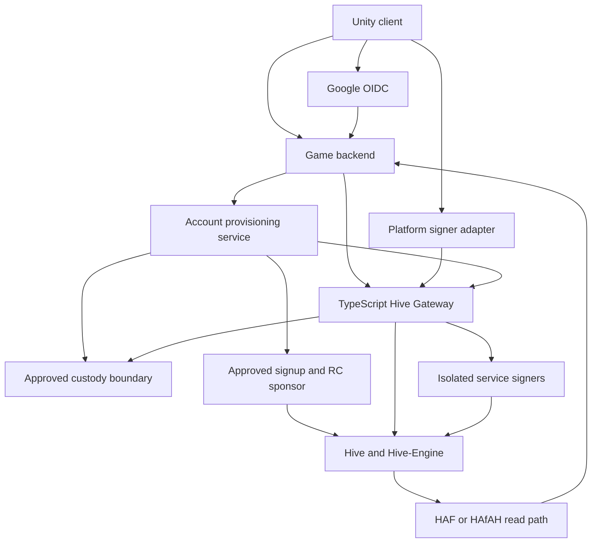
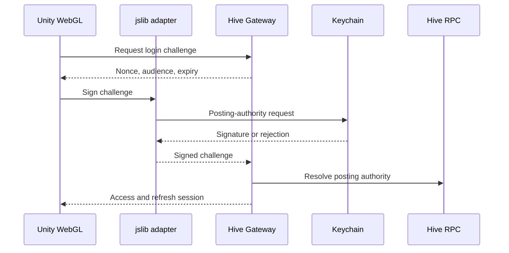
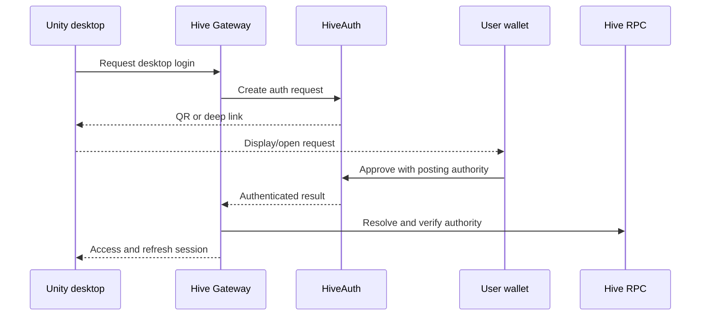
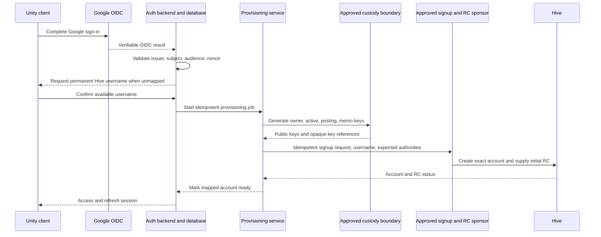
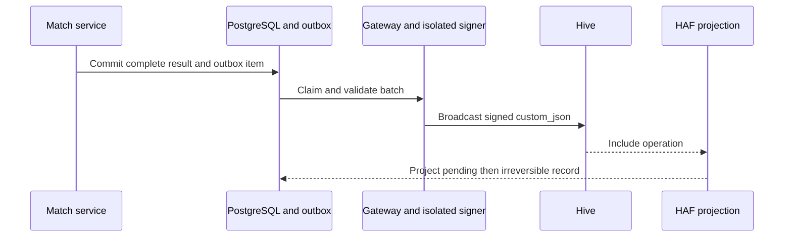

# Hive Chameleon - Hive Layer Design

## 1. Purpose

This document defines the explicit Hive layer for Hive Chameleon: what Hive is authoritative for, what remains in the game backend, how Unity authenticates and requests signatures across web and desktop builds, how Google-authenticated players receive and can later claim real Hive accounts, how on-chain data is indexed, and how keys, Resource Credits, payments, and trust boundaries are handled.

The design deliberately avoids copying live simulation and detailed telemetry onto Hive. Hive is used where it provides a concrete property that the centralized backend cannot provide alone:

- Hive-rooted player identity: signed proof for self-custodial users and a verified custodial entitlement for Google-provisioned users
- A canonical immutable public ledger of batched, server-attested match summaries
- Permanent ownership of issued collectible cosmetics and badges
- Native Hive posts and votes for creator map showcases
- Publicly visible HIVE, HBD, and AFIT tournament payments and payouts

Real-time gameplay and complete operational product data remain off-chain. PostgreSQL is authoritative while a match is running and for the complete server result; after an approved summary is published and becomes irreversible, Hive is authoritative for the permanent public match-summary record.

## 2. Design Decisions

1. A Hive account is the player identity root. Existing Hive users authenticate with a signed challenge; a Google-authenticated new player is mapped to a real, newly provisioned Hive account and authenticates the game session through Google OIDC. Google authentication is not a Hive signature.
2. Completed normal and tournament gameplay rounds are periodically published as batched, server-attested `match_results_batch` summaries. Live state, detailed telemetry, and the complete result remain in PostgreSQL.
3. Hive event history is authoritative for issued collectible ownership and for the canonical immutable public record of finalized match summaries.
4. Collectible cosmetics and collectible badges are non-transferable in the approved scope.
5. Creator map showcases use native Hive posts and votes, but map ownership, attribution, review, versions, and files remain in the backend.
6. Tournament gameplay, bracket state, and winner calculation remain in PostgreSQL. Completed tournament rounds may appear in the same match-summary batches; entry payments and payouts use their native on-chain operations.
7. No new Hive-Engine token is created. HIVE, HBD, and the existing AFIT token may be used for approved payment flows.
8. Generic match, achievement, camouflage, and tournament sharing buttons are excluded. One-click map-showcase publishing remains part of the creator flow.
9. WAX (`@hiveio/wax`) is the standard transaction-construction and serialization library.
10. HAF/HAfAH is the standard Hive read path. Initial deployment may consume a public endpoint; self-hosting is deferred until justified.
11. No Unity client receives, stores, or ships a Hive private key.
12. Active matches continue during a Hive outage through the authoritative server and PostgreSQL; new authentication/provisioning and player Hive-dependent actions pause, while official match summaries remain in the durable publication outbox for idempotent retry.
13. A Google-provisioned Hive account is custodial by default. Fresh owner, active, posting, and memo keys are generated inside a non-exportable production custody boundary that has passed the Hive capability spike; the general backend receives key references and public keys, not raw private key material.
14. Until claim, the backend may request posting- and active-authority signatures for the Google-provisioned account after an explicit authenticated player action. No Keychain or HiveAuth setup is required for those actions.
15. Claim rotates owner, active, posting, and memo authorities to player-controlled keys through `account_update2` and requests a non-platform recovery account through `change_recovery_account`. Custodial key material is destroyed after the authority rotation is irreversible and verified; full self-custody status waits for Hive's 30-day recovery-account change to become effective.
16. An approved external signup sponsor creates each Google-provisioned account with the exact
    custody public authorities and supplies its initial RC under a versioned signup-code policy.
    The platform coordinates and verifies this flow but does not maintain its own HP-funded
    Account Creation Token pool or hold the sponsor's Hive keys.

Decisions 13-16 implement the management-confirmed cross-project Google onboarding standard supplied for this revision. The custody model and capabilities are requirements; the provider-specific feasibility, recovery-account UX, and operational thresholds remain implementation decisions called out below.

## 3. On-Chain and Off-Chain Boundary

| Capability | On-chain responsibility | Off-chain responsibility |
| --- | --- | --- |
| Hive account identity | Standard Hive account and its authorities; signed proof for direct-Hive authentication | Google OIDC subject mapping for Google-authenticated players, session, profile, device policy, permissions, and claim state |
| Google-provisioned Hive account | Sponsor-backed account creation and initial RC, followed by claim through `account_update2` plus `change_recovery_account` | Username confirmation, sponsor policy/request reference, idempotent provisioning state, non-secret custody references, recovery-transition state, abuse controls, and recoverable UI state |
| Gameplay, matches, and results | Irreversible batched summaries of completed rounds, signed by the allow-listed official publisher | Live authoritative state, reconnect, detailed telemetry, scoring calculation, and complete result |
| Statistics and achievements | None | Progress, unlock conditions, statistics |
| Collectible badges | Issuance/revocation and ownership | Definition, progress, images, presentation |
| Cosmetic collectibles | Issuance/revocation and ownership | Catalog, assets, prices, availability, equip state |
| Maps and attribution | None | File, creator attribution, versions, hashes, review status |
| Map showcase | Native Hive post and vote | Draft, portal workflow, cached presentation |
| Friends and social graph | None | Friends, invitations, blocks, presence |
| Tournament entry and payout | Native HIVE/HBD transfer or Hive-Engine AFIT transfer | Rules, eligibility, live state, result, winner calculation |
| Notifications | None | All delivery and read state |
| Generic sharing | No feature | No feature |

### 3.1 Server-Attested Match-Summary Model

The authoritative game server calculates the outcome and commits the complete result to PostgreSQL. It then creates a reduced public summary and a SHA-256 hash of the versioned canonical complete-result document. Summaries are grouped into byte-bounded periodic batches and signed by an allow-listed official match-publisher account.

This is intentionally server-attested rather than trustless. Hive does not reproduce movement, collision, paint, shots, timing, or anti-cheat decisions and cannot independently recompute the winner. Its value is to make the official server's published statement immutable, timestamped, publicly auditable, and independently indexable. PostgreSQL remains authoritative for live play and complete operational queries; once irreversible, Hive is the canonical public ledger for the published summary.

## 4. High-Level Flow



The Unity client handles presentation and gameplay. The game backend owns accounts, sessions, live gameplay, complete match results, inventory presentation, tournaments, and internal authorization. The Hive Gateway builds and validates transaction intents and service events using WAX, coordinates self-custodial player signing providers, routes explicitly authorized operations for Google-provisioned Hive accounts to the custodial signer, and routes official events to separate isolated service signers. The account provisioning service owns the Google-to-Hive creation and claim workflow but does not own gameplay or official publisher/issuer/treasury responsibilities. HAF/HAfAH reads confirmed Hive activity back into a separate indexed projection consumed by the backend. Match publication never depends on a Unity client request or player key.

## 5. Components and Responsibilities

### 5.1 Unity Client

- Requests authentication challenges and Hive action intents from the backend.
- Starts the selected Keychain, HiveAuth, HiveSigner, or Google sign-in flow and displays approval, provisioning, and claim state.
- Never accepts a raw private key, master password, or service key.
- Treats all client-supplied usernames, transaction IDs, prices, and collectible IDs as untrusted input.
- Uses the same backend session and Hive account across supported platforms.
- Presents Hive connection and verification states using Hive's official red/crimson (approximately `#E31337`) and approved logomark/wordmark from the hive.io brand kit. It does not use generic hexagons, honeycomb imagery, invented marks, or generic blue as Hive blockchain branding.

### 5.2 WebGL JavaScript Bridge

- Implemented as a Unity `.jslib` bridge.
- Detects the browser-injected Keychain API.
- Passes a backend challenge or validated transaction intent to Keychain.
- Returns only the approval result, signature/transaction result, and safe error data to Unity.
- May use the browser build of WAX for canonical encoding and validation.

Hive Keychain documents browser injection and supports signing buffers, transactions, posts, votes, transfers, and `custom_json` requests. See the [official Keychain integration documentation](https://github.com/hive-keychain/hive-keychain-extension/blob/master/documentation/README.md).

### 5.3 TypeScript Hive Gateway

- Uses WAX as the canonical Hive transaction model.
- Generates login challenges and transaction intents with expiration and nonce values.
- Validates requested operation type, account, authority, recipient, amount, memo, and application payload.
- Coordinates HiveAuth and HiveSigner flows for desktop clients.
- Verifies returned signatures or transaction details before the backend accepts the action.
- Validates explicit player operation intents for Google-provisioned Hive accounts and routes them to the custodial signer for the mapped, unclaimed account.
- Validates sponsor-created account/RC evidence and constructs the allow-listed
  `change_recovery_account` plus `account_update2` claim transaction.
- Submits service-authorized collectible events to the isolated issuer signer.
- Builds validated `match_results_batch`, correction, and invalidation events from completed server results and submits them to the isolated match-publisher signer.
- Submits approved payouts to the isolated treasury signer.
- Does not expose service keys to the game backend or clients.

WAX provides Hive protocol functionality for TypeScript/JavaScript and supports multiple signer strategies. See the [official WAX TypeScript project](https://gitlab.syncad.com/hive/wax/-/tree/develop/ts).

### 5.4 Account Provisioning and Custodial Signing Service

- Accepts only authenticated internal requests tied to a verified Google OIDC subject and one mapped provisioning record.
- Requires the selected custody boundary to generate distinct, non-exportable secp256k1 owner, active, posting, and memo key pairs. It stores only public keys, opaque provider key identifiers, lifecycle state, and audit metadata outside that boundary.
- Sends the approved sponsor one idempotent signup request containing the permanent username and
  exact expected public authorities. It stores only the sponsor policy version and a stable,
  non-secret request reference; raw signup credentials are never stored in product tables.
- Requires irreversible Hive evidence that the configured sponsor created the exact account with
  matching authorities and supplied the required initial RC before linking a player.
- Requests a posting- or active-authority signature only for the mapped unclaimed account and only after the backend supplies an authenticated, allow-listed player intent.
- Uses the custodied owner key only for the approved `account_update2` plus `change_recovery_account` claim transaction; ordinary gameplay, posting, payment, and service operations cannot request it.
- After authority-rotation finality, destroys all custodied owner, active, posting, and memo key material for that player and retains only a non-secret destruction audit record; recovery-transition tracking continues separately.
- Has no access to match-publisher, issuer, treasury, or RC-support keys. Those official roles cannot request keys for Google-provisioned Hive accounts.

Provider selection remains open until a feasibility and cost spike proves the complete Hive path. A production candidate must:

- Generate or securely import non-exportable secp256k1 keys and return Hive-compatible public keys without exposing raw private material to general application memory.
- Produce Hive-compatible canonical transaction signatures from WAX digests, including any compact-signature/recovery-ID conversion required by Hive, under per-key authorization and audit controls.
- Enforce independent policy for owner, active, posting, and memo keys; support revocation and verifiable cryptographic destruction; and scale to one isolated key set per Google-provisioned account.
- Keep the memo private key non-exportable. If encrypted Hive memo support is introduced, the provider or a separately approved hardened boundary must also perform Hive-compatible secp256k1 shared-secret derivation without releasing the key.

No generic KMS/HSM/Vault label proves those capabilities. The AWS KMS spike proved the signing
conversion, but its per-key topology and missing secp256k1 shared-secret derivation did not pass
the production provider gate. Standard HashiCorp Vault Transit documents NIST P-curve ECDSA
types rather than secp256k1, so it is not a drop-in Hive signer. A custom Vault plugin,
externally managed-key design, or direct HSM integration is a distinct design that must pass the
full spike.
Encrypted memo processing is therefore not an MVP capability, and a split signing/memo design
cannot ship without a separate security review. See the
[AWS KMS key-spec reference](https://docs.aws.amazon.com/kms/latest/developerguide/symm-asymm-choose-key-spec.html)
and [Vault Transit key types](https://developer.hashicorp.com/vault/docs/secrets/transit).
The validated signature conversion and the remaining provider gate are recorded in the
[managed secp256k1 signing recipe](./integrations/managed-secp256k1-hive-signing.md) and
[third-party integration register](./integrations/third-party-integration-register.md).

Raw custodial keys must never be placed in environment variables, source, logs, Unity assets, or general application memory. An encrypted secret or prototype vault is allowed only for an explicitly non-production prototype with no real-value flow and a documented migration to a provider that passes the production capability spike.

### 5.5 HAF/HAfAH Read Path

- Reads relevant account history, application `custom_json`, native transfers, posts, and votes.
- Tracks claim authority state, pending recovery-account changes, and the effective `changed_recovery_account` virtual operation.
- Indexes accepted match batches and later correction/invalidation events from the allow-listed publisher.
- Tracks block, transaction, operation, and irreversible status.
- Supports fork-aware rollback before application state is considered final.
- Produces a normalized Hive projection for the game backend.
- Starts with an approved public endpoint.
- Moves to a dedicated HAF application or self-hosted deployment only when availability, volume, or query needs justify it.

HAF is PostgreSQL-native and designed for fork-aware Hive applications. HAfAH is a read-only HAF application exposing account-history data through a REST service. See the [official HAF repository](https://gitlab.syncad.com/hive/haf) and [official HAfAH repository](https://gitlab.syncad.com/hive/HAfAH).

HAfAH exposes history; it does not replace the game's own domain projection. The application still validates expected signers, operation types, payload schemas, recipients, amounts, and idempotency rules.

### 5.6 PostgreSQL Boundaries

Chain-derived data and mutable game data use separate schema/database boundaries even when both use PostgreSQL technology.

- **Game database:** accounts, sessions, profiles, verified OIDC issuer/subject mapping, username/provisioning state, non-secret custody-provider key references, authority/recovery claim state, gameplay, matches, statistics, maps, tournaments, catalogs, equip state, and notifications.
- **Hive projection:** indexed operation identity, confirmation state, canonical match-summary batches and current correction state, collectible ownership, verified payments, payouts, and community-content references.

The game database may cache finalized collectible ownership and public match summaries for fast reads. The cache is not allowed to invent or change ownership or an irreversible public summary independently of validated Hive history. The complete PostgreSQL match result remains the source for operational detail that is intentionally absent from the public summary.

Google email addresses are not Hive identity keys and are never used to infer or silently link an existing Hive account. The durable identity mapping uses the verified OIDC issuer and subject. Database constraints permit at most one Google-provisioned Hive account per supported issuer/subject and at most one issuer/subject mapping per provisioned Hive account, regardless of later claim state.

## 6. Cross-Platform Authentication and Google Provisioning

### 6.1 Direct Hive Authentication Contract

1. Player submits a normalized lowercase Hive account name.
2. Backend creates a single-use challenge containing a cryptographically random nonce, audience, issue time, expiration, and device-session identifier.
3. The player approves the challenge with posting authority through the platform signer.
4. The Hive Gateway verifies the signature against the account's current posting authority.
5. A successful login revokes the previous refresh session and active game connection for that Hive account.
6. Backend issues a short-lived access token and a longer-lived, revocable refresh token.
7. No blockchain transaction and no RC are required for login.

Only one signed-in device is permitted per Hive account. There is no in-profile account switch. The player signs out before authenticating another account.

### 6.2 Unity WebGL: Keychain



Initial WebGL support uses Keychain through `.jslib`. A later fallback may add HiveAuth or HiveSigner for users without the extension.

### 6.3 Windows, macOS, and Linux: HiveAuth



HiveAuth is the initial desktop path because it supports application authentication without asking the application for a password or private Hive key. See the [official HiveAuth documentation](https://docs.hiveauth.com/).

HiveSigner through the system browser is a later desktop fallback. The game must validate OAuth state/callback correlation and the exact returned account and authority before issuing a session.

### 6.4 Google OIDC and First-Time Provisioning

Google is an alternative game-authentication path, not a Hive signing provider. The backend validates the Google OIDC response, including signature, issuer, audience, expiration, nonce/callback correlation, and the stable subject identifier. It maps the verified `(issuer, subject)` pair to one player and one Google-provisioned Hive account; it does not use an email address as the mapping key.

For a first-time subject, the player selects an available normalized Hive account name and confirms that the name is permanent before provisioning starts. The name remains unassigned in product state until Hive confirms that the platform created that exact account with the expected public authorities.



The sponsor contract must accept the four expected public authorities, create that exact Hive
account, and supply enough initial RC without charging the player. The platform does not operate
a large HP-staked provisioning account, replenish an Account Creation Token pool, or receive the
sponsor's Hive keys. If the sponsor uses `create_claimed_account` and `delegate_rc`, those are
observed and validated as sponsor operations, not signed by the platform. The account is not
marked ready until irreversible creation, exact authority equality, configured creator/recovery
account, and initial RC support are all verified from Hive.

The raw signup code or sponsor API credential lives only in the provisioning secret boundary.
The durable job records a versioned sponsor policy and opaque non-secret request reference so a
retry resumes the same sponsor request instead of consuming another code or creating a second
account. Actifit is a candidate example, not a selected sponsor.

A returning verified OIDC subject resumes its existing account and any incomplete provisioning state. Linking a pre-existing Hive account to Google, changing the mapped Google subject, and post-claim Google session behavior are not defined by the confirmed standard and remain open decisions; no implementation may silently perform those transitions.

### 6.5 Provisioning Idempotency and Partial-Failure Recovery

Provisioning is a durable state machine keyed by the verified OIDC issuer/subject, not a client retry or email address. At minimum it records `username_confirmed`, `keys_ready`, `account_created`, `rc_delegated`, `ready`, and a recoverable failure state. Claim adds `authority_rotation_pending`, `recovery_change_pending`, and `self_custody_complete`. A unique database constraint and serialized worker ownership prevent two concurrent jobs from provisioning two accounts for one subject.

Recovery rules:

- An uncertain sponsor response is reconciled by reading Hive for the selected name and comparing
  the creator/recovery account plus owner, active, posting, and memo public authorities with the
  configured sponsor policy and stored expected public keys. A matching account continues the
  same job; a mismatching or independently created account is never linked.
- If the selected name is taken before matching sponsor creation succeeds, the job returns to username selection without treating that unrelated account as the player.
- If account creation succeeds but sponsor RC support is not yet verified, retries resume at RC
  verification/support and never submit a second account-creation request or identity mapping.
- Custody, Hive, sponsor, signup-capacity, or RC-capacity outages leave the job pending with a
  visible retry state. The same persisted job resumes after recovery.
- A job reaches `ready` only after the account, expected authorities, and initial RC support are verified. Forked reversible provisioning operations return to a pending state and are reconciled before play is enabled.
- Abandoned key material for an account that was never created is destroyed under the custodial key-retention policy; this cleanup cannot delete keys for an account observed on Hive.

Rate limits and abuse controls apply per OIDC subject, device/risk signal, source network, and username attempt. Exact thresholds are operations configuration; they do not weaken the one-subject/one-account idempotency rule.

### 6.6 Signing Behavior

- Direct-Hive login approval occurs once when establishing a session. Google OIDC session establishment does not create or verify a Hive signature.
- Every self-custodial player-originated post, vote, or financial transfer requires explicit approval through the selected Hive signing provider.
- For an unclaimed Google-provisioned account, each post, vote, or financial transfer requires an explicit authenticated in-product intent or confirmation. The approved custodial signer signs only the validated operation for that mapped account; no external wallet prompt is required.
- The application performs no silent or unrelated background player signing. Server-owned match
  publication, collectible issuance, treasury payouts, and later RC support are separately
  authorized official operations. Sponsor-backed account creation and initial RC use the sponsor
  contract and no platform Hive signer.
- Rejection affects only the requested action unless it is the required login action.
- Declining a map-showcase post leaves the draft unpublished.
- Declining a tournament payment leaves the player unregistered.
- Declining a vote leaves gameplay unaffected.
- Once the claim authority rotation is irreversible and verified, the custodial signer rejects every request for that account and all later Hive actions use a supported player-controlled signer. The separate recovery-account transition may remain pending for 30 days.

## 7. Authority and Key Model

| Actor/key | Permitted use | Storage and exposure |
| --- | --- | --- |
| Self-custodial player posting authority | Login challenge, map-showcase post, map-showcase vote | Held only by Keychain, HiveAuth-compatible wallet, HiveSigner, or another approved player signer; never received by Unity/backend |
| Self-custodial player active authority | HIVE/HBD transfer and AFIT/Hive-Engine transfer | Held only by the approved player signer; explicit approval for every action |
| Google-provisioned Hive account owner authority | `change_recovery_account` and `account_update2` during self-custody claim only | Distinct per-player key held in the approved custody boundary until verified authority rotation; unavailable to ordinary signing paths |
| Google-provisioned Hive account active authority | Explicitly confirmed HIVE/HBD and AFIT/Hive-Engine transfers before claim | Distinct per-player key in the approved custody boundary; raw material unavailable to Unity and the general backend |
| Google-provisioned Hive account posting authority | Explicitly initiated showcase posts, votes, and other approved posting operations before claim | Distinct per-player key in the approved custody boundary; raw material unavailable to Unity and the general backend |
| Google-provisioned Hive account memo key | Set at account creation and rotated during claim; encrypted memo processing is not an MVP capability | Distinct per-player non-exportable secp256k1 key; not an operation-signing authority and not exposed to clients/general backend |
| Approved signup sponsor | Account creation and initial RC only | External provider contract; the platform stores no sponsor Hive key or raw signup credential and accepts only matching irreversible Hive evidence |
| Sponsor recovery role | The configured sponsor/creator may be the initial recovery account; transitional only after a claim request | Remains on-chain for Hive's 30-day change delay, then must be replaced by the player's selected valid non-platform recovery account; the platform does not control this role |
| Official match-publisher posting authority | `match_results_batch`, `match_result_corrected`, and `match_result_invalidated` | Isolated service signer; unavailable to Unity and the general gameplay process |
| Official issuer posting authority | `collectible_issued` and `collectible_revoked` | Isolated signing service; unavailable to Unity and general game services |
| Treasury active authority | Approved tournament payouts | Isolated payout signer with allow-lists, limits, and audit trail |
| RC-support authority | Controlled RC delegation/reclaim | Isolated administrative signer; not shared with issuer or gameplay processes |
| Official service-account owner authorities | Recovery/governance only | Offline; never requested or used by the application |

The external signup sponsor, per-player custodial keys, match publisher, issuer, treasury, and
RC-support account are separate trust roles and credentials. They must not be collapsed into one
Hive account or signer for convenience. In particular, the platform never receives the sponsor's
Hive authority, and the match publisher never creates accounts or signs on behalf of a player.
Production account names and custody procedures require explicit operational approval.

### 7.1 Claim to Self-Custody

The claim workflow transfers control of the existing Google-provisioned Hive account; it does not create a replacement account or export the platform's old private keys. Because `create_claimed_account` makes the creator the recovery account, rotating keys alone is not described as full self-custody.

1. The player creates and takes control of a new owner, active, posting, and memo key set through Keychain or an approved master-password/seed-based credential experience, and selects a valid non-platform Hive recovery account. Exact key-generation/export, proof-of-control, and recovery-account selection UX require implementation approval.
2. The claim service validates the new public authorities, recovery account, and explicit authenticated claim request. It builds one owner-authorized claim transaction containing `change_recovery_account` followed by `account_update2`, so the current custodied owner authorizes both the delayed recovery change and replacement of owner, active, posting, and memo values.
3. The custodied current owner authority signs and broadcasts that exact transaction. No sponsor key—which the platform does not hold—or publisher, issuer, treasury, or RC-support key can substitute for the player's current owner authority.
4. The authority rotation remains pending until the transaction is irreversible, a fresh Hive read matches all player-supplied public authorities, and the pending recovery-account request names the player's selected account. A reversible/forked transaction does not trigger key destruction.
5. The custodial service then irreversibly destroys the old per-player owner, active, posting, and memo key material and records a non-secret destruction audit event. From this point it is cryptographically unable to sign normal operations for the account.
6. Hive keeps the sponsor/creator account as the effective recovery account for 30 days. The
   platform does not control that sponsor authority, but the residual third-party recovery role
   still exists on-chain, so the UI and backend state remain `recovery_change_pending` and cannot
   represent the role as already removed.
7. HAF observes the effective recovery-account change through account state and the `changed_recovery_account` virtual operation. Only then does the backend mark `self_custody_complete`.

The same Hive username, balances, history, collectibles, and game profile remain linked throughout claim. If authority-transaction finality or verification fails, the workflow remains recoverable and does not destroy the still-required custodied owner key. After verified authority rotation, all player-originated Hive operations use the player's supported signing provider even while the recovery change is pending. Whether the verified Google identity remains usable only for game-session authentication after claim is an open decision; it can never restore platform signing access. Hive documents that the creator is the initial recovery account and that `change_recovery_account` has a 30-day delay; see the [Hive operation reference](https://developers.hive.io/apidefinitions/broadcast-ops.html).

## 8. Hive Operation Mapping

| Product action | Hive operation | Authority | Accepted signer/recipient |
| --- | --- | --- | --- |
| Direct Hive login | Off-chain signed challenge | Player posting | Account being authenticated through an approved player signer |
| Google game login | Off-chain Google OIDC verification; no Hive operation or signature | None | Verified configured OIDC issuer/subject mapped by the backend |
| Request sponsored Google provisioning | Off-chain sponsor API/signup-code contract; no platform Hive signature | Sponsor-defined request authentication | Provisioning service sends the exact username and custody-provider public authorities under the approved policy and retains only an opaque request reference |
| Observe sponsored account creation | Approved account-creation operation, expected initially to be `create_claimed_account` | Configured sponsor/creator authority | Exact username, creator/recovery account, and all four new authorities must match before acceptance |
| Observe initial account RC | Sponsor-supplied RC evidence, expected initially as `custom_json` ID `rc`/`delegate_rc` | Configured sponsor posting authority | Exact new account, configured sponsor, minimum RC, purpose, and irreversibility must match |
| Request recovery-account transfer during claim | `change_recovery_account` | Current Google-provisioned account owner | That account's custodied owner key before rotation; target is the player's selected valid non-platform recovery account and becomes effective after 30 days |
| Rotate claim authorities | `account_update2` rotating owner, active, posting, and memo | Current Google-provisioned account owner | That account's custodied owner key before claim; replacement keys are player controlled |
| Publish completed match batch | `custom_json` with ID `hive.chameleon` | Match-publisher posting | Configured official match publisher only |
| Correct/invalidate published match | `custom_json` with ID `hive.chameleon` | Match-publisher posting | Configured official match publisher only |
| Issue cosmetic/badge | `custom_json` with ID `hive.chameleon` | Issuer posting | Configured official issuer only |
| Revoke cosmetic/badge | `custom_json` with ID `hive.chameleon` | Issuer posting | Configured official issuer only |
| Publish map showcase | `comment` (and optional `comment_options`) | Creator posting | Authenticated creator account |
| Upvote map showcase | `vote` | Player posting | Authenticated voter account |
| HIVE/HBD tournament entry | `transfer` | Player active | Configured official treasury |
| HIVE/HBD tournament payout | `transfer` | Treasury active | Backend-approved winner account |
| AFIT tournament entry | Hive-Engine `tokens.transfer` through `custom_json` ID `ssc-mainnet-hive` | Player active | Configured official treasury |
| AFIT tournament payout | Hive-Engine `tokens.transfer` | Treasury active | Backend-approved winner account |

Hive `custom_json` supports posting or active required authorities. Native posts/comments, votes, and transfers use their corresponding Hive operations. See the [official Hive broadcast-operation reference](https://developers.hive.io/apidefinitions/broadcast-ops.html).

For player operations, the required Hive authority belongs to the player account in both custody modes. The signing provider changes: an approved external wallet signs for a self-custodial account, while the isolated per-player custody key signs for an unclaimed Google-provisioned account after explicit player authorization. Official publisher, issuer, treasury, and RC-support operations are not player operations and cannot use player keys; sponsor-backed creation and initial RC are external operations observed by the platform.

Hive-Engine accepts contract actions through Hive `custom_json`; token transfers use the `tokens` contract and require active authority. See the [official Hive-Engine developer documentation](https://hive-engine.github.io/engine-docs/) and [token contract reference](https://github.com/hive-engine/steemsmartcontracts-wiki/blob/master/Tokens-Contract.md).

HAF inclusion proves that the underlying AFIT `custom_json` reached Hive, but it does not by itself prove successful Hive-Engine contract execution. AFIT payment verification must also check the Hive-Engine transaction/contract result before granting tournament entry or marking a payout successful.

## 9. Collectible Protocol

### 9.1 Namespace and Envelope

All Hive Chameleon collectible events use one application ID:

```text
hive.chameleon
```

Common payload envelope:

```json
{
  "v": 1,
  "type": "collectible_issued",
  "event_id": "019...uuidv7",
  "occurred_at": "2026-07-10T12:00:00Z",
  "data": {}
}
```

Rules:

- UUIDv7 is used for event and collectible-instance IDs.
- Hive account names are normalized to lowercase.
- `v` is the schema version. Breaking changes increment it; additive optional fields do not.
- Historical events are never edited.
- Corrections are new events that reference the original event.
- Application payloads are limited to 6 KiB, below Hive's 8,192-byte custom-operation data limit.
- Duplicate `event_id` values are ignored after the first valid finalized event.

### 9.2 `collectible_issued`

```json
{
  "v": 1,
  "type": "collectible_issued",
  "event_id": "019...uuidv7",
  "occurred_at": "2026-07-10T12:00:00Z",
  "data": {
    "collectible_id": "019...uuidv7",
    "definition_id": "weapon-skin.rpg-neon.v1",
    "kind": "weapon_skin",
    "owner": "alice",
    "issuer": "approved-issuer-account",
    "reason": "purchase",
    "metadata_uri": "https://assets.example/collectibles/weapon-skin.rpg-neon.v1.json",
    "metadata_sha256": "64-lowercase-hex-characters",
    "payment_tx_id": "optional-hive-or-hive-engine-transaction-id"
  }
}
```

Approved `kind` values initially include:

- `badge`
- `weapon_skin`
- `character_material`
- `lobby_emote`
- `profile_frame`
- `victory_effect`

Each issued copy receives its own collectible-instance UUID even when many copies reference the same definition. Both badges and cosmetics are non-transferable. Equip/unequip is not an on-chain event.

The metadata file remains off-chain, while its hash anchors the version used at issuance. Metadata changes require a new definition/version rather than silently changing the meaning of an existing issued collectible.

### 9.3 `collectible_revoked`

```json
{
  "v": 1,
  "type": "collectible_revoked",
  "event_id": "019...uuidv7",
  "occurred_at": "2026-07-10T13:00:00Z",
  "data": {
    "collectible_id": "019...uuidv7",
    "issued_event_id": "019...uuidv7",
    "reason_code": "issuance_error"
  }
}
```

Revocation never deletes history. The projection marks the instance revoked only when:

- The event schema is valid.
- The signer is the configured official issuer.
- The referenced issuance is valid and finalized.
- The collectible has not already been revoked.

Free-form private evidence is not placed in the payload. Internal audit material remains off-chain.

### 9.4 Hive `custom_json` Wrapper

```json
{
  "required_auths": [],
  "required_posting_auths": ["approved-issuer-account"],
  "id": "hive.chameleon",
  "json": "<serialized collectible envelope>"
}
```

Any Hive account can broadcast a payload using the same application ID. Therefore, the ID alone is never trusted. The indexer accepts issuance/revocation events only when the signer matches the configured issuer allow-list.

## 10. Match Result Protocol

### 10.1 Publication Authority and Eligibility

Only the authoritative game service may authorize a match-summary publication. The general gameplay process writes the complete terminal result to PostgreSQL and a durable publication outbox in one transaction. A separate publisher worker validates that committed result, builds the public payload, and sends it through the Hive Gateway to the isolated match-publisher signer.



Eligible scope includes completed Casual and Infection rounds from public or private normal lobbies, including small private matches, plus completed rounds associated with a tournament.

A round is eligible only when:

- Its terminal status is `completed`.
- Its complete participant, role, score, discovery, survival, like, map-version, server-build, match-result-schema, scoring-rule, and protocol data has been committed successfully.
- It is not aborted, incomplete, or already invalidated before publication.
- Its `round_id` has not appeared in another accepted initial batch.
- Its canonical complete-result document produces the stored SHA-256 hash.

The publisher's Hive posting-authority signature attests that the official service published the batch. Players do not sign match results, and player RC is never consumed for this flow.

### 10.2 `match_results_batch` Envelope

All match events use the provisional `hive.chameleon` application ID and the common event envelope. The initial batch event is:

```json
{
  "v": 1,
  "type": "match_results_batch",
  "event_version": 1,
  "event_id": "019...uuidv7",
  "occurred_at": "2026-07-11T12:05:00Z",
  "data": {
    "batch_id": "019...uuidv7",
    "period_start": "2026-07-11T12:00:00Z",
    "period_end": "2026-07-11T12:05:00Z",
    "publisher": "approved-match-publisher",
    "result_count": 1,
    "results": [
      {
        "round_id": "019...uuidv7",
        "completed_at": "2026-07-11T12:03:42Z",
        "context": "normal",
        "mode": "infection",
        "result_schema": "match-result-1",
        "scoring_rules": "scoring-1",
        "map": {
          "map_id": "019...uuidv7",
          "version_id": "019...uuidv7",
          "version": "1.0.0",
          "content_sha256": "64-lowercase-hex-characters"
        },
        "server": {
          "build": "game-server-0.1.0",
          "protocol": "match-1"
        },
        "winning_side": "hiders",
        "winner_accounts": ["alice"],
        "participants": [
          {
            "account": "alice",
            "initial_role": "hider",
            "final_role": "hider",
            "outcome": "survived",
            "score": "1250.0000"
          },
          {
            "account": "bob",
            "initial_role": "hunter",
            "final_role": "hunter",
            "outcome": "hunter_loss",
            "score": "900.0000"
          },
          {
            "account": "carol",
            "initial_role": "hider",
            "final_role": "hunter",
            "outcome": "converted",
            "score": "600.0000"
          }
        ],
        "discoveries": [
          { "hunter": "bob", "hider": "carol" }
        ],
        "survivors": ["alice"],
        "likes": [
          { "account": "alice", "received": 2 }
        ],
        "result_sha256": "64-lowercase-hex-characters"
      }
    ]
  }
}
```

Field rules:

- `v` is the common Hive Chameleon envelope-schema version.
- `event_version` is the version of the `match_results_batch` event contract. Either value increments only for a breaking change in its respective layer.
- `event_id` uniquely identifies this on-chain event. `batch_id` identifies the logical publication batch and remains stable across retries.
- `occurred_at` is when the service finalized the event payload. The Hive block timestamp independently records when it was published.
- `period_start` is inclusive and `period_end` is exclusive. They describe the completion-time window represented by the batch.
- `publisher` must equal the transaction's sole required posting authority and an allow-listed official match-publisher account.
- `result_count` must equal the length of `results` and must be greater than zero.
- `context` is `normal` or `tournament`; a tournament result may include an optional `tournament_id`.
- `mode`, role, outcome, and winning-side values come from versioned allow-lists. Initial and final roles preserve Infection conversions.
- `result_schema` identifies the canonical complete-result schema whose export is hashed; `scoring_rules` identifies the exact scoring-rule set used to calculate the published scores and winners.
- `winner_accounts` contains the accounts credited with the round win under the versioned scoring rules; `winning_side` preserves the role-side outcome.
- `discoveries` records each successful Hunter-to-Hider discovery relation, including the discovery that caused an Infection conversion. `survivors` contains Hiders not found by round completion.
- Scores use canonical fixed-decimal strings rather than binary floating-point JSON values.
- Hive usernames are normalized to lowercase. Participant accounts must be unique inside a result.
- `likes` contains aggregate likes received per Hider, not the identities of individual voters. Standalone like events remain off-chain.
- The exact map identity includes the stable map ID, immutable version ID, human-readable version, and content hash.
- Server build, match-protocol, result-schema, and scoring-rule versions are recorded per result because one batch may cross a deployment or rules boundary.
- `result_sha256` is the SHA-256 hash of a versioned canonical complete-result document exported from PostgreSQL after terminal commit. The canonical export excludes secrets and infrastructure-only fields but includes all authoritative gameplay result fields defined by that result schema; it is not a hash of raw database pages or unordered SQL rows.
- Movement, paint strokes, shot telemetry, positions, IP addresses, device identifiers, anti-cheat evidence, lobby credentials, tokens, and other private or high-volume data are never included.
- Before Google account creation or a direct-Hive user's first match participation, the product requires one acknowledgement that Hive usernames, match participation, roles, scores, outcomes, and aggregated likes in these summaries become permanently public. No extra per-match player signature or repeated blocking prompt is introduced.

### 10.3 Hive `custom_json` Wrapper

```json
{
  "required_auths": [],
  "required_posting_auths": ["approved-match-publisher"],
  "id": "hive.chameleon",
  "json": "<serialized match event envelope>"
}
```

The application ID is not proof of authority. The indexer accepts a match event only when the required posting authority exactly matches the configured publisher allow-list and every payload validation succeeds.

### 10.4 Batching Cadence, Size, and Idempotency

Initial batching policy:

- `MATCH_BATCH_MAX_AGE`: 5 minutes from the oldest unpublished completed result.
- `MATCH_BATCH_MAX_RESULTS`: 20 results.
- `MATCH_BATCH_MAX_PAYLOAD`: 6 KiB of serialized application JSON.
- The worker publishes when the first limit is reached. If adding the next result would exceed the byte limit, it closes the current non-empty batch and starts another.
- A batch may contain one result. Empty batches are never published.
- Results are ordered by `completed_at`, then `round_id`, before canonical serialization.
- Required fields are never truncated to force a payload under the limit. Worst-case 10-player summaries must pass a pre-production size test; a result that cannot fit by itself fails safely and raises an operational alert rather than publishing a hash-only substitute.

The durable outbox stores the canonical bytes, `event_id`, and `batch_id` before broadcast. A timeout or uncertain response retries the same bytes and identifiers; it never creates a new logical batch merely because confirmation was delayed. The application projection deduplicates by event ID and by the HAF-indexed Hive transaction ID plus operation index. An accepted `round_id` can belong to only one initial batch.

Batch publication is asynchronous and does not block the next round or change the already committed gameplay outcome. The publication worker tracks queue age so delayed canonical records are visible operationally.

### 10.5 Correction and Invalidation

Hive history is immutable, so an incorrect published summary is never edited or deleted. The same allow-listed publisher may append one of two events:

- `match_result_corrected` references the affected round, original batch/event, and latest event it supersedes; it includes a complete replacement public summary and a new complete-result hash.
- `match_result_invalidated` references the affected round, original batch/event, and latest event it supersedes; it marks the result invalid with a controlled non-sensitive reason code and does not invent a replacement winner.

Common correction envelope:

```json
{
  "v": 1,
  "type": "match_result_corrected",
  "event_version": 1,
  "event_id": "019...uuidv7",
  "occurred_at": "2026-07-11T13:00:00Z",
  "data": {
    "round_id": "019...uuidv7",
    "original_batch_id": "019...uuidv7",
    "original_event_id": "019...uuidv7",
    "supersedes_event_id": "019...uuidv7",
    "publisher": "approved-match-publisher",
    "reason_code": "authoritative_result_correction",
    "replacement_result": "<complete result-summary object from section 10.2>"
  }
}
```

Invalidation uses the same envelope with `type: "match_result_invalidated"` and omits `replacement_result`. Free-form evidence, player reports, moderation notes, and security details remain off-chain.

Correction rules:

- The original event remains queryable forever.
- Each later event references the current accepted event through `supersedes_event_id`, creating a linear correction chain.
- A correction cannot change `round_id` or point to a different original batch.
- Only the configured official publisher may correct or invalidate a result.
- Corrections and invalidations use the same 6 KiB limit, durable outbox, idempotency, validation, and irreversibility rules as initial batches.
- The HAF-derived projection exposes both the complete event history and the current canonical status.

### 10.6 Indexing, Finality, and Reconciliation

For every match event, the Hive projection stores the transaction ID, operation index, block number/time, publisher, event/batch IDs, schema versions, round IDs, summary fields, hashes, and confirmation state.

Validation includes:

- Exact application ID, event type, schema/event version, signer, and payload-size checks.
- UUIDv7, timestamp-window, count, controlled-enum, account-normalization, and hash-format checks.
- Unique initial publication per `round_id` and linear correction references.
- Agreement between the publisher field and required posting authority.
- Agreement between the public summary/hash and the corresponding committed PostgreSQL result at publication time.

An included event is pending. It becomes the canonical public summary only when irreversible. If a fork removes an included event, HAF rolls back the pending projection and the worker continues tracking the original idempotent publication. A later mismatch between an irreversible Hive summary and the local complete result is a security/operations incident; the application does not silently overwrite either record.

## 11. Tournament Payment Correlation

The initial tournament model uses an official treasury. Community-organized custody is deferred.

### 11.1 HIVE/HBD

- A self-custodial player signs a native transfer to the configured treasury through the selected Hive signing provider. For an unclaimed Google-provisioned account, the backend validates an explicit payment confirmation and the approved per-player custodial active key signs the same transfer.
- Memo contains a non-sensitive structured correlation value such as:

```text
hive.chameleon:tournament:<tournament-uuidv7>:entry
```

- Backend verifies sender, recipient, asset, amount, memo, transaction uniqueness, inclusion, and irreversible status.
- A transaction ID can satisfy only one entry.
- Payout uses the same tournament ID with `:payout` in the memo.

### 11.2 AFIT

- A self-custodial player signs a Hive-Engine `tokens.transfer` for symbol `AFIT` using active authority through the selected Hive signing provider. For an unclaimed Google-provisioned account, the backend validates an explicit payment confirmation and the approved per-player custodial active key signs the same operation.
- Contract payload includes the treasury recipient, exact quantity, and tournament correlation memo.
- Backend verifies both the underlying Hive operation and successful Hive-Engine execution.
- Payout follows the same validation rules in the opposite direction.

### 11.3 Tournament Publication Boundary

The payment protocol does not create a separate tournament-settlement event and does not publish brackets, organizer administration, or payout calculations. The backend remains authoritative for eligibility, bracket progression, and winner calculation. Completed tournament gameplay rounds may be included in the Section 10 match-summary protocol with `context: "tournament"` and an optional tournament ID. Native/Hive-Engine transfers prove movement of value, while the match event separately preserves the official server-attested public result summary.

## 12. Trust Boundary and Forgery Resistance

The authoritative game server remains responsible for gameplay and result calculation. No client or player-signed operation can create an accepted match summary, map approval, tournament result, or collectible issuance. A match summary becomes valid only through the committed server-result pipeline and the allow-listed official publisher.

Controls:

1. Unity requests an intent; it does not construct authoritative service events.
2. The Hive Gateway allow-lists operation types, signers, recipients, assets, and amount policies.
3. A custodial player signature is accepted only for the unclaimed Hive account mapped to the authenticated OIDC subject, the exact player-authorized operation, and the authority required by that operation. Claim state is checked again inside the signing boundary.
4. Sponsor responses are never accepted on trust: account creator/recovery, public authorities,
   initial RC, operation identities, and irreversibility must match the configured sponsor policy
   in Hive. The platform has no sponsor Hive signer and cannot use sponsor credentials for any
   other purpose.
5. Match events are valid only from the configured match-publisher account and must reference a committed eligible server result with the expected canonical hash.
6. Collectible events are valid only from the configured issuer account.
7. Internal provisioning, custodial signing, match-publication, and issuance requests require service authentication, authorization, idempotency, and an audit record without secret material.
8. Treasury payouts require an approved backend payout instruction and strict destination/amount checks.
9. Player transaction IDs are verified against indexed chain data rather than trusted from the client.
10. Payment transactions cannot be reused.
11. HAF fork rollback removes pending projections until the operation reappears or is replaced.
12. Unknown event types, unsupported schema versions, oversized payloads, invalid UUIDs, and unexpected authorities are rejected.
13. PostgreSQL ownership rows cannot be mutated directly to create ownership; they are derived from valid finalized events.
14. PostgreSQL match rows cannot be mutated to rewrite an irreversible Hive summary; correction or invalidation requires a new authorized on-chain event.

This is a trust-boundary design, not a client anti-cheat system. It prevents forged Hive-layer state while real-time game fairness remains the responsibility of the authoritative match server. The official publisher attests to that server's result; its signature does not turn the result into trustless computation.

## 13. Confirmation and Transaction State

Every Hive-dependent action uses one of these states:

- `queued` (service publication outbox only)
- `requested`
- `awaiting_signature`
- `broadcast`
- `included`
- `irreversible`
- `rejected`
- `expired`
- `failed`

Policy:

- Direct-Hive login succeeds after challenge-signature verification; Google login succeeds after OIDC verification and safe resolution of the mapped account/provisioning state. Neither login event is a blockchain transaction.
- First-time Google-provisioned Hive account creation is a separate sponsor-backed on-chain workflow and does not reach `ready` until account creation and initial RC evidence are validated.
- A post or vote may show success after block inclusion.
- A match batch, correction, or invalidation is pending at inclusion and becomes the canonical public record only when irreversible.
- Collectible ownership is pending at inclusion and finalized only when irreversible.
- Tournament entry and payout remain pending until irreversible and, for AFIT, until Hive-Engine execution is verified.
- A server-owned match-publication job may retry automatically with the same canonical bytes and identifiers because it requires no player signature.
- A self-custodial player's rejected or expired signature is not retried silently; a new request requires fresh wallet approval.
- A custodial player operation may retry only under its existing idempotency key and exact canonical transaction intent after the explicit player action. A materially changed operation requires new confirmation.
- Authority claim remains pending through inclusion and completes only after the owner/active/posting/memo update is irreversible, re-read successfully, and followed by verified custodial key destruction.
- Full self-custody remains `recovery_change_pending` until Hive's 30-day delay expires and the selected non-platform recovery account becomes effective.

## 14. Resource Credits and Rate Limits

Hive transactions consume Resource Credits rather than ordinary per-transaction gas fees. The Hive Gateway checks player RC through the Hive RC API before requesting a signed action. The official API exposes `rc_api.find_rc_accounts` for current RC availability. See the [Hive API reference](https://developers.hive.io/apidefinitions/).

A newly created Hive account begins with effectively no usable RC. Google provisioning therefore
requires the approved signup sponsor to supply enough initial RC before the account becomes
ready. The configured sponsor flow is expected to expose verifiable `delegate_rc` evidence, but
the platform validates the actual Hive operation and minimum RC rather than assuming success
from an off-chain response. RC support is capacity, not HP, HIVE, or content-vote weight granted
to the player.

Initial policy:

- Show a clear low-RC state before requesting an action likely to fail.
- Require a versioned sponsor/signup-code policy with per-subject and per-network abuse controls.
- Store no raw signup code and retry only the same opaque sponsor request.
- Verify the configured sponsor/creator, exact recipient, minimum RC, operation identity, and
  irreversibility before marking provisioning ready.
- Keep later general RC assistance, cooldowns, and reclaim policy behind the separate platform
  RC-support role.
- Provision match-publisher, issuer, treasury, and RC-support accounts independently; none may
  substitute for the sponsor.
- Do not promise unlimited free on-chain actions.

The sponsor supplies only account creation and initial RC under this flow; the platform has no
sponsor Hive key and does not operate a fallback HP-funded provisioning account. Later general RC
assistance and reclaim policy remains the responsibility of the separate RC-support role. Rate
limits are configuration, not protocol schema. At minimum they cover login challenges, Google
OIDC/provisioning attempts, username checks, outstanding signing intents, custodial player
operations, community actions, match-batch publication/correction, payment checks, collectible
issuance, sponsor requests, and RC-support requests.

### 14.1 Match-Publisher RC Budget

Match publication consumes the official publisher account's RC, never player RC. Operational sizing uses measured serialized WAX transactions and the live RC API rather than assuming a fixed fee.

The initial forecast is:

```text
daily batch operations = ceil(completed publishable rounds / measured average results per batch)
                       + correction/invalidation operations
```

The publisher account is provisioned for at least twice the forecast peak rate and enough additional capacity to drain a one-day publication backlog without delaying new batches. Monitoring covers available RC percentage, serialized bytes, batches/results per day, oldest queued result, retry count, and projected time to exhaustion. Alert thresholds are configuration reviewed after load testing.

If publisher RC falls below the configured reserve, the durable outbox retains the same events and identifiers, publication pauses with an operational alert, and gameplay continues. The system does not shrink a required summary, switch to a different unapproved signer, or charge a player to publish the official result.

### 14.2 Sponsor-Backed Provisioning Capacity

The platform uses an approved sponsor program and special signup-code policy instead of funding a
large provisioning account with staked HP or maintaining its own Account Creation Token pool.
The sponsor contract must support the expected public authorities, account/recovery semantics,
initial RC, stable request reconciliation, and an abuse-controlled capacity signal before it is
enabled.

Operations monitoring covers sponsor availability, policy version, remaining/advertised signup
capacity when exposed, pending request age, irreversible account/RC evidence, request failures,
retries, and forecast exhaustion. Raw signup codes and sponsor API credentials are secret and
never appear in logs, telemetry, or product tables. Exact minimum RC and sponsor-specific limits
remain production configuration.

When sponsor capacity is low, signup remains pending or returns a clear retry state. It is never
redirected to the match publisher, issuer, treasury, a player's balance, or an unapproved
platform-funded creator.

## 15. Failure and Outage Behavior

### 15.1 Hive RPC or Signer Unavailable

- Active matches continue through the authoritative game server and PostgreSQL; no active match is aborted solely because Hive is unavailable.
- New direct-Hive authentication pauses if current authority cannot be resolved and verified safely.
- First-time Google provisioning remains in its durable recoverable state while Hive, the signup
  sponsor, sponsor capacity, custody provider, or initial RC evidence is unavailable. It does not
  issue a guest identity, consume a second signup code, or create a second account on retry.
- Returning Google authentication may resolve only when the OIDC mapping and current custody/claim state are known safely; Hive-dependent operations still pause when their current authority cannot be verified.
- If the selected custodial key service is unavailable, posts, votes, payments, and claims for Google-provisioned Hive accounts pause. The system never falls back to an official service key or exports a raw player key.
- New collectible, payment, post, and vote actions pause.
- Completed match summaries continue entering the durable service outbox. The publisher retries the same canonical bytes and identifiers after Hive recovers.
- Cached finalized Hive data remains readable.
- The UI shows the affected Hive feature as unavailable.
- No match is aborted solely because Hive becomes unavailable.
- No unsigned or rejected self-custodial player transaction is queued for later automatic signing. A previously confirmed custodial operation may resume only under its original idempotency key and exact canonical intent.

### 15.2 HAF/HAfAH Unavailable

- Cached finalized ownership may be displayed with a stale-data indicator.
- Cached irreversible match summaries may be displayed with a stale-data indicator; newly broadcast batches remain pending until the indexer confirms them.
- A recovery-account transition cannot be marked `self_custody_complete` until the effective change is projected and verified.
- Ownership-changing and payment-dependent actions pause.
- The system does not finalize a transaction based only on a client-provided transaction ID.
- Endpoint failover may be attempted through an allow-listed provider set.

### 15.3 Fork/Reorganization

- Included but reversible operations remain pending.
- The Hive projection follows HAF rollback.
- Derived match-summary, ownership, and payment state is reverted with the operation.
- Reversible sponsor account-creation or initial-RC evidence returns provisioning to pending reconciliation.
- A reversible owner-authorized claim transaction retains the old custodial keys and remains pending; key destruction occurs only after the replacement authorities and pending recovery-account request are irreversible and verified.
- The 30-day recovery-account delay is tracked separately after authority rotation. Loss or delay of the effective-change projection cannot be treated as completed self-custody.
- Finalized game actions are triggered only after the required irreversible state.

## 16. Security Requirements

- Never collect or log Hive master passwords, seed phrases, recovery material, or private keys supplied or controlled by a self-custodial player.
- Google-provisioned owner, active, posting, and memo private key material exists only inside the approved production custody boundary until authority claim. Unity and general backend services receive only public keys and opaque key references.
- Never embed custodial player, sponsor, match-publisher, issuer, treasury, or RC-support keys or
  raw signup codes in Unity, WebGL assets, source bundles, environment variables exposed to the
  application, logs, or general backend configuration.
- Never request owner authority from a self-custodial player. The platform-custodied owner key for a Google-provisioned account is callable only by the claim workflow for that same account.
- Use the least authority required for each action.
- Keep per-player custodial signing, sponsor integration credentials, match-publisher posting,
  issuer posting, treasury active, and RC-support signing responsibilities isolated.
- Enforce the OIDC-subject/account mapping, unclaimed status, required authority, operation allow-list, recipient/amount policy, explicit player intent, and idempotency key again at the custodial signing boundary.
- Require the provider feasibility/cost spike, Hive-compatible signature tests, non-exportability controls, and verified key-destruction procedures before real-value custodial flows are enabled. A generic KMS/HSM/Vault claim or encrypted-secret prototype is insufficient and cannot carry real player value.
- Restrict treasury signing to allow-listed operations, assets, recipients, and payout limits.
- Require authenticated internal authorization and idempotency for service signing.
- Store refresh tokens using platform-appropriate secure storage and server-side revocation records.
- Revoke the previous account session when a new device signs in.
- Validate HiveSigner state/callback values and HiveAuth request correlation.
- Validate Google OIDC issuer, audience, signature, expiration, nonce/callback correlation, and stable subject; never map Hive ownership by email address.
- Validate the exact operation approved by a self-custodial player or explicitly confirmed for custodial signing.
- Keep custodied keys through a pending authority claim, destroy all four key roles only after the authority rotation and recovery-change request are irreversible and verified, prevent every later custodial signing request for the claimed account, and track the residual 30-day recovery role until it changes effectively.
- Build match payloads only from terminal committed server records; never accept a client-supplied result, result hash, participant set, score, or winner.
- Exclude private keys, tokens, email, IP, device identifiers, lobby passwords, invitation codes, and internal evidence from on-chain payloads.
- Record audit events without recording secrets.

## 17. Delivery Scope

### 17.1 Initial Hive Layer

- WebGL Keychain login through `.jslib`
- Desktop HiveAuth login through QR/deep-link/WebSocket flow
- Posting-authority signed challenge
- Google OIDC game authentication with stable issuer/subject mapping and permanent Hive-username confirmation
- Idempotent sponsor-backed account creation and initial RC with exact authority/creator checks,
  versioned signup policy, opaque request reconciliation, and no platform-held sponsor key
- Per-player owner/active/posting/memo custody behind a production provider that passes the Hive capability spike, with explicit-intent posting and active signing
- Claim-ready `change_recovery_account` plus `account_update2`, authority finality verification, irreversible custodial key destruction, and 30-day recovery-transition tracking even if the player-facing claim UI ships later
- Single-device session enforcement
- TypeScript Hive Gateway using WAX
- Public HAF/HAfAH read path and separate Hive projection
- `match_results_batch`, `match_result_corrected`, and `match_result_invalidated`
- Durable match-publication outbox, isolated publisher signer, and finalized public-summary projection
- `collectible_issued` and `collectible_revoked`
- Collectible ownership view backed by finalized Hive history
- Controlled RC assistance
- Hive outage and transaction-state UX

### 17.2 Later/Conditional

- HiveAuth or HiveSigner fallback for WebGL users without Keychain
- HiveSigner desktop fallback
- Player-facing self-custody claim UI and approved Keychain or master-password/seed-based credential experience
- Creator map-showcase post/vote flow when the Creator Workshop ships
- Controlled HIVE/HBD/AFIT tournament entry and payout flow
- Dedicated/self-hosted HAF application if justified

### 17.3 Explicitly Out of Scope

- A separate on-chain game-registration event; creation of the real Google-provisioned Hive account is in scope
- Live match state, movement, paint, shots, positions, detailed telemetry, or on-chain game simulation
- Client- or player-published authoritative match results
- On-chain statistics or normal achievements
- On-chain map attribution, files, review, or versions
- On-chain friends, invitations, blocks, or presence
- Standalone disguise-like events or voter identities; only aggregate likes appear inside an official match summary
- Generic sharing buttons
- Transfer or resale of badges or cosmetics
- A new Hive-Engine reward token
- Custody of keys belonging to direct-Hive or already claimed self-custodial accounts
- Silent/background player signing unrelated to an explicit action by a player with a Google-provisioned Hive account; official service-account jobs remain governed by their separate policies

## 18. Open Decisions Before Production

1. Manager approval of the `hive.chameleon` protocol namespace
2. Production Hive account names for match publisher, issuer, treasury, and RC support
3. Production custody-provider feasibility/cost spike covering secp256k1 generation/import, Hive compact signatures, non-exportability, per-key policy, destruction, and any future memo shared-secret capability
4. Approved claim key-generation/export UX, proof-of-control check, valid non-platform recovery-account selection, and residual 30-day recovery-role support policy without platform access to replacement private keys
5. Google-account loss and identity-recovery policy, including whether/how to link a pre-existing Hive account, relink an OIDC subject, and authenticate the game session through Google after claim
6. Google OIDC client configuration, supported clients, and provider/session operational policy
7. Signup-sponsor selection, approved account-creation operation, signup-code policy, capacity
   contract, minimum initial RC, creator/recovery account, and abuse/risk limits
8. Match-publisher, issuer, and treasury custody/signing implementation
9. Public HAF/HAfAH endpoint selection and failover providers
10. HiveAuth service selection and HiveSigner application registration
11. General RC-support eligibility threshold, delegation amount, cooldown, and reclaim duration
12. Production tuning of the initial 5-minute, 20-result, and 6 KiB match-batch limits after worst-case payload and load testing
13. Operational approval workflow and reason-code allow-list for match correction/invalidation
14. Treasury payout approval thresholds and operational limits
15. Collectible metadata host, retention policy, and content-versioning process
16. Exact rollout phase for tournament payments, creator showcase actions, and the player-facing claim UI

## 19. Checklist Coverage

| Card requirement | Covered in |
| --- | --- |
| Define what makes the game Hive-based | Sections 1-3 |
| On-chain versus off-chain split | Section 3 |
| Map actions to operations and schemas | Sections 8-11 |
| Match batch envelope, cadence, correction, and finality | Section 10 |
| WebGL Keychain path | Sections 5-6 |
| Desktop HiveAuth/HiveSigner path | Section 6 |
| Google OIDC, real-account provisioning, and partial-failure recovery | Sections 5-6 |
| Custodial signing and self-custody claim | Sections 6-8 and 12-16 |
| Key and permission model | Section 7 |
| WAX standardization | Sections 5 and 6 |
| HAF/HAfAH reads/indexing | Section 5 |
| Hive account to player identity | Section 6 |
| Trust boundary and forged actions | Section 12 |
| Sponsor-backed account creation, RC limits, and later support | Sections 6, 8, and 14 |
| Token/reward decision | Sections 2 and 17 |
| On-chain/off-chain diagram | Section 4 |

## 20. References

- [Hive Keychain website integration](https://github.com/hive-keychain/hive-keychain-extension/blob/master/documentation/README.md)
- [HiveAuth documentation](https://docs.hiveauth.com/)
- [Hive authentication overview](https://developers.hive.io/quickstart/authentication.html)
- [WAX TypeScript project](https://gitlab.syncad.com/hive/wax/-/tree/develop/ts)
- [Hive Application Framework](https://gitlab.syncad.com/hive/haf)
- [HAfAH account-history API](https://gitlab.syncad.com/hive/HAfAH)
- [Hive broadcast operations](https://developers.hive.io/apidefinitions/broadcast-ops.html)
- [Hive Hardfork 26 RC-delegation explanation](https://hive.blog/hive/@hiveio/the-evolution-of-hive-hardfork-26)
- [Hive API and RC methods](https://developers.hive.io/apidefinitions/)
- [AWS KMS key-spec capabilities](https://docs.aws.amazon.com/kms/latest/developerguide/symm-asymm-choose-key-spec.html)
- [HashiCorp Vault Transit key types](https://developer.hashicorp.com/vault/docs/secrets/transit)
- [Hive-Engine developer portal](https://hive-engine.github.io/engine-docs/)
- [Hive-Engine token contract](https://github.com/hive-engine/steemsmartcontracts-wiki/blob/master/Tokens-Contract.md)
