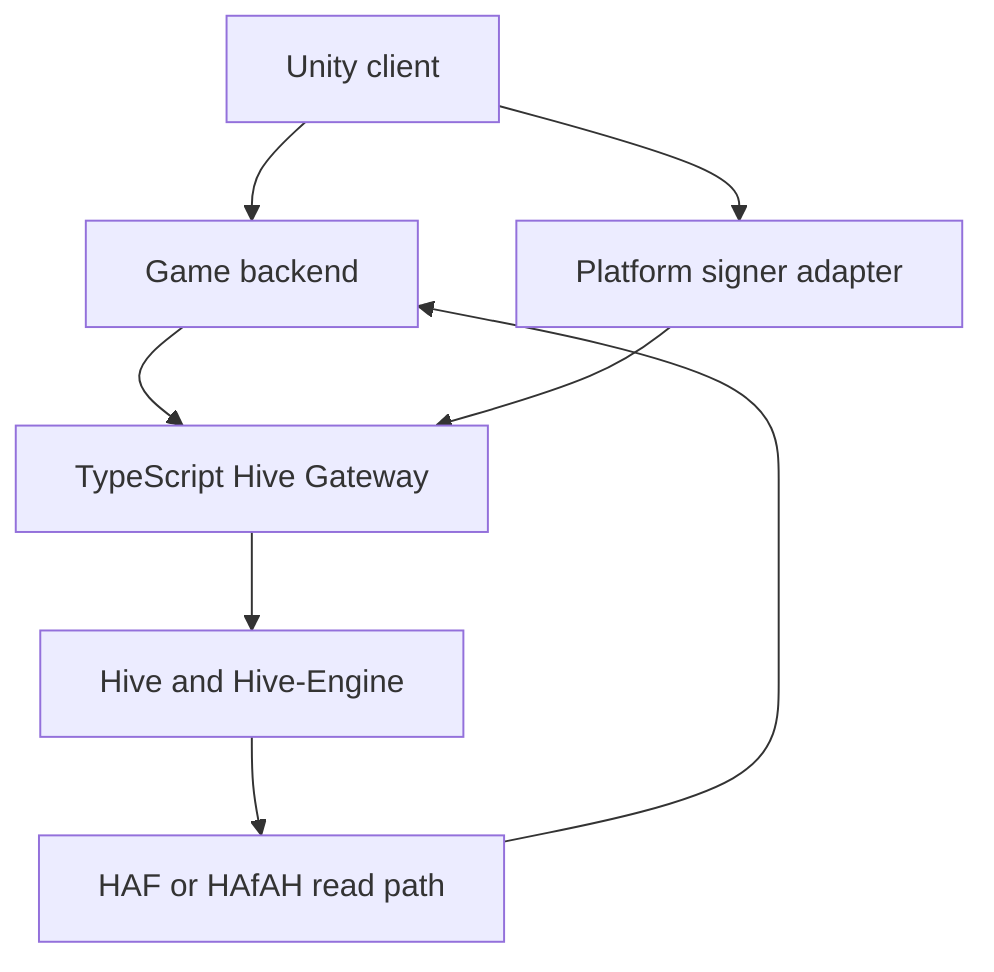
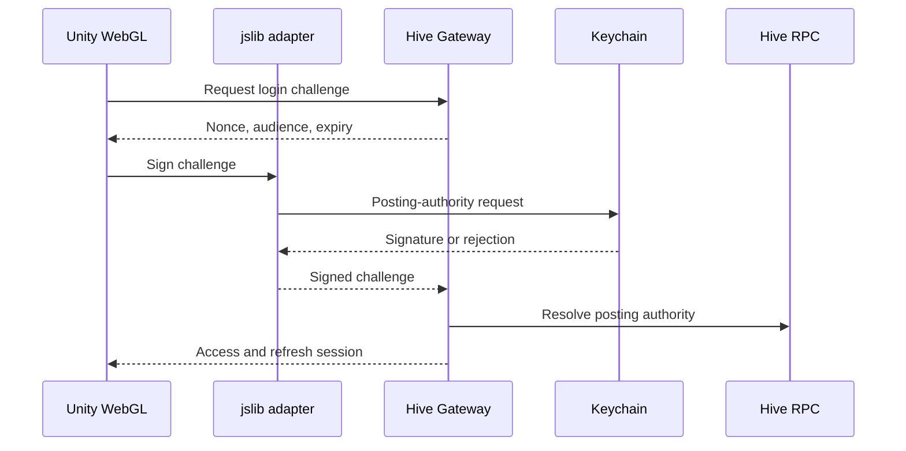
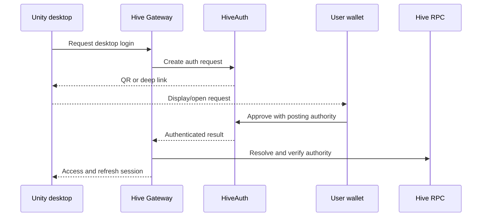

# Hive Chameleon - Hive Layer Design

## 1. Purpose

This document defines the explicit Hive layer for Hive Chameleon: what Hive is authoritative for, what remains in the game backend, how Unity authenticates and requests signatures across web and desktop builds, how on-chain data is indexed, and how keys, Resource Credits, payments, and trust boundaries are handled.

The design deliberately avoids copying ordinary game data onto Hive. Hive is used where it provides a concrete property that the centralized backend cannot provide alone:

- Proof that a player controls a Hive account
- Permanent ownership of issued collectible cosmetics and badges
- Native Hive posts and votes for creator map showcases
- Publicly visible HIVE, HBD, and AFIT tournament payments and payouts

Real-time gameplay and operational product data remain off-chain.

## 2. Design Decisions

1. A Hive account is the player identity root. Authentication uses a signed challenge; it does not require an on-chain registration transaction.
2. Normal matches, tournament results, statistics, achievements, likes, maps, and social relationships are not written to Hive.
3. Hive event history is authoritative only for issued collectible ownership.
4. Collectible cosmetics and collectible badges are non-transferable in the approved scope.
5. Creator map showcases use native Hive posts and votes, but map ownership, attribution, review, versions, and files remain in the backend.
6. Tournament gameplay and outcomes remain in PostgreSQL. Only entry payments and payouts are on-chain.
7. No new Hive-Engine token is created. HIVE, HBD, and the existing AFIT token may be used for approved payment flows.
8. Generic match, achievement, camouflage, and tournament sharing buttons are excluded. One-click map-showcase publishing remains part of the creator flow.
9. WAX (`@hiveio/wax`) is the standard transaction-construction and serialization library.
10. HAF/HAfAH is the standard Hive read path. Initial deployment may consume a public endpoint; self-hosting is deferred until justified.
11. No Unity client receives, stores, or ships a Hive private key.
12. Existing authenticated gameplay continues during a Hive outage; Hive-dependent actions pause.

## 3. On-Chain and Off-Chain Boundary

| Capability | On-chain responsibility | Off-chain responsibility |
| --- | --- | --- |
| Hive account identity | Hive account and signed proof of posting authority | Session, profile, device policy, permissions |
| Gameplay, matches, and results | None | Full authoritative state and history |
| Statistics and achievements | None | Progress, unlock conditions, statistics |
| Collectible badges | Issuance/revocation and ownership | Definition, progress, images, presentation |
| Cosmetic collectibles | Issuance/revocation and ownership | Catalog, assets, prices, availability, equip state |
| Maps and attribution | None | File, creator attribution, versions, hashes, review status |
| Map showcase | Native Hive post and vote | Draft, portal workflow, cached presentation |
| Friends and social graph | None | Friends, invitations, blocks, presence |
| Tournament entry and payout | Native HIVE/HBD transfer or Hive-Engine AFIT transfer | Rules, eligibility, live state, result, winner calculation |
| Notifications | None | All delivery and read state |
| Generic sharing | No feature | No feature |

### 3.1 Why Match Results Stay Off-Chain

The authoritative game server already calculates and stores match outcomes. Publishing the same result through an official Hive account would prove only that the server published a statement; it would not independently reproduce or verify the match simulation. Writing every result would also create permanent public activity, RC consumption, additional schemas, and indexer complexity without changing the trust boundary.

PostgreSQL therefore remains authoritative for all match results. Tournament transparency is provided by visible entry and payout transactions, not by an additional result event.

## 4. High-Level Flow



The Unity client handles presentation and gameplay. The game backend owns accounts, sessions, gameplay, inventory presentation, tournaments, and internal authorization. The Hive Gateway builds and validates transaction intents using WAX and coordinates signing providers. HAF/HAfAH reads confirmed Hive activity back into a separate indexed projection consumed by the backend.

## 5. Components and Responsibilities

### 5.1 Unity Client

- Requests authentication challenges and Hive action intents from the backend.
- Displays Keychain, HiveAuth, or HiveSigner approval state.
- Never accepts a raw private key, master password, or service key.
- Treats all client-supplied usernames, transaction IDs, prices, and collectible IDs as untrusted input.
- Uses the same backend session and Hive account across supported platforms.

### 5.2 WebGL JavaScript Bridge

- Implemented as a Unity `.jslib` bridge.
- Detects the browser-injected Keychain API.
- Passes a backend challenge or validated transaction intent to Keychain.
- Returns only the approval result, signature/transaction result, and safe error data to Unity.
- May use the browser build of WAX for canonical encoding and validation.

Hive Keychain documents browser injection and supports signing buffers, transactions, posts, votes, transfers, and `custom_json` requests. See the [official Keychain integration documentation](https://github.com/hive-keychain/hive-keychain-extension/blob/master/documentation/README.md).

### 5.3 TypeScript Hive Gateway

- Uses WAX as the canonical Hive transaction model.
- Generates login challenges and transaction intents with expiration and nonce values.
- Validates requested operation type, account, authority, recipient, amount, memo, and application payload.
- Coordinates HiveAuth and HiveSigner flows for desktop clients.
- Verifies returned signatures or transaction details before the backend accepts the action.
- Submits service-authorized collectible events to the isolated issuer signer.
- Submits approved payouts to the isolated treasury signer.
- Does not expose service keys to the game backend or clients.

WAX provides Hive protocol functionality for TypeScript/JavaScript and supports multiple signer strategies. See the [official WAX TypeScript project](https://gitlab.syncad.com/hive/wax/-/tree/develop/ts).

### 5.4 HAF/HAfAH Read Path

- Reads relevant account history, application `custom_json`, native transfers, posts, and votes.
- Tracks block, transaction, operation, and irreversible status.
- Supports fork-aware rollback before application state is considered final.
- Produces a normalized Hive projection for the game backend.
- Starts with an approved public endpoint.
- Moves to a dedicated HAF application or self-hosted deployment only when availability, volume, or query needs justify it.

HAF is PostgreSQL-native and designed for fork-aware Hive applications. HAfAH is a read-only HAF application exposing account-history data through a REST service. See the [official HAF repository](https://gitlab.syncad.com/hive/haf) and [official HAfAH repository](https://gitlab.syncad.com/hive/HAfAH).

HAfAH exposes history; it does not replace the game's own domain projection. The application still validates expected signers, operation types, payload schemas, recipients, amounts, and idempotency rules.

### 5.5 PostgreSQL Boundaries

Chain-derived data and mutable game data use separate schema/database boundaries even when both use PostgreSQL technology.

- **Game database:** accounts, sessions, profiles, gameplay, matches, statistics, maps, tournaments, catalogs, equip state, and notifications.
- **Hive projection:** indexed operation identity, confirmation state, collectible ownership, verified payments, payouts, and community-content references.

The game database may cache finalized collectible ownership for fast reads. The cache is not allowed to invent or change ownership independently of validated Hive history.

## 6. Cross-Platform Authentication

### 6.1 Common Authentication Contract

1. Player submits a normalized lowercase Hive account name.
2. Backend creates a single-use challenge containing a cryptographically random nonce, audience, issue time, expiration, and device-session identifier.
3. The player approves the challenge with posting authority through the platform signer.
4. The Hive Gateway verifies the signature against the account's current posting authority.
5. A successful login revokes the previous refresh session and active game connection for that Hive account.
6. Backend issues a short-lived access token and a longer-lived, revocable refresh token.
7. No blockchain transaction and no RC are required for login.

Only one signed-in device is permitted per Hive account. There is no in-profile account switch. The player signs out before authenticating another account.

### 6.2 Unity WebGL: Keychain



Initial WebGL support uses Keychain through `.jslib`. A later fallback may add HiveAuth or HiveSigner for users without the extension.

### 6.3 Windows, macOS, and Linux: HiveAuth



HiveAuth is the initial desktop path because it supports application authentication without asking the application for a password or private Hive key. See the [official HiveAuth documentation](https://docs.hiveauth.com/).

HiveSigner through the system browser is a later desktop fallback. The game must validate OAuth state/callback correlation and the exact returned account and authority before issuing a session.

### 6.4 Signing Behavior

- Login approval occurs once when establishing a session.
- Every player-originated post, vote, or financial transfer requires explicit approval.
- The application performs no background player signing.
- Rejection affects only the requested action unless it is the required login action.
- Declining a map-showcase post leaves the draft unpublished.
- Declining a tournament payment leaves the player unregistered.
- Declining a vote leaves gameplay unaffected.

## 7. Authority and Key Model

| Actor/key | Permitted use | Storage and exposure |
| --- | --- | --- |
| Player posting authority | Login challenge, map-showcase post, map-showcase vote | Held only by Keychain, HiveAuth-compatible wallet, or HiveSigner; never received by Unity/backend |
| Player active authority | HIVE/HBD transfer and AFIT/Hive-Engine transfer | Held only by external signer; explicit approval for every action |
| Official issuer posting authority | `collectible_issued` and `collectible_revoked` | Isolated signing service; unavailable to Unity and general game services |
| Treasury active authority | Approved tournament payouts | Isolated payout signer with allow-lists, limits, and audit trail |
| RC-support authority | Controlled RC delegation/reclaim | Isolated administrative signer; not shared with issuer or gameplay processes |
| Owner authority | Recovery/governance only | Offline; never requested or used by the application |

The logical roles remain separate even if an initial deployment temporarily uses fewer Hive accounts. Production account names and custody procedures require explicit operational approval.

## 8. Hive Operation Mapping

| Product action | Hive operation | Authority | Accepted signer/recipient |
| --- | --- | --- | --- |
| Login | Off-chain signed challenge | Player posting | Account being authenticated |
| Issue cosmetic/badge | `custom_json` with ID `hive.chameleon` | Issuer posting | Configured official issuer only |
| Revoke cosmetic/badge | `custom_json` with ID `hive.chameleon` | Issuer posting | Configured official issuer only |
| Publish map showcase | `comment` (and optional `comment_options`) | Creator posting | Authenticated creator account |
| Upvote map showcase | `vote` | Player posting | Authenticated voter account |
| HIVE/HBD tournament entry | `transfer` | Player active | Configured official treasury |
| HIVE/HBD tournament payout | `transfer` | Treasury active | Backend-approved winner account |
| AFIT tournament entry | Hive-Engine `tokens.transfer` through `custom_json` ID `ssc-mainnet-hive` | Player active | Configured official treasury |
| AFIT tournament payout | Hive-Engine `tokens.transfer` | Treasury active | Backend-approved winner account |

Hive `custom_json` supports posting or active required authorities. Native posts/comments, votes, and transfers use their corresponding Hive operations. See the [official Hive broadcast-operation reference](https://developers.hive.io/apidefinitions/broadcast-ops.html).

Hive-Engine accepts contract actions through Hive `custom_json`; token transfers use the `tokens` contract and require active authority. See the [official Hive-Engine developer documentation](https://hive-engine.github.io/engine-docs/) and [token contract reference](https://github.com/hive-engine/steemsmartcontracts-wiki/blob/master/Tokens-Contract.md).

HAF inclusion proves that the underlying AFIT `custom_json` reached Hive, but it does not by itself prove successful Hive-Engine contract execution. AFIT payment verification must also check the Hive-Engine transaction/contract result before granting tournament entry or marking a payout successful.

## 9. Collectible Protocol

### 9.1 Namespace and Envelope

All Hive Chameleon collectible events use one application ID:

```text
hive.chameleon
```

This value is provisional until manager approval. It must be approved before the first production event because consumers will index it permanently.

Common payload envelope:

```json
{
  "v": 1,
  "type": "collectible_issued",
  "event_id": "019...uuidv7",
  "occurred_at": "2026-07-10T12:00:00Z",
  "data": {}
}
```

Rules:

- UUIDv7 is used for event and collectible-instance IDs.
- Hive account names are normalized to lowercase.
- `v` is the schema version. Breaking changes increment it; additive optional fields do not.
- Historical events are never edited.
- Corrections are new events that reference the original event.
- Application payloads are limited to 6 KiB, below Hive's 8,192-byte custom-operation data limit.
- Duplicate `event_id` values are ignored after the first valid finalized event.

### 9.2 `collectible_issued`

```json
{
  "v": 1,
  "type": "collectible_issued",
  "event_id": "019...uuidv7",
  "occurred_at": "2026-07-10T12:00:00Z",
  "data": {
    "collectible_id": "019...uuidv7",
    "definition_id": "weapon-skin.rpg-neon.v1",
    "kind": "weapon_skin",
    "owner": "alice",
    "issuer": "approved-issuer-account",
    "reason": "purchase",
    "metadata_uri": "https://assets.example/collectibles/weapon-skin.rpg-neon.v1.json",
    "metadata_sha256": "64-lowercase-hex-characters",
    "payment_tx_id": "optional-hive-or-hive-engine-transaction-id"
  }
}
```

Approved `kind` values initially include:

- `badge`
- `weapon_skin`
- `character_material`
- `lobby_emote`
- `profile_frame`
- `victory_effect`

Each issued copy receives its own collectible-instance UUID even when many copies reference the same definition. Both badges and cosmetics are non-transferable. Equip/unequip is not an on-chain event.

The metadata file remains off-chain, while its hash anchors the version used at issuance. Metadata changes require a new definition/version rather than silently changing the meaning of an existing issued collectible.

### 9.3 `collectible_revoked`

```json
{
  "v": 1,
  "type": "collectible_revoked",
  "event_id": "019...uuidv7",
  "occurred_at": "2026-07-10T13:00:00Z",
  "data": {
    "collectible_id": "019...uuidv7",
    "issued_event_id": "019...uuidv7",
    "reason_code": "issuance_error"
  }
}
```

Revocation never deletes history. The projection marks the instance revoked only when:

- The event schema is valid.
- The signer is the configured official issuer.
- The referenced issuance is valid and finalized.
- The collectible has not already been revoked.

Free-form private evidence is not placed in the payload. Internal audit material remains off-chain.

### 9.4 Hive `custom_json` Wrapper

```json
{
  "required_auths": [],
  "required_posting_auths": ["approved-issuer-account"],
  "id": "hive.chameleon",
  "json": "<serialized collectible envelope>"
}
```

Any Hive account can broadcast a payload using the same application ID. Therefore, the ID alone is never trusted. The indexer accepts issuance/revocation events only when the signer matches the configured issuer allow-list.

## 10. Tournament Payment Correlation

The initial tournament model uses an official treasury. Community-organized custody is deferred.

### 10.1 HIVE/HBD

- Player signs a native transfer to the configured treasury.
- Memo contains a non-sensitive structured correlation value such as:

```text
hive.chameleon:tournament:<tournament-uuidv7>:entry
```

- Backend verifies sender, recipient, asset, amount, memo, transaction uniqueness, inclusion, and irreversible status.
- A transaction ID can satisfy only one entry.
- Payout uses the same tournament ID with `:payout` in the memo.

### 10.2 AFIT

- Player signs a Hive-Engine `tokens.transfer` for symbol `AFIT` using active authority.
- Contract payload includes the treasury recipient, exact quantity, and tournament correlation memo.
- Backend verifies both the underlying Hive operation and successful Hive-Engine execution.
- Payout follows the same validation rules in the opposite direction.

### 10.3 What Is Not Published

The Hive layer does not publish tournament brackets, participants beyond what transfers already reveal, scores, winner calculations, or match-result hashes. The backend remains authoritative for eligibility and winner calculation; the chain proves only the movement of value.

## 11. Trust Boundary and Forgery Resistance

The authoritative game server remains responsible for gameplay. No client or player-signed operation can create a valid game result, map approval, tournament result, or collectible issuance.

Controls:

1. Unity requests an intent; it does not construct authoritative service events.
2. The Hive Gateway allow-lists operation types, signers, recipients, assets, and amount policies.
3. Collectible events are valid only from the configured issuer account.
4. Internal issuance requests require service authentication, authorization, idempotency, and an audit record.
5. Treasury payouts require an approved backend payout instruction and strict destination/amount checks.
6. Player transaction IDs are verified against indexed chain data rather than trusted from the client.
7. Payment transactions cannot be reused.
8. HAF fork rollback removes pending projections until the operation reappears or is replaced.
9. Unknown event types, unsupported schema versions, oversized payloads, invalid UUIDs, and unexpected authorities are rejected.
10. PostgreSQL ownership rows cannot be mutated directly to create ownership; they are derived from valid finalized events.

This is a trust-boundary design, not a client anti-cheat system. It prevents forged Hive-layer state while real-time game fairness remains the responsibility of the authoritative match server.

## 12. Confirmation and Transaction State

Every Hive-dependent action uses one of these states:

- `requested`
- `awaiting_signature`
- `broadcast`
- `included`
- `irreversible`
- `rejected`
- `expired`
- `failed`

Policy:

- Login succeeds after signature verification; no block confirmation exists because login is not a transaction.
- A post or vote may show success after block inclusion.
- Collectible ownership is pending at inclusion and finalized only when irreversible.
- Tournament entry and payout remain pending until irreversible and, for AFIT, until Hive-Engine execution is verified.
- Rejected or expired signatures are not retried silently.
- A new request requires fresh user approval.

## 13. Resource Credits and Rate Limits

Hive transactions consume Resource Credits rather than ordinary per-transaction gas fees. The Hive Gateway checks player RC through the Hive RC API before requesting a signed action. The official API exposes `rc_api.find_rc_accounts` for current RC availability. See the [Hive API reference](https://developers.hive.io/apidefinitions/).

Initial policy:

- Show a clear low-RC state before requesting an action likely to fail.
- Provide controlled RC delegation from an application support account.
- Apply eligibility and abuse checks before delegation.
- Use a small configurable delegation amount.
- Apply per-account cooldowns and rate limits.
- Reclaim delegation after prolonged inactivity where operationally appropriate.
- Provision issuer, treasury, and RC-support accounts independently.
- Do not promise unlimited free on-chain actions.

Rate limits are configuration, not protocol schema. At minimum they cover login challenges, outstanding signing intents, community actions, payment checks, collectible issuance, and RC delegation requests.

## 14. Failure and Outage Behavior

### 14.1 Hive RPC or Signer Unavailable

- Existing authenticated gameplay continues.
- New authentication pauses if current authority cannot be resolved and verified safely.
- New collectible, payment, post, and vote actions pause.
- Cached finalized Hive data remains readable.
- The UI shows the affected Hive feature as unavailable.
- No match is aborted solely because Hive becomes unavailable.
- No unsigned or rejected player transaction is queued for later automatic signing.

### 14.2 HAF/HAfAH Unavailable

- Cached finalized ownership may be displayed with a stale-data indicator.
- Ownership-changing and payment-dependent actions pause.
- The system does not finalize a transaction based only on a client-provided transaction ID.
- Endpoint failover may be attempted through an allow-listed provider set.

### 14.3 Fork/Reorganization

- Included but reversible operations remain pending.
- The Hive projection follows HAF rollback.
- Derived ownership/payment state is reverted with the operation.
- Finalized game actions are triggered only after the required irreversible state.

## 15. Security Requirements

- Never collect or log Hive master passwords or private player keys.
- Never embed issuer, treasury, or RC-support keys in Unity, WebGL assets, source bundles, or general backend configuration.
- Never request owner authority.
- Use the least authority required for each action.
- Keep issuer posting, treasury active, and RC-support signing responsibilities isolated.
- Restrict treasury signing to allow-listed operations, assets, recipients, and payout limits.
- Require authenticated internal authorization and idempotency for service signing.
- Store refresh tokens using platform-appropriate secure storage and server-side revocation records.
- Revoke the previous account session when a new device signs in.
- Validate HiveSigner state/callback values and HiveAuth request correlation.
- Validate the exact operation shown to and signed by the player.
- Exclude private keys, tokens, email, IP, device identifiers, lobby passwords, invitation codes, and internal evidence from on-chain payloads.
- Record audit events without recording secrets.

## 16. Delivery Scope

### 16.1 Initial Hive Layer

- WebGL Keychain login through `.jslib`
- Desktop HiveAuth login through QR/deep-link/WebSocket flow
- Posting-authority signed challenge
- Single-device session enforcement
- TypeScript Hive Gateway using WAX
- Public HAF/HAfAH read path and separate Hive projection
- `collectible_issued` and `collectible_revoked`
- Collectible ownership view backed by finalized Hive history
- Controlled RC assistance
- Hive outage and transaction-state UX

### 16.2 Later/Conditional

- HiveAuth or HiveSigner fallback for WebGL users without Keychain
- HiveSigner desktop fallback
- Creator map-showcase post/vote flow when the Creator Workshop ships
- Controlled HIVE/HBD/AFIT tournament entry and payout flow
- Dedicated/self-hosted HAF application if justified

### 16.3 Explicitly Out of Scope

- On-chain player registration
- On-chain normal or tournament match results
- On-chain statistics or normal achievements
- On-chain map attribution, files, review, or versions
- On-chain friends, invitations, blocks, presence, or disguise likes
- Generic sharing buttons
- Transfer or resale of badges or cosmetics
- A new Hive-Engine reward token
- Player private-key custody
- Silent/background player signing

## 17. Open Decisions Before Production

1. Manager approval of the `hive.chameleon` protocol namespace
2. Production Hive account names for issuer, treasury, and RC support
3. Issuer and treasury custody/signing implementation
4. Public HAF/HAfAH endpoint selection and failover providers
5. HiveAuth service selection and HiveSigner application registration
6. RC eligibility threshold, delegation amount, cooldown, and reclaim duration
7. Treasury payout approval thresholds and operational limits
8. Collectible metadata host, retention policy, and content-versioning process
9. Exact rollout phase for tournament payments and creator showcase actions

## 18. Checklist Coverage

| Card requirement | Covered in |
| --- | --- |
| Define what makes the game Hive-based | Sections 1-3 |
| On-chain versus off-chain split | Section 3 |
| Map actions to operations and schemas | Sections 8-10 |
| WebGL Keychain path | Sections 5-6 |
| Desktop HiveAuth/HiveSigner path | Section 6 |
| Key and permission model | Section 7 |
| WAX standardization | Sections 5 and 6 |
| HAF/HAfAH reads/indexing | Section 5 |
| Hive account to player identity | Section 6 |
| Trust boundary and forged actions | Section 11 |
| RC, limits, and delegation | Section 13 |
| Token/reward decision | Sections 2 and 16 |
| On-chain/off-chain diagram | Section 4 |