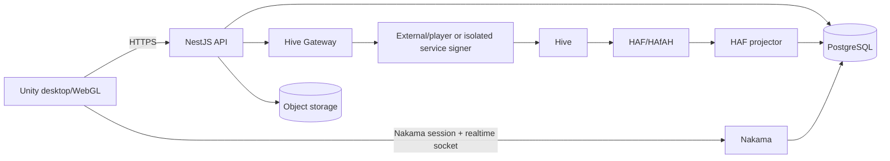
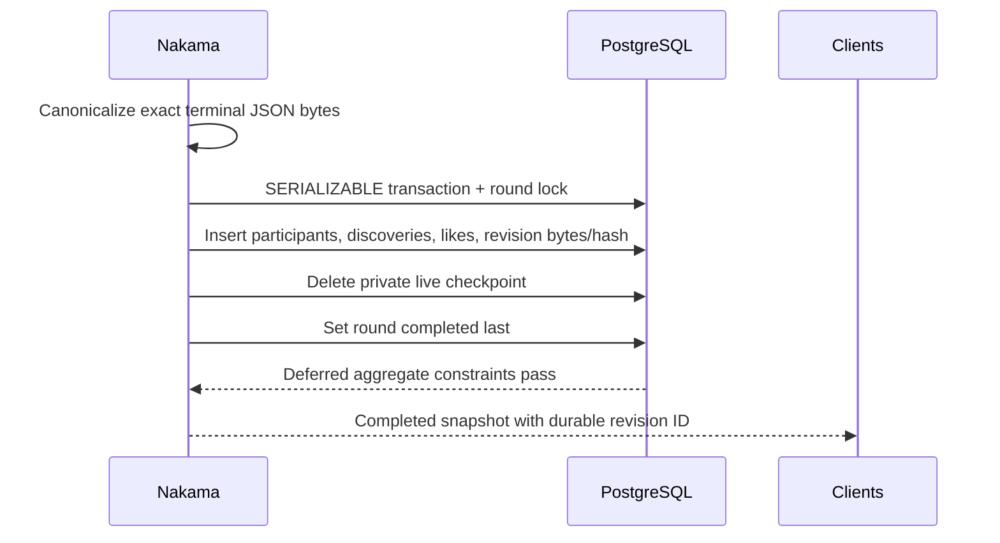

# Hive Chameleon — Architecture and API Design

## 1. System shape

Hive Chameleon is an authoritative multiplayer game with a Unity client, NestJS product API,
Nakama realtime runtime, PostgreSQL durability, and narrowly scoped Hive integration services.

Authority boundaries:

- Nakama owns lobby and live-match decisions.
- PostgreSQL owns durable product state, exact terminal results, and revision history.
- Hive account authorities own player-authorized Hive actions.
- Accepted irreversible Hive history owns collectible, transfer, and other projected chain evidence.
- Object storage owns binary map/media artifacts; PostgreSQL stores their metadata and hashes.
- Unity renders server state and requests commands; it does not declare outcomes.

## 2. Deployable components

| Component | Responsibility | Principal dependencies |
| --- | --- | --- |
| Unity client | Menus, lobby/game presentation, input, wallet/provider handoff | API, Nakama, packaged map/assets |
| NestJS API | Product auth, profiles, onboarding, configuration, Hive intents | PostgreSQL, Hive Gateway, providers |
| Nakama runtime | Lobbies, role assignment, simulation, reconnect, score/result commit | PostgreSQL |
| PostgreSQL | Identity, lobby/result history, maps, commerce, tournaments, projections | Backups and migrations |
| Hive Gateway | Canonical WAX operations, authorization policy, signer boundary | Hive RPC, configured signers |
| Provisioning worker | Sponsor-backed account creation, custody and initial RC workflow | PostgreSQL, sponsor/custody, Hive |
| Collectible issuer | Approved issue/revoke events | PostgreSQL, Hive Gateway, signer |
| Treasury worker | Approved bounded transfers | PostgreSQL, Hive Gateway, signer |
| RC-support worker | Approved delegation/reclaim | PostgreSQL, Hive Gateway, signer |
| HAF projector | Fork-aware operation evidence and irreversible projections | HAfAH/Hive RPC, PostgreSQL |

Production workloads use separate identities and least-privilege network/database policy. The
general API and Nakama runtime do not receive official signer or custody credentials.

## 3. Identity and sessions

### 3.1 Direct Hive

1. `POST /api/v1/auth/hive/challenges` issues a short-lived challenge bound to account, audience,
   device session, nonce, issuance, and expiry.
2. The player signs outside Unity with an approved Hive provider.
3. `POST /api/v1/auth/hive/sessions` consumes the challenge once, verifies current posting
   authority, and issues access/refresh credentials.
4. Refresh rotation revokes the previous token hash; explicit logout revokes the session.

### 3.2 Google provisioning

1. `POST /api/v1/auth/google/exchange` verifies OIDC and maps the protected issuer/subject identity.
2. A linked player receives a normal session. A new identity receives a restricted onboarding
   token whose next step is permanent username selection.
3. Username confirmation creates or resumes one idempotent provisioning job.
4. The provisioning worker generates four custody key references, submits the sponsor request,
   observes account creation and authorities, verifies initial RC, and links the player.
5. Only the ready state can issue a playable session.

Onboarding tokens authorize only onboarding resources. They are not game access tokens, Hive
signatures, or Nakama credentials.

### 3.3 Realtime bridge

`POST /api/v1/realtime/session` requires a current playable product session and mints a short-lived
Nakama token scoped to the same player. Nakama validates the signed bridge assertion and never
accepts a client-selected player ID.

## 4. Realtime game authority

The supported lobby flow is create/join → configure/nominate → ready/start → role reveal → hiding →
hunting → Answer Check → completed result → return to lobby.

Nakama validates host ownership, membership, capacity, map distribution, protocol/build
compatibility, and legal state transition for every command. Host and guest are client roles only;
the server remains authoritative regardless of which player currently hosts lobby controls.

The live match checkpoint contains private role assignments, timers, accepted avatar state,
ammunition/reload state, discoveries, likes, score cadence, reconnect reservations, and command
idempotency caches. A fenced compare-and-swap heartbeat permits process recovery while preventing
an old handler from overwriting a newer handler.

### 4.1 Terminal result

The initial revision stores the exact canonical UTF-8 JSON bytes and SHA-256. Database constraints
verify the bytes/hash pair. An ambiguous retry succeeds only if the already-committed round and
evidence are identical. Corrections append a complete replacement revision; invalidations append a
revision without replacement bytes. Existing terminal evidence is immutable.

### 4.2 Reconnect

Normal disconnect reserves the player's outcome for 60 seconds. A warm reconnect uses the same
Nakama session and lobby. Cold reconnect uses the authenticated API recovery path to discover the
active reservation, obtain a new realtime credential, and rejoin the authoritative round. Expiry
converts or eliminates according to the active game mode; it never extends merely because a
process restarted.

`GET /api/v1/me/reconnect` is a narrow security-definer projection over the private live checkpoint.
It returns only the authenticated player's lobby ID, fixed expiry, and restoration mode; it omits
the round ID and all private match state. The API cannot select the checkpoint table. The client
must still claim the returned descriptor through `match.reconnect`, where Nakama validates current
membership, reservation ownership, and authoritative role/outcome state before returning a match ID.

## 5. HTTP API conventions

- Base path: `/api/v1`.
- JSON uses camelCase; durable identifiers are lowercase UUIDv7 strings.
- Timestamps are RFC 3339 UTC.
- Errors use `application/problem+json` with stable code, title, status, and safe detail.
- Mutating retryable commands require an idempotency key where the operation can cross a process or
  provider boundary.
- Access tokens and onboarding tokens have disjoint audiences/scopes.
- Responses containing tokens or account workflow state use `Cache-Control: no-store`.

The normative HTTP contract is
[`openapi.yaml`](./openapi.yaml). Realtime RPC/event names and payloads are implemented by the
Nakama runtime and mirrored in typed Unity models.

## 6. Hive transaction boundary

Player operations are explicitly authorized product actions, then encoded canonically by Hive
Gateway. Self-custodial players sign through their selected provider. Google-provisioned unclaimed
players can use the custody signer only for the current player/account/session and allow-listed
operation. Service operations use dedicated accounts and isolated signers.

The gateway binds idempotency key, policy version, role, account, authority, expected public key,
key reference, canonical operation, digest, and transaction ID. A signer reconstructs the request
and denies any mismatch before signing.

## 7. HAF projection

The projector stores block checkpoints and raw application operations first. It retains malformed
or unauthorized evidence with safe rejection codes. Included rows are reversible; irreversible
rows cannot be reverted.

Only accepted, allow-listed, irreversible events materialize product state. Collectible issuance
must agree with the local definition, owner, metadata, and optional payment. Revocation must target
the finalized matching issuance. Fork replacement marks the old reversible branch, applies the new
branch, and replays by stable identity.

## 8. Maps and binary assets

PostgreSQL records stable map/version identity, immutable manifest, package/media hashes, review,
and platform distribution. Binary packages and images live in object storage or approved bundled
client assets. A round starts only when its exact map version has an available distribution for the
requesting platform/build/protocol.

Licensed Asset Store content needs a repository-safe distribution strategy. Source assets that
cannot be redistributed are restored through documented licensed package setup; approved derived
or bundled runtime artifacts must carry clear provenance and license review.

## 9. Failure behavior

| Failure | Behavior |
| --- | --- |
| PostgreSQL unavailable | Do not acknowledge durable mutations; active authority fails closed where state cannot be checkpointed |
| Nakama process loss | Recover only from a valid fenced private checkpoint; otherwise fail closed |
| Hive/RPC unavailable | Continue live play; pause/retry Hive-dependent authentication and actions |
| HAfAH disagreement or deep fork | Stop finality advancement and alert; retain evidence |
| Signer/custody uncertainty | Fence the attempt for replay or reconciliation; do not sign again blindly |
| Object storage unavailable | Existing packaged content may run; uploads/downloads requiring it fail with a retryable dependency error |

## 10. Hetzner deployment

The production topology uses Hetzner environments with separate staging and production secrets,
databases, API/Nakama workloads, worker identities, TLS endpoints, monitoring, and backups. Unity
WebGL may be hosted statically, but it requires live API/Nakama endpoints and browser login/session
delivery; the client is not an offline gameplay authority.

Migrations run as a reviewed deployment step before workload promotion. Deployments perform health
checks, retain the previous artifact for rollback, and verify database backup/restore procedures.
No example credential in the repository is valid for production.

## 11. Verification

CI must cover:

- TypeScript build/lint/tests for API, gateway, and workers;
- Go formatting, vet, unit tests, and race tests for Nakama runtime;
- clean PostgreSQL migration/constraint/role tests;
- OpenAPI and DBML validation;
- authoritative two-client smoke flow;
- canonical result byte/hash replay and conflict behavior;
- fork rollback/LIB promotion and service-policy denial; and
- Unity edit/play-mode tests plus human visual acceptance for player-facing changes.
