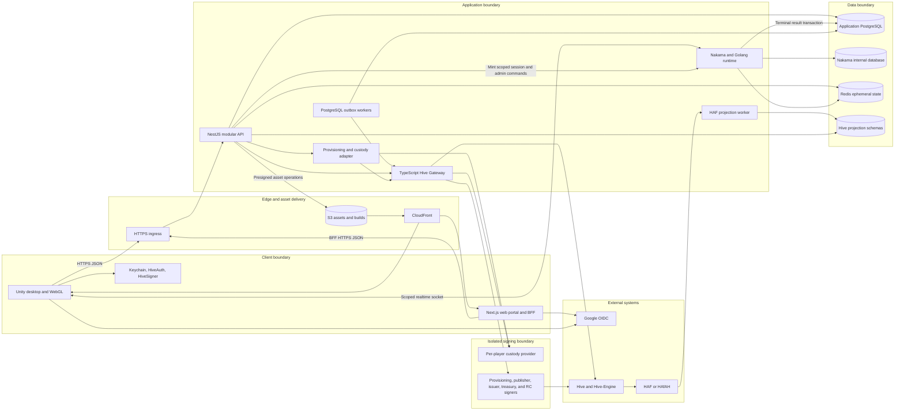
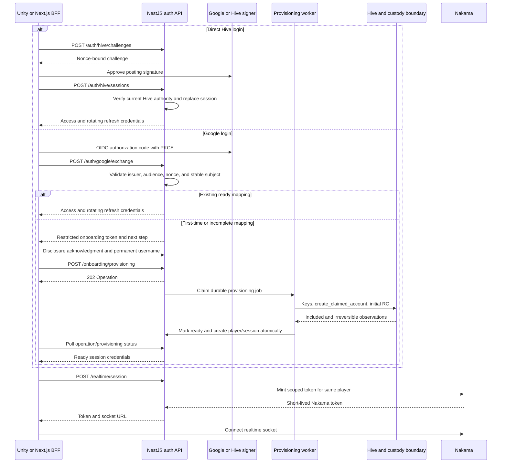
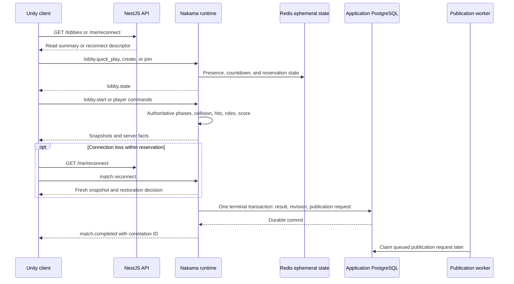
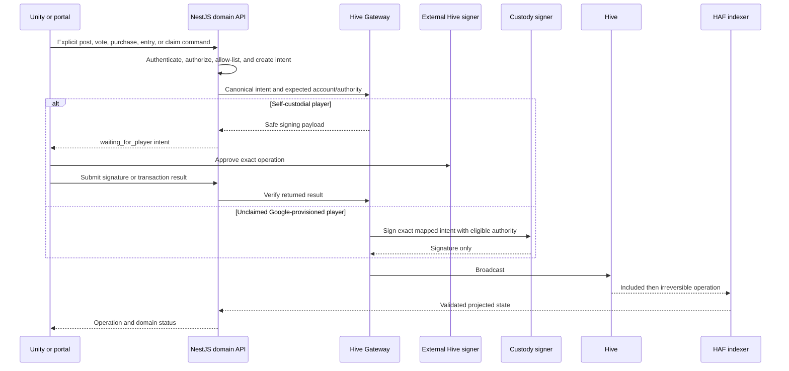
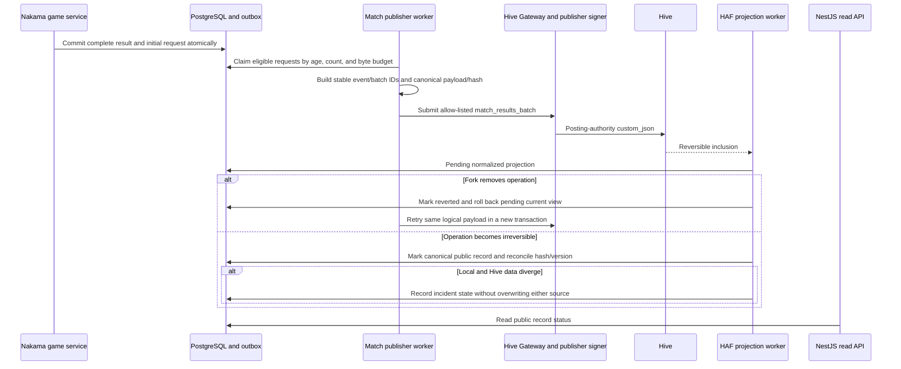

# Hive Chameleon — High-Level Architecture and Main API Design

**Deliverable:** High-level architecture diagram and main API endpoints

**Architecture style:** Logical containers plus key flows

**Status:** Ready for review

## 1. Purpose

This document defines the high-level runtime architecture and interface boundaries for Hive Chameleon. It translates the approved Product Spec, Hive-Layer Design, and data model into deployable logical components without selecting an AWS compute topology or writing implementation code.

The deliverable covers:

- client, service, worker, data-store, blockchain, and external-provider boundaries;
- which interface uses HTTP, Nakama RPC/realtime messaging, direct object delivery, or an internal worker contract;
- a client-facing OpenAPI 3.1 draft for P0, P1, and explicitly conceptual P2 endpoints;
- the main Nakama commands and server events without pretending that HTTP owns live simulation;
- authentication, asynchronous operation, idempotency, finality, outage, and trust-boundary rules; and
- feature-to-interface coverage for every prioritized backlog item.

This document does not replace the detailed gameplay networking design, production AWS topology, security runbooks, database migrations, or provider-selection spikes.

## 2. Architecture decisions

1. The ordinary product backend starts as one NestJS modular monolith. Identity, social, content, commerce, tournament, and read-model modules have explicit code and authorization boundaries but share one initial deployment.
2. Nakama with a Golang runtime owns lobby presence, matchmaking, host state, realtime commands, authoritative simulation, reconnect decisions, and terminal gameplay result production.
3. NestJS owns durable client HTTP APIs, sessions, product authorization, profiles, social features, catalogs, commerce orchestration, creator workflows, and read views.
4. Privileged Hive responsibilities remain isolated from the ordinary NestJS process: Hive Gateway, account provisioning/custodial signing, match publication, HAF projection, collectible issuance, treasury payout, and RC-support workers have distinct identities and least-privilege access.
5. PostgreSQL state and outbox rows coordinate durable asynchronous work. Workers poll or claim rows idempotently. Redis is limited to ephemeral presence, discovery acceleration, short-lived challenges/callback correlation, rate limiting, locks, and cache.
6. The client API uses HTTP/JSON under `/api/v1`; live lobby/gameplay traffic uses a scoped Nakama session and Nakama RPC/realtime messages.
7. OpenAPI describes only client-facing HTTP. Internal services and Nakama messages are documented here so privileged endpoints are not accidentally exposed as public API.
8. Conceptual P2 routes are marked `x-priority: P2` and `x-maturity: conceptual`. Their existence in the draft is not approval of unresolved transfer, resale, fiat, organizer, or experimental-gameplay rules.
9. Live gameplay never waits for Hive. Official match publication never depends on a client request or player key.
10. No client or general backend process receives a Hive private key, master password, seed phrase, raw custodial key, service-account key, or raw Google token after OIDC exchange.

## 3. Logical architecture

The diagram is logical, not a network topology. Production remains constrained to AWS `eu-central-1`, but ECS/EKS/EC2, VPC layout, database product, load-balancer shape, autoscaling, and disaster-recovery topology require a later deployment card.

### 3.1 Component responsibilities

| Component | Primary responsibility | Must not do |
| --- | --- | --- |
| Unity client | Presentation, input, prediction/interpolation, signer-adapter launch, realtime connection | Declare authoritative hits, roles, results, ownership, payments, or service events |
| Next.js portal/BFF | Web UI, server-side API mediation, secure browser session cookie, creator/profile/shop/tournament pages | Hold Hive player/service keys or bypass NestJS authorization |
| NestJS modular API | Durable HTTP resources, sessions, domain authorization, async operation views, product orchestration | Run authoritative frame simulation or directly use service signing keys |
| Nakama Golang runtime | Matchmaking, lobbies, presence, host lifecycle, simulation, reconnect, terminal result production | Treat client messages as facts or publish official Hive summaries itself |
| PostgreSQL workers | Claim durable jobs/outboxes and execute idempotent orchestration | Use Redis queues as the only durable record |
| Hive Gateway | Build/validate WAX operations and route an approved intent to the correct signer | Expose signer credentials or accept arbitrary operations/recipients/assets |
| Provisioning/custody adapter | One-subject/one-account provisioning, per-player key references, custodial signing, claim workflow | Publish matches, issue collectibles, hold treasury funds, or sign unrelated player actions |
| Match publisher worker | Build bounded summaries from committed results and publish through the official publisher | Require a player signature or modify complete results |
| HAF projection worker | Fork-aware operation ingestion, allow-list/schema validation, normalized projections and reconciliation | Treat reversible inclusion as final or invent ownership/results |
| S3/CloudFront | Immutable build, map, cosmetic, and media delivery by key/hash | Store relational authority or permit unreviewed map packages into live distribution |

### 3.2 Authority and persistence matrix

| State | Authoritative owner | Durable location | Client read path |
| --- | --- | --- | --- |
| Access/session identity | NestJS auth service | `identity.auth_session` plus short-lived Redis challenge state | HTTP bearer token |
| Google-to-Hive provisioning | Provisioning state machine plus observed Hive state | PostgreSQL identity tables and HAF operation projection | Onboarding HTTP and `Operation` status |
| Lobby presence and current host | Nakama authoritative runtime | Nakama runtime/internal storage; terminal history in application PostgreSQL | Nakama socket; HTTP summary cache |
| Movement, paint, shots, phase, live roles | Nakama authoritative runtime | Match runtime; only selected terminal facts persist | Nakama realtime events |
| Complete terminal round result | Authoritative game service | Application PostgreSQL | Authorized HTTP round view |
| Published public round summary | Irreversible Hive history | Hive plus HAF-derived local projection | HTTP public-record view |
| Collectible ownership | Accepted irreversible Hive event history | Hive plus commerce/projection cache | Inventory HTTP |
| Profiles, friends, maps, tournaments | NestJS domain modules | Application PostgreSQL | HTTP API |
| Payments | Native Hive/Hive-Engine evidence plus workflow state | Hive/Hive-Engine and PostgreSQL | Payment/operation HTTP views |
| Binary assets and builds | Object storage content addressed by hash | S3/CloudFront | CDN or short-lived distribution URL |

## 4. Client HTTP contract

The machine-readable contract is [`openapi.yaml`](./openapi.yaml). It is the source of truth for client-facing HTTP paths, schemas, status codes, security declarations, priority, and maturity metadata. This section defines the shared behavior that applies across those paths.

### 4.1 Session and token model

- Direct Hive login uses a backend nonce challenge and posting-authority signature through an external signer. Google login exchanges an OIDC authorization code with PKCE. Google authentication is not a Hive signature.
- A first-time Google identity receives a short-lived `onboardingBearer` token scoped to its deterministic external identity and single provisioning job. It is not a playable access token and cannot mint a Nakama session.
- A ready player receives a short-lived NestJS access JWT and a rotating opaque refresh credential. The database stores only a refresh-token hash.
- Unity stores refresh credentials in platform-appropriate secure storage. The Next.js BFF keeps the browser refresh credential in a Secure, HttpOnly, SameSite cookie and does not expose it to browser JavaScript.
- Establishing a new player session revokes the prior unrevoked session under the approved one-device rule.
- `POST /api/v1/realtime/session` validates the current game session and current public-record disclosure acknowledgment, then mints a short-lived Nakama token scoped to the same player. Direct-Hive players may sign in and acknowledge after login, but cannot enter realtime participation first. Nakama is not the identity root for NestJS.
- Claiming self-custody revokes custodial signing eligibility and outstanding custodial intents. Whether Google remains a game-login credential after claim remains an open product decision.

### 4.2 Common HTTP rules

| Concern | Contract |
| --- | --- |
| Base path | `/api/v1` |
| Media type | `application/json`; errors use `application/problem+json` |
| Errors | RFC 7807 fields plus stable lowercase `code`, request UUID, and optional field errors; no provider secrets or raw upstream payloads |
| Authentication | Bearer access JWT except explicitly anonymous authentication endpoints; restricted onboarding bearer where declared |
| Idempotency | `Idempotency-Key` UUID is mandatory on side-effecting commands that can be retried; the same key cannot represent different payloads |
| Optimistic concurrency | Mutable versioned resources require `If-Match`; responses return an opaque `ETag` derived from the resource version |
| Pagination | Opaque cursor plus bounded `limit`; clients cannot infer database offsets |
| Time | ISO 8601 UTC timestamps |
| Money and scores | Decimal strings; no binary floating-point JSON amounts |
| Identifiers | UUID/UUIDv7 where defined; normalized lowercase Hive usernames remain the human identity key |
| Request tracing | Server assigns a request UUID and returns it through problem payloads/log correlation; production may also expose `X-Request-Id` |
| Availability | `503` plus safe code and optional `Retry-After`; a dependency outage is not reported as a successful Hive action |

### 4.3 Asynchronous operations

Commands that depend on Hive, custody, payment finality, review, or another external system return `202 Accepted`, a `Location` header, and an `Operation` resource. The generic states are:

| State | Meaning |
| --- | --- |
| `pending` | Durable command accepted but not claimed by a worker |
| `in_progress` | Worker owns the current attempt |
| `waiting_for_player` | An external signer or explicit player step is required |
| `waiting_for_hive` | Broadcast, inclusion, irreversibility, or Hive dependency is pending |
| `succeeded` | Domain-specific completion criteria are satisfied |
| `failed` | Terminal safe error; a new logical command is required |
| `cancelled` | Command was explicitly cancelled or superseded before irreversible effects |

Domain resources retain their more precise states. For example, provisioning exposes `keys_ready` and `rc_delegated`, claim exposes `recovery_change_pending`, payment exposes `included` and `irreversible`, and match publication exposes fork/reconciliation state. A generic operation must not flatten those meanings into premature success.

### 4.4 Main endpoint groups

| Group | Main paths | Owner | Priority/maturity |
| --- | --- | --- | --- |
| Authentication | `/auth/hive/challenges`, `/auth/hive/sessions`, `/auth/google/exchange`, `/auth/refresh`, `/auth/session` | NestJS identity module and Hive Gateway verification | P0 committed |
| Google onboarding | `/disclosures/public-match/*`, `/onboarding/hive-username*`, `/onboarding/provisioning*` | NestJS identity module plus provisioning worker | P0 committed |
| Session bridge | `/realtime/session`, `/me/reconnect` | NestJS identity/game modules plus Nakama admin interface | P0 committed |
| Player/profile | `/me`, `/me/preferences`, `/me/platform-settings/{platform}`, `/me/appearance`, `/players/{hiveUsername}`, player round history | NestJS identity/profile modules | P0 committed |
| Hive claim/actions | `/me/hive-account/claims*`, `/hive/transaction-intents/*`, `/operations/{operationId}` | NestJS, Hive Gateway, custody adapter | P0 committed |
| Rounds/public record | `/rounds/{roundId}`, `/rounds/{roundId}/public-record` | Game read module and HAF projection | P0 committed |
| Lobby reads/invites | `/lobbies`, `/lobbies/{lobbyId}`, `/lobbies/{lobbyId}/invitations`, invitation acceptance | Game/social read modules; mutations use Nakama | P0 committed / P1 planned |
| Social | `/players/search`, `/friend-requests*`, `/friends*`, `/blocks*`, `/notifications*` | NestJS social module | P1 planned |
| Catalog/inventory | `/catalog/*`, `/me/inventory`, `/me/loadout/{slot}` | Catalog/commerce modules and Hive projection | P0 committed / P1 planned |
| Shop/payments | `/shop/offers`, `/purchases*`, `/payments/{paymentId}` | Commerce module, Hive Gateway, issuer worker | P1 planned |
| Tournaments | `/tournaments*` including entries, standings, matches, payouts | Tournament/commerce modules | P1 planned; organizer creation P2 conceptual |
| Maps/workshop | `/maps*`, `/map-versions*` | Content module and S3 delivery | Controlled read P1; self-service/dynamic distribution P2 conceptual |
| Showcase/vote | `/maps/{mapId}/showcase`, `/showcases/{showcaseId}/*` | Content module and Hive Gateway | P1 planned |
| Transfer/resale/fiat | `/collectibles/{id}/transfers`, `/marketplace/*`, `/checkout-sessions` | Not yet approved | P2 conceptual |

No client endpoint starts official match publication, collectible issuance, treasury payout, Account Creation Token maintenance, or RC reclaim. Those are internal jobs with separate authorization.

## 5. Nakama realtime interface

HTTP establishes identity and reads durable resources; Nakama owns lobby/match commands and server events after `POST /realtime/session`. Names below are stable logical contract names. Numeric Nakama operation codes, binary encoding, tick rate, compression, snapshot delta format, and bandwidth budgets belong to the later gameplay-networking card.

### 5.1 RPC commands

| Name | Direction | Authority and purpose | Priority |
| --- | --- | --- | --- |
| `lobby.quick_play` | Client → server | Requests nearest compatible non-full public lobby; server selects by region and population | P0 |
| `lobby.create` | Client → server | Creates named public/private regional lobby with approved limits; server creates host assignment | P0 |
| `lobby.join` | Client → server | Joins by lobby ID with password or validated invitation proof; server enforces capacity/block/build rules | P0/P1 |
| `lobby.leave` | Client → server | Leaves current lobby; server performs host migration when required | P0 |
| `lobby.update_configuration` | Host client → server | Changes mode/map/timers/Hunter count/taunt/weapon/start rules between rounds using optimistic lobby version | P0 |
| `lobby.kick` | Host client → server | Requests removal of an eligible player; server authorizes and records resulting membership state | P0 |
| `lobby.transfer_host` | Host client → server | Transfers host to an eligible current member | P0 |
| `lobby.nominate_hunter` | Client → server | Adds/removes the current player's nomination; server resolves assignment at start | P0 |
| `lobby.start` | Host client → server | Requests manual start; server validates population, map distribution, roles, and current countdown | P0 |
| `match.reconnect` | Client → server | Claims a still-valid reserved slot and returns same-role, spectator, or next-round restoration | P0 |

Every RPC uses the authenticated Nakama identity; the client never supplies an authoritative player ID. Domain commands carry a client command UUID for duplicate suppression where retry is possible.

### 5.2 Client-to-server match commands

| Name | Authority | Application delivery class | Purpose |
| --- | --- | --- | --- |
| `player.input` | Client intent only | Sequenced, replaceable | Movement/look/control input used by prediction and server simulation |
| `player.appearance` | Client request | Reliable state command | Select approved form/size and current allowed lobby/round appearance |
| `hider.paint` | Client request | Sequenced deltas plus server checkpoints | Apply validated paint/material/eyedropper action within rate and surface rules |
| `hider.pose` | Client request | Reliable state command | Select an approved pose compatible with form and phase |
| `hunter.fire` | Client request | Reliable ordered command | Attempt a shot; server validates ammunition, reload, hit, phase, and target |
| `spectator.camera` | Client-local preference with server eligibility | Replaceable | Select an allowed spectator camera/target without changing simulation |
| `answer_check.like` | Client request | Idempotent reliable command | Cast one eligible non-self Hider like; server records the accepted fact |
| `hider.texture_copy` | Client request | Conceptual | P2 once-per-game texture-copy attempt; no wire schema until fairness approval |

### 5.3 Server-to-client events

| Name | Server fact | Consumer behavior |
| --- | --- | --- |
| `lobby.state` | Versioned membership, host, configuration, nomination, and readiness snapshot | Replace older lobby version; never infer host locally |
| `lobby.countdown` | Automatic/manual countdown start, cancellation, and deadline | Render from server deadline; do not keep running after cancellation |
| `match.snapshot` | Authoritative transform, action, and phase-relevant state | Reconcile prediction and interpolate remote players |
| `match.phase_changed` | Preparing/hiding/hunting/Answer Check/terminal phase and server deadline | Gate controls and UI using server phase |
| `match.role_assigned` | Player-specific initial/current role | Private per-recipient delivery where mode visibility requires it |
| `match.discovery` | Validated Hunter/Hider discovery or Infection conversion | Drive fall/splash/conversion feedback from the server fact |
| `match.score_updated` | Versioned score view at approved refresh cadence | Replace score view; client does not calculate authoritative totals |
| `match.answer_check` | Eligible revealed Hiders, disguise artifacts, like eligibility, and deadline | Render color and non-color cues and accepted-like state |
| `match.reconnect_state` | Reservation/restoration/spectator decision | Resume only the state authorized by server |
| `match.completed` | Terminal winner/outcome and durable-result correlation ID | Show result; publication to Hive occurs independently later |

Nakama socket delivery is not treated as durable history. After reconnect, the client requests a fresh authoritative snapshot instead of replaying an assumed complete event log.

## 6. Key flows

### 6.1 Authentication, onboarding, and Nakama session

The onboarding token cannot call normal player or realtime endpoints. Email never selects or links a Hive account. Concurrent Google retries resolve the same durable external identity and provisioning job.

### 6.2 Lobby, authoritative match, reconnect, and terminal commit

An aborted round does not fabricate participants/winners and does not enter normal Hive publication. If PostgreSQL cannot accept the terminal transaction, the result is not acknowledged as durably complete and no publication request exists.

### 6.3 Player-authorized Hive action

Custodial signing still requires an explicit player action. Official service jobs follow a different authorization mode and never use player keys.

Claim is a specialized owner-authority operation, not an export of the platform's old keys. The request supplies new public owner, active, posting, and memo authorities plus a valid non-platform recovery account. One owner-authorized transaction contains `change_recovery_account` and `account_update2`. After the authority rotation is irreversible, custodial signing is disabled and the old custody keys are destroyed, but the claim remains `recovery_change_pending` during Hive's 30-day recovery-account delay. It becomes `self_custody_complete` only after the new recovery account is effective and verified from Hive history/current account state.

### 6.4 Match publication and reconciliation

The default batch flush is five minutes, 20 results, or 6 KiB of serialized application payload, whichever occurs first. Players do not sign or spend RC for official publication.

## 7. Internal service interfaces

Internal interfaces are not added to the public OpenAPI file. Their authentication is workload identity or an equivalent private service credential, with network policy and operation allow-lists in addition to authentication.

| Caller → callee | Interface | Contract |
| --- | --- | --- |
| NestJS → Nakama | Private admin/session API | Mint a token only for an authenticated playable player; issue administrative lobby actions only after domain authorization |
| Nakama → application PostgreSQL | Dedicated game repository/database role | Write lobby history and terminal results; one transaction includes result revision and initial publication request |
| NestJS/worker → Hive Gateway | Private typed HTTP or in-process client contract | WAX-compatible operation intent, expected signer/authority, policy version, idempotency key; never arbitrary raw operations |
| Provisioning worker → Hive Gateway | Official provisioning authorization | Allow only `claim_account`, `create_claimed_account`, and initial posting-authority `custom_json` with ID `rc` and a `delegate_rc` payload; keep this signer separate from match publisher, issuer, treasury, and general RC support |
| Provisioning worker → custody adapter | Provider-neutral custody interface | Generate/sign/destroy by opaque key reference; return public keys, signatures, and non-secret lifecycle evidence only |
| Outbox workers → PostgreSQL | `FOR UPDATE SKIP LOCKED` or equivalent claim protocol | Durable attempts, backoff, ownership timeout, idempotent recovery, safe failure code |
| Match publisher → Hive Gateway | Official service authorization | Only validated match batch/correction/invalidation payloads for the allow-listed publisher |
| Issuer/treasury/RC workers → Hive Gateway | Separate official authorization classes | Operation-, account-, asset-, recipient-, amount-, and rate-limited; credentials are never interchangeable |
| HAF/HAfAH → projection worker | Fork-aware read cursor | Block/operation identity, application payload, current fork state, and irreversibility |
| Projection worker → projection schemas | Dedicated projection role | Append raw operation evidence; update reversible projections and finalize only at LIB |

No general-purpose internal endpoint accepts a private key, seed, master password, raw Google token, or service-account signing secret.

## 8. Failure and degradation behavior

| Failure | Required behavior |
| --- | --- |
| Hive RPC or signer unavailable | Active matches continue. New Hive login/provisioning and player Hive actions return retryable unavailable states. Official summary rows remain in the durable outbox. |
| Custody provider unavailable | Google-provisioned posts/payments/claim pause; never fall back to an official key or export a player key. Direct-Hive gameplay can continue. |
| HAF/HAfAH unavailable | Reversible/finality-dependent transitions pause. Cached irreversible ownership/public summaries remain readable with a stale timestamp. |
| Redis unavailable | Presence, quick discovery, short-lived challenges, and caches degrade or pause; durable player/result/payment/history state is not lost. |
| PostgreSQL unavailable | Stop new durable commands and match starts. A running match may continue only while safe, but terminal completion is not acknowledged or published until its transaction commits. |
| Nakama node unavailable | Clients reconnect through the scoped session and reservation rules; role restoration is decided by the authoritative runtime, otherwise spectate/next-round fallback applies. |
| S3/CloudFront unavailable | Existing packaged web maps/build assets may remain cached; new uploads/downloads pause. A missing map package cannot be selected for a new lobby. |
| Worker crash after external success | Resume the same database job, reconcile external state by stable identifiers, and never create a duplicate account/payment/event. |
| Hive fork before irreversibility | Revert pending projection, retain raw evidence/outbox identity, and replay idempotently. |
| Irreversible local/public mismatch | Record and alert a divergence incident; overwrite neither record. |

## 9. Security and trust rules

- Validate all client identifiers against the authenticated player and current domain state. A supplied username, price, transaction ID, collectible ID, lobby ID, or map ID is untrusted.
- Apply origin/CORS, audience, nonce, expiry, callback correlation, and PKCE validation to browser/Google flows.
- Keep access tokens short-lived; rotate refresh credentials on every use and revoke the prior session when a replacement login succeeds.
- Rate-limit authentication, username checks, provisioning, realtime session minting, lobby commands, transaction intents, uploads, purchases, tournament entry, and public content actions by appropriate identity and risk signals.
- Use constant-time comparison for token hashes and signature verification inputs where applicable.
- Require explicit confirmation for posts, votes, purchases, tournament entries, transfers, listings, and claim.
- Never log authorization codes, refresh tokens, signed transaction bodies containing sensitive memos, private keys, custody provider credentials, presigned upload/download URLs, lobby passwords, or invitation raw tokens.
- Streamer Mode aliases are a client presentation rule; they do not mutate canonical Hive usernames or public Hive history.
- Validate object media type, byte count, SHA-256, ownership, and lifecycle before accepting a map/cosmetic upload reference. Approved content is served from a separate distribution path.
- Treat P2 conceptual endpoints as disabled in production. If routed before approval, they return the defined conceptual-feature problem and perform no state change.

## 10. Feature-to-interface coverage

### 10.1 P0 core demonstration

| ID | Primary interface/owner |
| --- | --- |
| P0-01 | HTTP authentication/onboarding/claim, Hive Gateway, provisioning/custody workers, Nakama token bridge |
| P0-02 | Player/profile/round-history HTTP reads |
| P0-03 | Client navigation plus character/catalog API; unavailable destinations use maturity metadata/client feature flags |
| P0-04 | `GET /lobbies`, `lobby.quick_play`, and `lobby.join` |
| P0-05 | `lobby.create` |
| P0-06 | Nakama lobby state and player input/appearance messages |
| P0-07 | Lobby configuration/kick/transfer/start RPCs and server-owned host migration |
| P0-08 | `lobby.nominate_hunter`; server assignment event in lobby/match state |
| P0-09 | `lobby.countdown` and `lobby.start`; server cancels under threshold |
| P0-10 | Authoritative Nakama Casual-mode commands/events |
| P0-11 | Authoritative Nakama Infection-mode visibility/conversion events |
| P0-12 | Official map in shipped build through S3/CloudFront; no dynamic API required |
| P0-13 | `/catalog/character-options`, `/me/appearance`, `player.appearance` |
| P0-14 | `player.input`, server snapshots, and client camera state |
| P0-15 | `hider.paint` plus server checkpoints |
| P0-16 | `hider.pose` |
| P0-17 | `/me/appearance` for lobby persistence; round appearance remains runtime state |
| P0-18 | Lobby configuration RPC plus authoritative phase/taunt event in match snapshot |
| P0-19 | `hunter.fire` and authoritative snapshot/discovery events |
| P0-20 | `spectator.camera`, role/reconnect events |
| P0-21 | `match.answer_check` and idempotent `answer_check.like` |
| P0-22 | `match.score_updated`; retained result through round HTTP API |
| P0-23 | `/me/reconnect` and `match.reconnect` |
| P0-24 | Internal terminal-result/outbox/publisher/HAF flow; public status at `/rounds/{id}/public-record` |
| P0-25 | HTTP `503`/Operation retry state; active Nakama match remains independent of Hive |
| P0-26 | Shared NestJS identity and Nakama protocol across desktop/WebGL |
| P0-27 | No product endpoint; performance budgets belong to runtime/build validation |
| P0-28 | Client-only fixed-window guard; no server endpoint |

### 10.2 P1 required product layer

| ID | Primary interface/owner |
| --- | --- |
| P1-01 | Player search, friend-request, friend, and block HTTP endpoints |
| P1-02 | Lobby invitation HTTP endpoints plus `lobby.join` proof |
| P1-03 | `/me/preferences`; alias rendering remains local and privacy-safe |
| P1-04 | Same Nakama commands/messages; controller mapping remains client configuration |
| P1-05 | Cosmetic catalog, inventory, and loadout HTTP endpoints |
| P1-06 | Shop/purchase/payment/transaction-intent HTTP plus issuer/HAF workers |
| P1-07 | Tournament reads, entry operation, match association, standings, and payout projection |
| P1-08 | Map/detail/version HTTP reads backed by controlled attribution records |
| P1-09 | Showcase draft/publish/vote HTTP plus Hive Gateway and HAF projection |

### 10.3 P2 expansion and stretch

| ID | Primary interface/owner |
| --- | --- |
| P2-01 | Conceptual map/version/upload/submission HTTP endpoints |
| P2-02 | Conceptual distribution-manifest endpoint; desktop only until web packaging changes |
| P2-03 | Conceptual map discovery plus current P1 detail/showcase reads |
| P2-04 | Conceptual collectible transfer and marketplace routes; current model remains non-transferable |
| P2-05 | Conceptual provider-neutral checkout session; provider/webhook/refund contract unresolved |
| P2-06 | Conceptual tournament creation and format fields; controlled P1 flow remains authoritative |
| P2-07 | Character catalog may advertise cosmetic forms; same `hunter.fire` mechanics apply |
| P2-08 | Conceptual `hider.texture_copy`; no production message schema before fairness/performance approval |

## 11. Decisions deliberately left open

The following remain unresolved in the approved source documents and are not silently decided by this card:

- Google-account loss/recovery, pre-existing Hive-account linking, Google relinking, and post-claim Google login;
- production custody-provider selection and exact claim credential/recovery-account UX;
- production service-account names, signer operations, and RC thresholds;
- exact public HAF/HAfAH endpoint and failover providers;
- final `hive.chameleon` application namespace approval;
- production match-batch tuning beyond the five-minute/20-result/6-KiB defaults;
- creator reviewer governance and final map packaging limits;
- community organizer/treasury authority, tournament variants, and refund changes;
- collectible transfer/resale protocol and storage changes;
- fiat provider, webhook, settlement, refund, and chargeback behavior;
- gameplay tick rate, serialization, compression, prediction budget, and Nakama op-code assignment; and
- AWS compute, network, database product, autoscaling, backup, and disaster-recovery topology.

## 12. Validation and acceptance

This card is ready for approval when:

- every Mermaid diagram renders without syntax errors;
- the OpenAPI file validates as OpenAPI 3.1 with resolved references and unique operation IDs;
- every HTTP operation declares priority and maturity;
- every side-effecting retryable command declares an idempotency key and asynchronous behavior where required;
- realtime gameplay commands are absent from ordinary REST mutation paths;
- no public endpoint can invoke an official publisher, issuer, treasury, provisioning-pool, or RC-reclaim operation directly;
- every P0/P1/P2 backlog item maps to HTTP, Nakama, internal worker, static delivery, or an explicit no-API classification;
- examples and schemas contain no raw signing, custody, Google, invitation, lobby-password, or presigned-URL secrets;
- match publication, fork, finality, custody, and recovery behavior agrees with the Hive-Layer Design and data model; and
- Markdown lint, OpenAPI lint, Mermaid rendering, and `git diff --check` pass.
