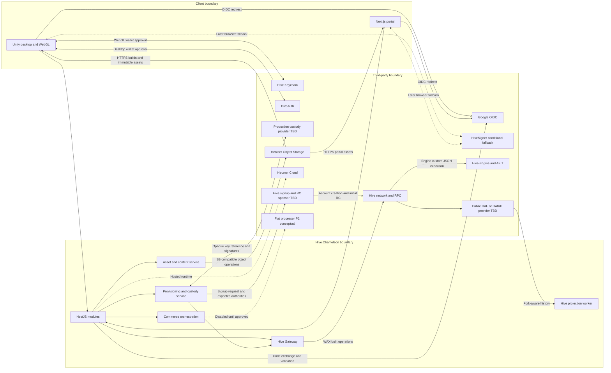

# Hive Chameleon — Third-Party Integration Register

**Deliverable:** Key integrations and third-party services

## 1. Purpose and Scope

This register identifies external systems, hosted services, wallet/signing products, networks, and third-party libraries used or contemplated by Hive Chameleon. It records why each integration exists, which internal boundary owns it, what data crosses the boundary, how authority and secrets are handled, and how the product behaves when the dependency is unavailable.

This register includes Hetzner Cloud and Hetzner Object Storage because they are the selected
hosting and storage services. It excludes internal or self-hosted application components such
as NestJS, Nakama, PostgreSQL, Redis, and project workers except where they are named as the
caller or owner of an external integration.

No provider name in a candidate or TBD row is approved merely by appearing in this document.

## 2. Integration Context

Wallet approval is client-mediated: Keychain, HiveAuth, or HiveSigner returns a signature or transaction result to the client flow, which submits it to the application for verification. The wallet provider does not receive authority to call arbitrary game APIs. Hive-Engine operations are represented by Hive operations, but successful Hive inclusion alone does not prove successful Hive-Engine execution.

## 3. Integration Inventory

| ID | Integration | Category | Maturity | Provider commitment | Internal owner |
| --- | --- | --- | --- | --- | --- |
| TP-01 | Google OpenID Connect | Identity | P0 committed | Google selected; production client configuration TBD | NestJS identity module and Unity/Next.js auth adapters |
| TP-02 | Hive network and RPC access | Blockchain | P0 committed, with P1 payment/content use | Hive selected; production RPC endpoints and failover TBD | TypeScript Hive Gateway and official workers |
| TP-03 | Hive Keychain | Player signing | P0 committed for WebGL | Primary WebGL signing provider selected | Unity `.jslib` signer adapter |
| TP-04 | HiveAuth | Player signing | P0 committed for desktop | Initial desktop path selected; production service configuration TBD | Unity desktop auth adapter and Hive Gateway |
| TP-05 | HiveSigner | Player signing | Conditional fallback | Product selected as a possible fallback; application registration and rollout TBD | System-browser signer adapter and Hive Gateway |
| TP-06 | WAX (`@hiveio/wax`) | Blockchain SDK | P0 committed | Transaction-construction library selected | TypeScript Hive Gateway; optional browser encoding validation |
| TP-07 | HAF/HAfAH read service | Blockchain indexing | P0 committed technology | Initial public provider, exact endpoint, and failover TBD | Hive projection worker |
| TP-08 | Hive-Engine and AFIT | Token payment | P1 planned | Existing AFIT token/network selected; production API endpoint policy TBD | Commerce module, Hive Gateway, treasury worker, and projection worker |
| TP-09 | Hetzner Cloud | Hosting | P0 committed | Provider selected; exact EU location, server topology, and recovery design TBD | Platform/operations |
| TP-10 | Hetzner Object Storage | Object storage and direct asset delivery | P0 committed; P1/P2 usage expands | S3-compatible service selected; bucket topology and retention policy TBD; no external CDN selected for MVP | Asset/content service |
| TP-11 | Production custody/signing provider | Player-key custody | P0 production prerequisite | Provider intentionally TBD pending capability and cost spike | Provisioning and custody service |
| TP-12 | Hive account/RC signup sponsor | Account provisioning | P0 production prerequisite | Sponsor intentionally TBD; Actifit is an example, not a commitment | Provisioning service |
| TP-13 | Fiat payment processor | Payment | P2 conceptual | No provider selected | Future commerce adapter |

## 4. Contracts, Authority, and Failure Behavior

| Integration | Contract and exchanged data | Authority and secret boundary | Unavailable or failed behavior |
| --- | --- | --- | --- |
| Google OIDC | Authorization Code flow with PKCE; backend validates issuer, audience, expiry, nonce, callback correlation, and stable subject | Google establishes a game-authentication session, not a Hive signature. Email is not an ownership key. Raw authorization codes and Google tokens are not retained or logged. | New Google login and first-time provisioning pause. Existing sessions and active matches continue while otherwise valid. |
| Hive network/RPC | JSON-RPC reads, sponsor account-creation/initial-RC observations, and WAX-serialized signed operations for posts, votes, collectibles, HIVE/HBD transfers, claim, and later platform RC support | Hive authorities and irreversible history govern chain effects. Sponsor operations are observed rather than signed by the platform; player and official service signers are isolated, and a service account never signs as a player. | New direct-Hive auth and Hive-dependent actions pause. Active matches continue, and pending service operations remain durably journaled for retry. Reversible operations are not final. |
| Hive Keychain | Browser-injected API through a Unity `.jslib` bridge for challenges, posts, votes, transfers, and approved operations | Private keys remain in Keychain. The client receives only approval results, signatures, transaction results, and safe errors. | Missing extension, rejection, or timeout fails the requested action without fallback signing by the platform. A later supported provider may be offered explicitly. |
| HiveAuth | QR/deep-link authentication and operation approval for desktop clients | Player keys remain in the user's wallet. The backend verifies the returned account, authority, challenge, and transaction result. | Direct-Hive login or the requested player action pauses; Google-authenticated gameplay is unaffected unless it needs HiveAuth after claim. |
| HiveSigner | System-browser OAuth/signing flow when enabled | OAuth state and callback correlation, exact account, authority, and operation must be validated. No application registration or rollout is assumed yet. | The fallback is not offered until configured and approved; its failure never authorizes custodial or official signing. |
| WAX | In-process Hive transaction model, canonical serialization, and digest construction | WAX builds operations but holds no authority by itself. Signer routing and operation allow-lists remain application policy. Dependency versions must be pinned and reviewed. | A serialization or compatibility failure blocks broadcast and leaves durable work retryable; the application does not construct an ad hoc incompatible transaction. |
| HAF/HAfAH | Fork-aware account/operation history used to build local projections and observe irreversibility | The projection accepts only allow-listed signers, operation types, application IDs, payload schemas, recipients, and amounts. HAF inclusion is not equivalent to Hive-Engine success. | Finality-dependent transitions pause. Cached irreversible ownership and public records remain readable with a stale timestamp. |
| Hive-Engine/AFIT | Active-authority `custom_json` carrying `tokens.transfer`; projection verifies the Hive operation and successful engine execution | AFIT is an existing external token. The project creates no replacement token. Exact sender, treasury recipient, quantity, memo, uniqueness, and execution result are validated. | Entry or payout remains pending/failed safely. A Hive transaction ID is not accepted as payment when engine execution failed or is unverified. |
| Hetzner Cloud | Self-managed application compute, private networking, ingress, and attached runtime storage for the MVP | Hetzner hosts the workload but receives no Hive signing authority. Workload credentials, databases, and service identities remain isolated by environment. | New sessions and APIs may pause during an outage; active matches continue only while the authoritative runtime and durable commit path remain safe. Recovery follows the later deployment runbook. |
| Hetzner Object Storage | S3-compatible object operations and short-lived presigned HTTPS delivery for builds, maps, cosmetics, and media; relational rows retain object keys and SHA-256 hashes | PostgreSQL stores no binary asset body. Uploads are accepted only after media type, size, hash, owner, and lifecycle validation. Object-store access credentials and presigned URLs are not logged or exposed beyond their intended client. | New uploads/downloads pause. Already packaged client content may remain available locally; a missing map package cannot be selected for a new lobby. |
| Custody provider | Generate distinct secp256k1 key pairs; return public keys and opaque references; sign WAX digests; destroy keys with non-secret evidence | Raw owner, active, posting, and memo keys never enter Unity, PostgreSQL, logs, environment variables, or general backend memory. Per-key policy and non-exportability are mandatory. | Google provisioning, custodial posts/payments, and claim pause. The system never falls back to a service-account key or exports the player's old keys. |
| Hive signup/RC sponsor | Accept one bounded signup request tied to an approved signup-code policy and the four expected public authorities; create the exact Hive account and supply initial RC; return a stable request reference while Hive remains authoritative evidence | Sponsor credentials and raw signup codes stay in the provisioning boundary and are never logged or stored in product tables. The platform never receives the sponsor's Hive keys and never substitutes its own funded provisioning account. | First-time Google provisioning remains pending/retryable. The system never creates a guest, links an account with mismatched authorities, or silently falls back to a platform-funded ACT/HP pool. |
| Fiat processor | Future hosted checkout or equivalent provider-neutral adapter; webhook, settlement, refund, and chargeback contract undefined | No production route may call a provider until product, security, accounting, and webhook-verification rules are approved. | All P2 fiat endpoints remain disabled and return the conceptual-feature response without changing state. |

## 5. Payment Integration Boundaries

| Value rail | Approved use | Signing path | Acceptance rule |
| --- | --- | --- | --- |
| Native HIVE/HBD | P1 controlled tournament entry/payout and approved purchases | Self-custodial player through a supported Hive signer; unclaimed Google-provisioned player through the per-player active custody key; payouts through isolated treasury | Verify sender, treasury recipient, asset, amount, non-sensitive correlation memo, uniqueness, inclusion, and irreversibility |
| Hive-Engine AFIT | P1 controlled tournament entry/payout and approved purchases | Same player/treasury separation, using active-authority `tokens.transfer` | Verify the underlying Hive operation and successful Hive-Engine execution before accepting payment |
| Fiat | P2 conceptual checkout only | Not defined | No provider, webhook, settlement, refund, or chargeback behavior is approved |

The project does not use a generic payment processor for HIVE, HBD, or AFIT. Official treasury
payouts, collectible issuance, and general RC support remain separate
service-account operations. Sponsor-backed account creation and initial RC are external
provisioning evidence, not operations signed by one of those platform service accounts.

## 6. Storage and Delivery Boundaries

- Hetzner Object Storage stores desktop/web builds, official map packages, approved
  community-map files, cosmetic/media objects, and related immutable artifacts where the
  product lifecycle permits them.
- The MVP delivers approved immutable objects directly over HTTPS or through bounded presigned
  URLs. No external CDN is selected. A CDN may be evaluated after traffic and latency
  measurements justify it; adding one does not change content-approval or ownership rules.
- Official web maps remain packaged with approved web builds; the presence of an object does not
  make a dynamic community map web-compatible.
- PostgreSQL stores object keys, immutable version references, sizes, media types, and SHA-256 hashes rather than file bodies.
- Creator uploads use short-lived presigned operations only when the P2 workshop flow is approved. Upload completion does not bypass review, validation, or distribution promotion.
- The collectible metadata host and its long-term retention/versioning policy remain an open
  production decision; selecting Hetzner Object Storage for application assets does not silently
  approve it as the permanent collectible metadata host.

## 7. Notifications

Notifications have no third-party delivery integration in the approved scope. They are in-game records owned by the backend and exposed through the authenticated notification API. Email, SMS, mobile push, browser push, and vendor-operated notification orchestration are not selected or required.

Adding an external notification channel later requires a separate product and privacy decision before provider evaluation. No current implementation should create provider tokens, external contact mappings, or silent outbound delivery hooks.

## 8. Configuration and Secret Inventory

| Integration | Runtime configuration | Secret or sensitive material rule |
| --- | --- | --- |
| Google OIDC | Approved client IDs, redirect URIs, issuers, audiences, and supported client types | Client secret where applicable belongs in the approved runtime secret boundary; authorization codes and tokens are ephemeral and never stored in product tables |
| Hive RPC | Ordered endpoint/failover configuration, network identity, application namespace, and official account allow-lists | Service-account keys remain in their isolated signers; endpoint configuration is not signing authority |
| Keychain | Browser capability detection and requested operation contract | No application-held Keychain credential or player private key |
| HiveAuth/HiveSigner | Service endpoint, application registration, redirect/deep-link configuration, and callback state | Provider credentials and refresh material, if required, stay outside clients and logs |
| WAX | Pinned package version and supported Hive protocol compatibility | No key material is stored in library configuration |
| HAF/HAfAH | Base URL, health/failover policy, cursor/checkpoint settings, and accepted signer/application allow-lists | Read-provider access credentials, if any, remain in the projection worker boundary |
| Hive-Engine | Approved API/history endpoint policy, AFIT symbol, treasury account, and execution-validation rules | Treasury keys stay in the isolated treasury signer |
| Hetzner Cloud | Project, location, server/network/firewall identifiers, backup policy, and environment-specific workload credentials | Cloud API credentials remain in the approved operations boundary and are never shipped to clients or reused as application credentials |
| Hetzner Object Storage | Endpoint/location, bucket names, object prefixes, lifecycle/retention configuration, and S3-compatible credentials | Static object-store credentials are not shipped to clients; presigned URLs are short-lived and treated as sensitive |
| Custody provider | Provider endpoint, key-policy templates, tenant/project identity, lifecycle policy, and opaque key references | Provider credentials remain inside the custody service; PostgreSQL stores only public keys, opaque references, and non-secret lifecycle evidence |
| Hive signup/RC sponsor | Sponsor endpoint/program identifier, approved signup policy/version, expected creator/recovery account, and secret signup credential | Raw signup codes/API credentials remain in the provisioning secret boundary; product tables store only a policy version and opaque non-secret request reference |
| Fiat processor | None until approval | No API or webhook secret may be provisioned while the integration remains conceptual |

## 9. Provider Selection Gates and Open Decisions

1. **Custody provider:** complete a feasibility and cost spike proving secp256k1 generation/import, Hive-compatible compact signatures, non-exportability, per-key authorization, destruction evidence, scaling, and any later memo shared-secret capability. Generic KMS/HSM/Vault branding is not sufficient evidence.

   The completed AWS KMS spike established the portable DER-to-Hive conversion path but did not
   approve the production topology or provider. Its
   [managed secp256k1 signing recipe](./managed-secp256k1-hive-signing.md) records low-S
   normalization, recovery-ID derivation, 65-byte assembly, compact-canonical retries, and the
   sanitized end-to-end validation result.

   Standard HashiCorp Vault Transit is not the fallback: its documented ECDSA key types are the
   NIST P-256/P-384/P-521 curves, not Hive's secp256k1. A custom Vault plugin, externally
   managed-key design, or direct HSM integration would be a distinct provider design and must
   pass the same spike before it is named or used.

2. **Hive RPC and HAF/HAfAH:** select production endpoints, health criteria, rate/retention limits, and failover behavior. Initial use of a public HAF/HAfAH endpoint does not commit the project to a specific operator.
3. **Google OIDC:** approve production client registrations, supported client types, redirect URIs, and provider/session operating policy.
4. **HiveAuth and HiveSigner:** finalize service selection/configuration, application registration, callbacks, and platform rollout.
5. **Hive-Engine:** approve production query endpoints and reconciliation behavior for proving successful AFIT execution.
6. **Hetzner deployment:** select the EU location and initial Cloud Server/dedicated-server shape,
   network/firewall layout, backup/restore targets, recovery procedure, and Object Storage bucket
   lifecycle. Add a CDN only after measured need and separate approval.
7. **Hive signup sponsor:** select and contract-test a sponsor that accepts the required public
   authorities, creates the exact account, supplies initial RC through the approved flow, exposes
   stable reconciliation evidence, and supports bounded signup-code abuse controls. Actifit is
   not selected merely because it is the current example.
8. **Fiat:** leave disabled until provider, checkout, webhook, settlement, refund, chargeback, accounting, and compliance requirements are approved.
9. **External notifications:** no selection work is required unless email, SMS, browser, or mobile push enters product scope.

Production service-account names, Hive application namespace approval, RC thresholds, treasury limits, and correction/invalidation governance remain required configuration decisions even though they do not select a third-party provider.

## 10. Explicitly Deferred or Excluded Integrations

- Steam and Epic distribution are deferred; initial desktop delivery remains direct download.
- External email, SMS, browser-push, and mobile-push providers are not in scope.
- No fiat payment processor is implied by the conceptual checkout API.
- No new Hive-Engine game or reward token is created.
- No third-party chat, voice, or direct-messaging provider is needed because those product features are out of scope.
- No observability, crash-reporting, anti-cheat, or support vendor has been approved by the source documents; this register does not select one.
- Nakama, PostgreSQL, Redis, NestJS, and internal workers are architecture dependencies, not third-party entries in this register.

## 11. Review Checklist

- Every named provider or technology appears in an approved source document.
- Every integration declares maturity, internal ownership, data exchanged, authority boundary, and failure behavior.
- TBD providers remain provider-neutral and have an explicit selection gate.
- Google authentication is never described as a Hive signature.
- HAF inclusion is never treated as successful Hive-Engine execution.
- Hetzner hosting or object delivery is never treated as content approval, relational authority,
  or Hive signing authority.
- Sponsor success is not trusted without matching irreversible Hive account, authority, and RC
  evidence.
- Notifications remain backend-only, with no invented outbound provider.
- No client or general backend receives raw player/service private keys or persistent Google tokens.
- Active gameplay remains independent of Hive, custody, HAF, payment, and asset-provider availability where the authoritative server can continue safely.
- P2 fiat routes remain conceptual and disabled.

## 12. External References

- [Hive Keychain website integration](https://github.com/hive-keychain/hive-keychain-extension/blob/master/documentation/README.md)
- [HiveAuth documentation](https://docs.hiveauth.com/)
- [Hive authentication overview](https://developers.hive.io/quickstart/authentication.html)
- [WAX TypeScript project](https://gitlab.syncad.com/hive/wax/-/tree/develop/ts)
- [Hive Application Framework](https://gitlab.syncad.com/hive/haf)
- [HAfAH account-history API](https://gitlab.syncad.com/hive/HAfAH)
- [Hive broadcast operations](https://developers.hive.io/apidefinitions/broadcast-ops.html)
- [Hetzner Cloud API](https://docs.hetzner.cloud/reference/cloud)
- [Hetzner Object Storage overview](https://docs.hetzner.com/storage/general/which-storage-is-right-for-me/)
- [Hetzner Object Storage buckets, objects, and presigned URLs](https://docs.hetzner.com/storage/object-storage/faq/buckets-objects/)
- [AWS KMS key-spec capabilities](https://docs.aws.amazon.com/kms/latest/developerguide/symm-asymm-choose-key-spec.html)
- [HashiCorp Vault Transit key types](https://developer.hashicorp.com/vault/docs/secrets/transit)
